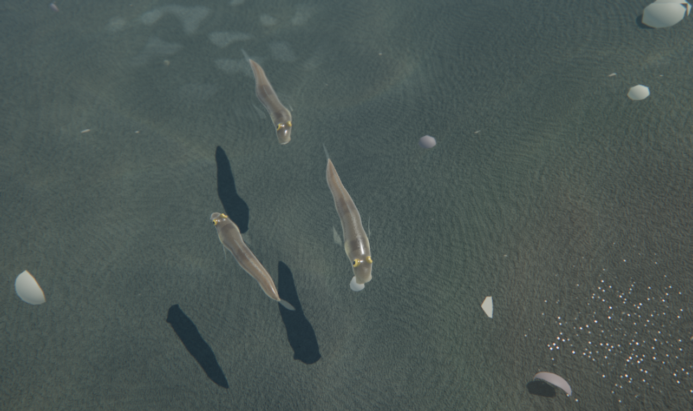
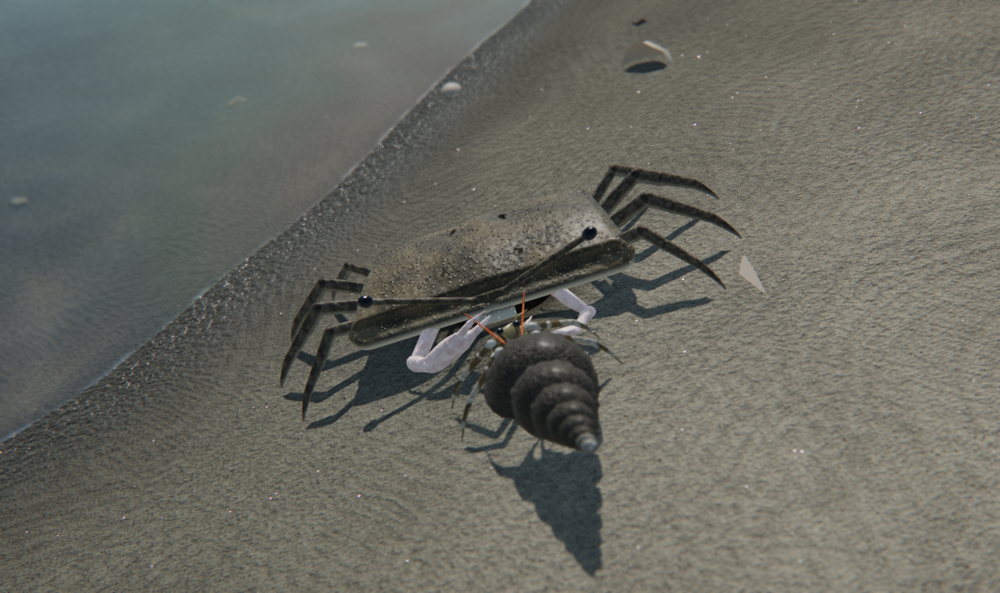

# 干潟観察 — 葛西の渚




東京湾奥・葛西海浜公園の干潟をモデルにした、生き物を上から観察するだけの 3D 観察ゲーム（Three.js / WebGL）。

## 起動

ビルド不要。静的サーバで配信してブラウザで開きます。

```sh
npx http-server -p 8080 .
# → http://localhost:8080/
```

URL パラメータ: `?hour=16`（時刻）, `?tide=0.5`（潮の位相 0=干潮, 0.5=満潮）

## 見どころ

### 描画の仕組み
- **透明な浅い水**：水面はメッシュではなくスクリーン空間のパスで描画。深度バッファから視線と水面の交点を求め、底の像の屈折（揺らぎ）、水の厚みに応じた吸収と散乱、空の環境マップの反射（フレネル）、太陽のきらめきを合成。浅い所はほぼ透明に、澪筋の深い所はわずかに緑がかる
- **生き物の造形**：符号付き距離関数（SDF）を Surface Nets でメッシュ化し、甲羅の溝・顆粒、脚の節、はさみの歯、魚の頭部や鰓蓋などを有機的に造形。物体空間の手続き的な模様・凹凸・表面下散乱を持つマテリアルで、個体ごとに模様が異なる（アサリの殻模様など）
- **歩行**：カニ・ヤドカリの脚は 2 リンク IK と交互歩容で足先を地面に固定して踏み替える
- **巣穴**：地形に穴を開け、掘り出した砂の縁と暗い竪穴をメッシュで表現（スナモグリのマウンド、マテガイの鍵穴形の穴、アサリの水管の穴）
- **被写界深度**：注視点に合焦するマクロレンズ風の被写界深度。近づくほど浅くなる
- 影の範囲を注視距離に合わせて変え、接写でも細い脚の影がくっきり落ちる。遠くの個体は低解像度の統合メッシュに切り替え

- **潮の満ち引き**：約5分で1潮汐。水位に応じて砂の濡れ・潮だまりの水膜・汀線の泡・水中のコースティクスと減衰が変化
- **光と影**：物理ベースの空（Rayleigh/Mie散乱）と環境光、4096 のソフトシャドウ、雲の影、ACES トーンマッピング、ブルーム、ミニチュア風ティルトシフト
- **生き物（9種）**とふるまい
  - コメツキガニ：干出時に巣穴から出て横歩き、砂団子を作る（満潮で崩れる）
  - ヤマトオサガニ：長い眼柄、オスははさみを振り上げるウェービング
  - ニホンスナモグリ：巣穴のマウンドから冠水時に顔を出す
  - マハゼ稚魚：群れで泳ぎ、干潮時は澪筋へ移動
  - ヒメハゼ稚魚：着底しては短く跳ねるように泳ぐ
  - ユビナガホンヤドカリ：巻貝の殻を背負って歩き回る
  - アラムシロガイ：冠水時に打ち上げられた魚へ集まる
  - アサリ：冠水時に水管を伸ばして濾過食
  - マテガイ：鍵穴形の巣穴から時々飛び出す

## 操作

ドラッグで回転、右ドラッグで移動、ホイールでズーム。生き物をクリックすると追従して図鑑カードを表示。`H` で UI 非表示、`Space` で一時停止。
