# Comet Goldfish — リアルタイム水槽（Three.js）

写真資料・文献調査に基づいて手続き生成した **コメット金魚（*Carassius auratus*）** が、Three.js / WebGL2 の水槽内を自律的に泳ぎ続けるプロジェクトです。外部の 3D モデル・テクスチャは使わず、形態・鱗・鰭・眼・口・鰓・体色・体の透明感・動き・行動（あくびも）をすべて実行時に生成します。起動するとシネマカメラが個体を追い、寄り・ローアングル・並走などのショットを切り替えます（画面に触れると自由視点）。

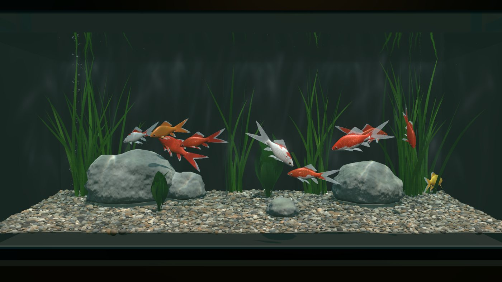

| | |
|---|---|
| 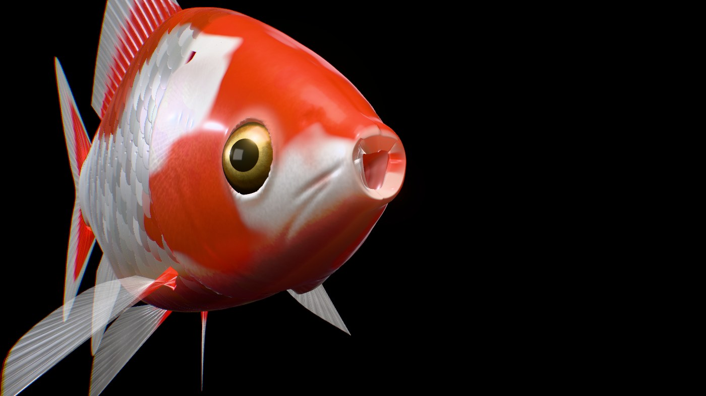 | 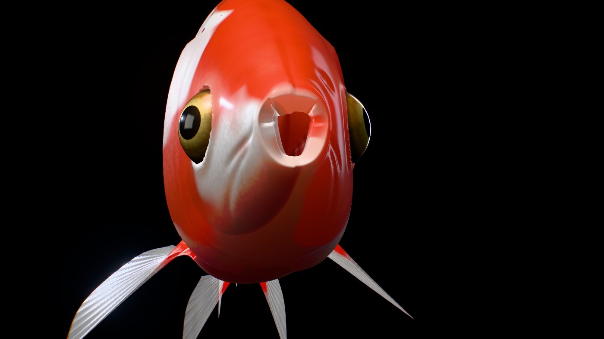 |
| 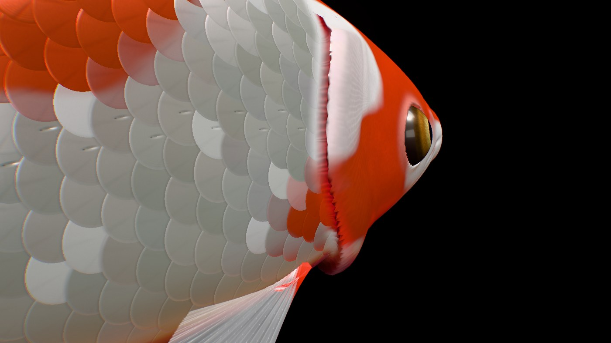 | 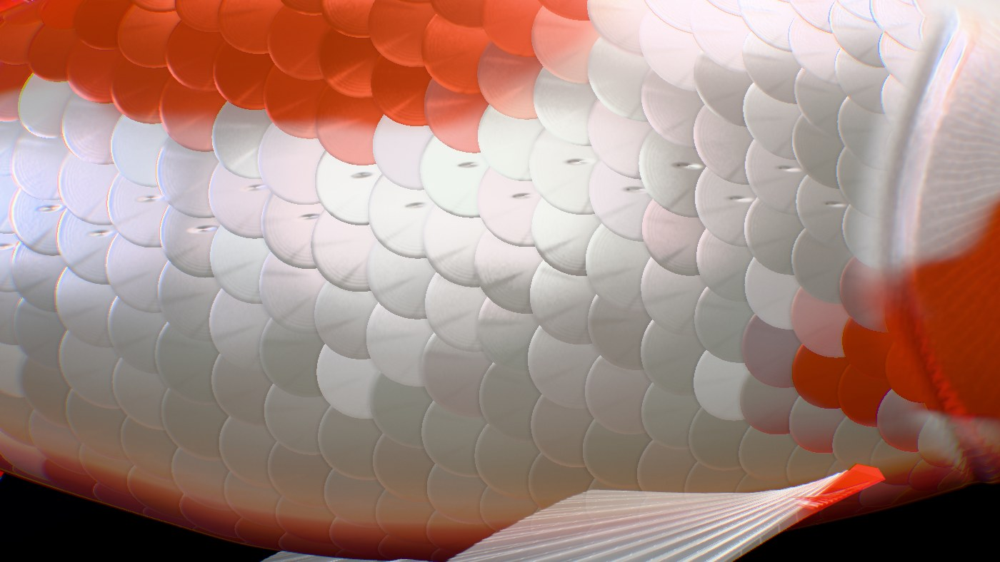 |
| 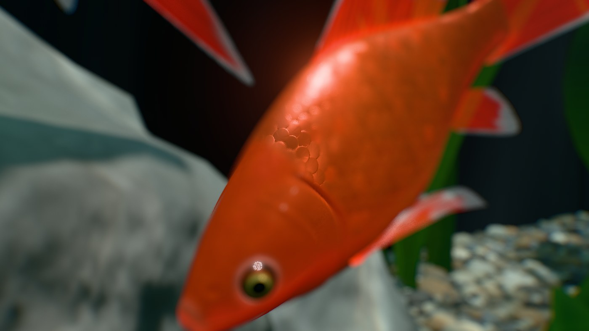 | 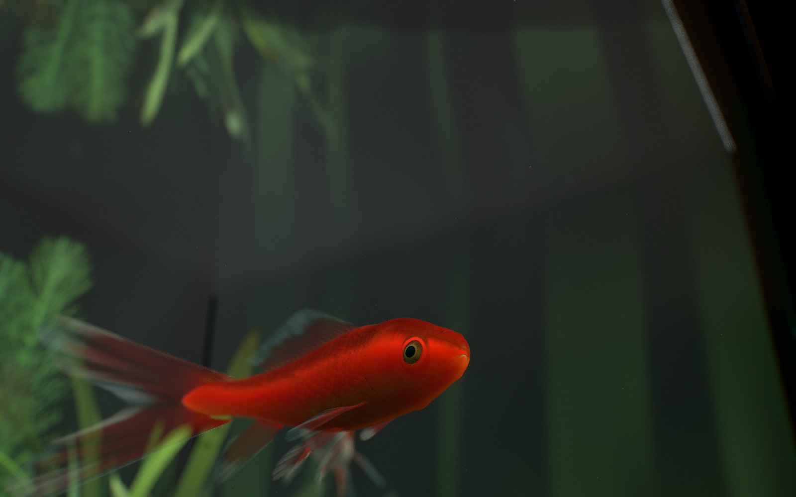 |
| 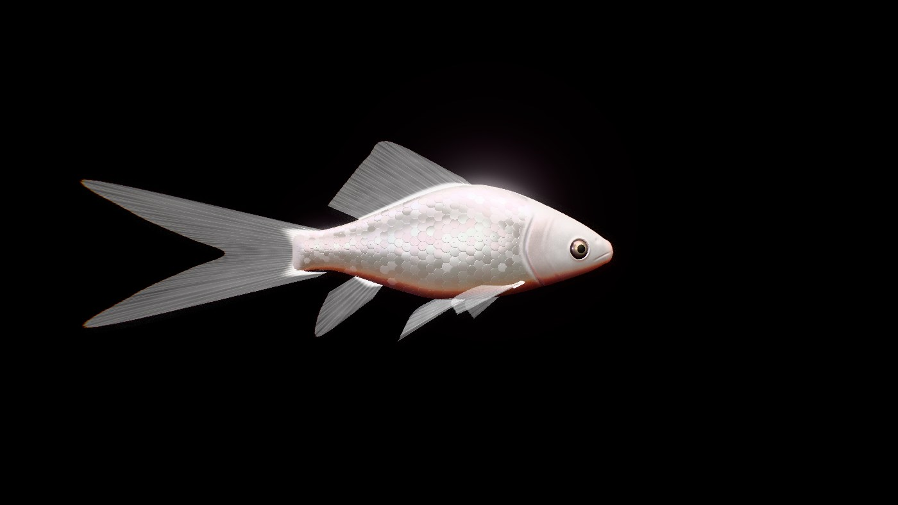 | 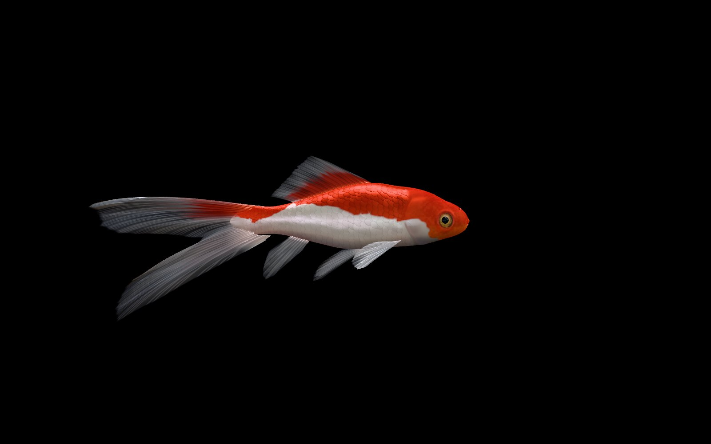 |
| 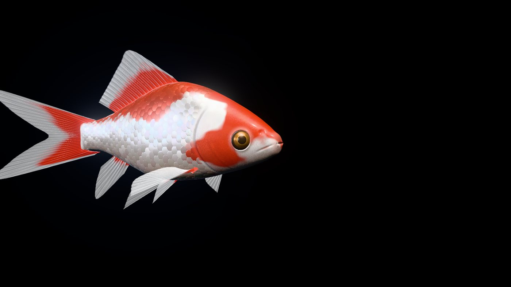 | 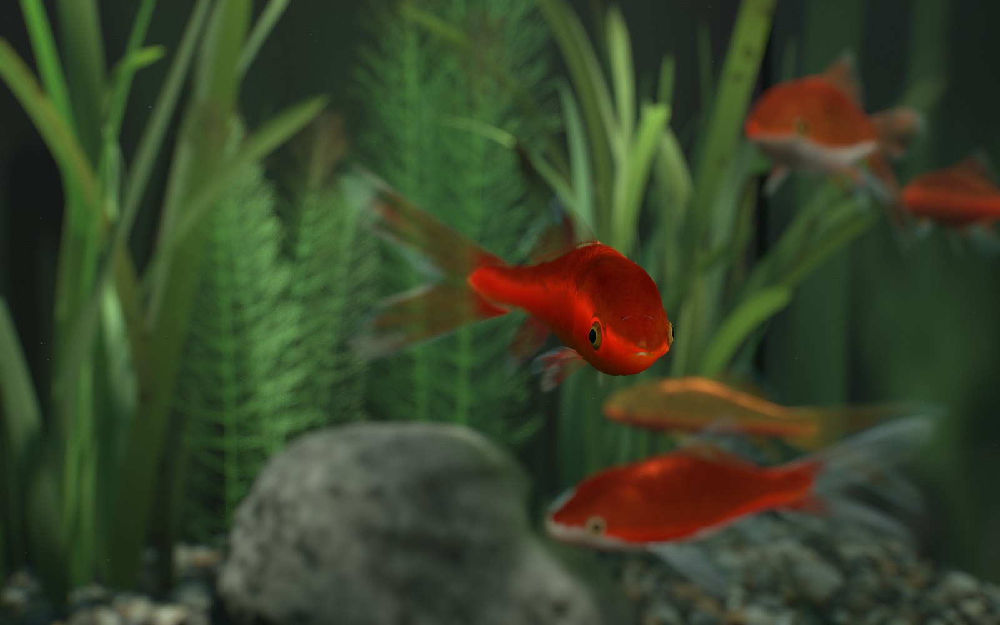 |
| 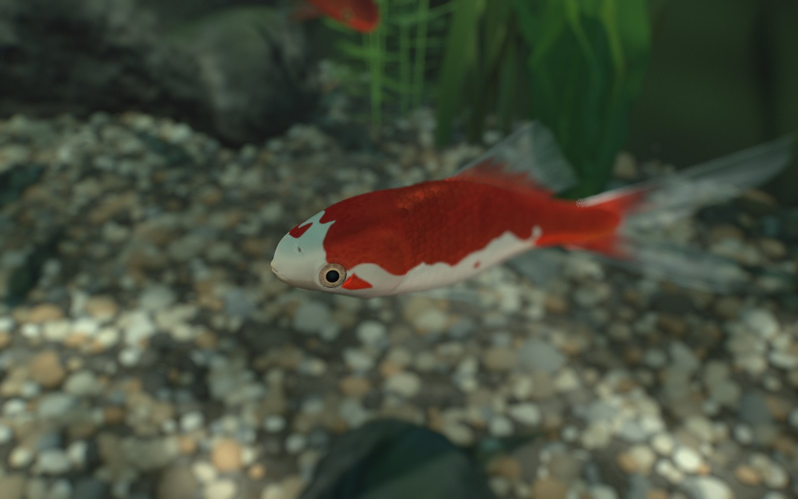 | 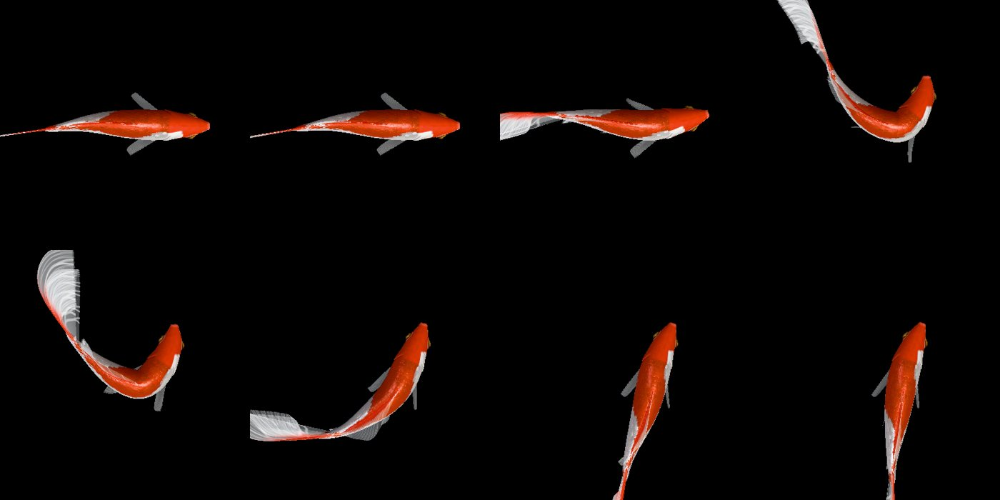 |
| 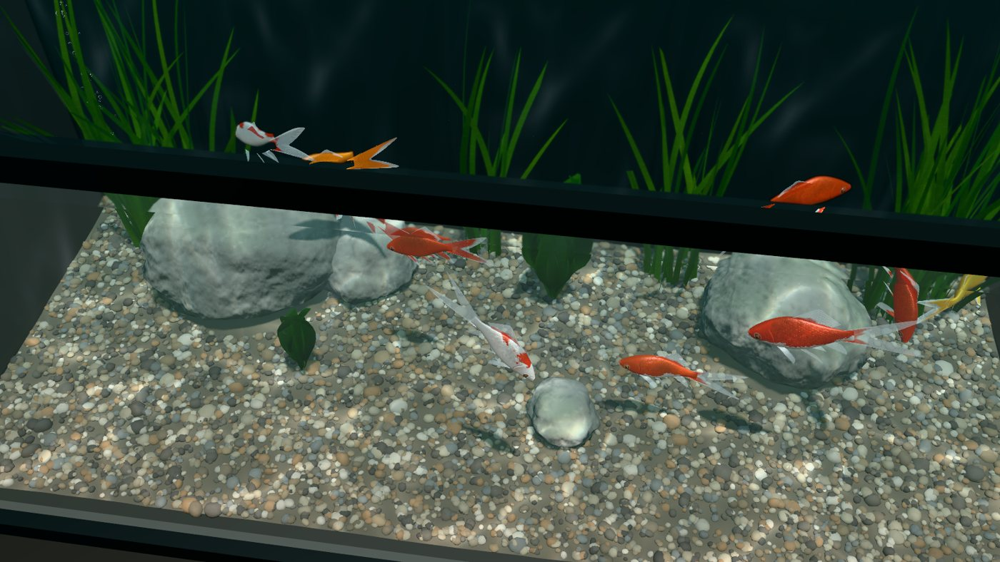 | 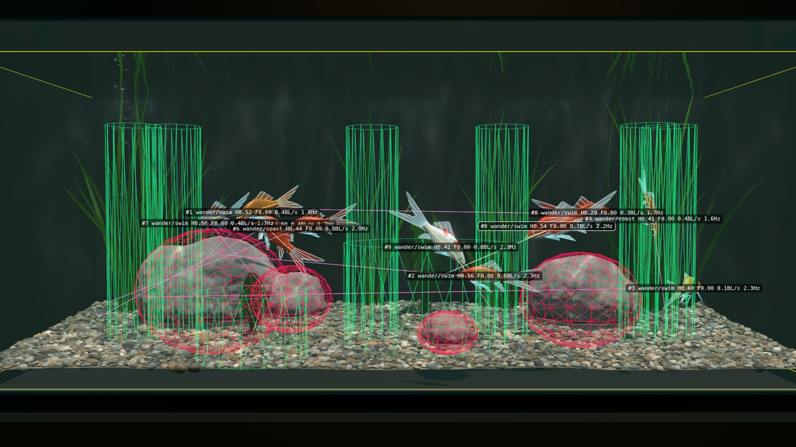 |

## 起動

```bash
npm install
npm run dev        # http://localhost:5173 を開く（npm start ならブラウザも自動で開く）
```

本番ビルド：`npm run build`（`dist/` を任意の静的サーバで配信。相対パスなのでサブディレクトリでも動作）。1 ファイル版：`npm run artifact`（`dist/artifact.html` に JS をインライン化）。WebGL2 対応のブラウザ（PC の Chrome / Edge / Firefox / Safari、スマートフォン）で動作し、フレームレートに応じて画質を自動調整します。

## 操作

| 操作 | 内容 |
|---|---|
| ドラッグ / ホイール（タッチ：ドラッグ / ピンチ） | カメラの回転・ズーム（シネマカメラ中なら自由視点に切替） |
| `V` / 右下の「シネマ」ボタン | シネマカメラの切替 |
| 金魚をクリック | その個体を選択（GUI・HUD・追従カメラの対象） |
| 前面ガラスをクリック（魚に重なる場合は Shift+クリック） | ガラスをタップ＝振動刺激（近い個体ほど C スタートで逃避、慣れも発生） |
| 上から水面をクリック | その位置に給餌（浮く餌と沈む餌） |
| `F` | 給餌 |
| `T` / `L` | ガラスをタップ / 頭上の影（ルーミング刺激） |
| `C` | 選択個体の追従カメラ切替 |
| 右下のボタン | シネマ / 自由視点、給餌、ガラスをタップ、UI 表示切替（タッチ操作用） |
| `N` | 次の個体を選択 |
| `P` | 一時停止 |
| `H` | UI の表示切替 |

## URL パラメータ

| パラメータ | 例 | 内容 |
|---|---|---|
| `mode` | `?mode=studio` | 黒背景のスタジオ（1 尾を流水中で定位させ、あらゆる角度から観察） |
| `fish` | `?fish=20` | 尾数（1–40） |
| `seed` | `?seed=7` | 個体生成の乱数シード |
| `anim` | `?mode=studio&anim=yawn` | スタジオのアニメーション（idle / slow / cruise / accelerate / turn / brake / startle / feeding / surfaceFeeding / yawn） |
| `view` | `?mode=studio&view=head` | スタジオのカメラ（side / top / front / q34 / rear / head / dorsal / tail / below、接写：face / mouthfront / gill / gillrear / flank）。`zoom=0.6` で寄る |
| `color` | `?mode=studio&color=1` | 体色（0 更紗、1 赤、2 橙、3 黄、4 白） |
| `quality` | `?quality=high` | 画質の段を固定（ultra / high / medium / low / lower / minimal）。既定は `auto`（自動調整） |
| `cine` | `?cine=0` | シネマカメラを使わず固定視点で開始。`?cine=head34` などでショットを固定（profile / head34 / low / tail / track / above / wide） |
| `dof` | `?dof=0` | 被写界深度を無効化 |
| `post` | `?post=0` | ポストエフェクトを無効化 |
| `gui` | `?gui=0` / `?gui=open` | GUI を非表示 / 開いた状態で開始（既定は閉じた状態） |

## デバッグ GUI（右上）

- **Simulation**：時間倍率（スローモーション）、一時停止、尾数、給餌・タップ・頭上の影・全個体驚愕、空腹の上昇速度、カメラ
- **Animation**：Idle / Slow Swim / Cruise / Accelerate / Turn / Brake / Startle / Feeding / Surface Feeding / Yawn（選択個体または全個体）、遊泳速度、尾の振幅・周波数、鰭の剛性・水の抵抗、呼吸速度
- **Material / Eyes**：鱗の強さ、粗さ、グアニン反射、虹色、体内散乱、体の透明度、鰭の不透明度・透過・粗さ、体色、瞳孔・虹彩
- **AI**：状態の強制、現在の状態、性格パラメータ
- **LOD**：強制 LOD、切替閾値
- **Lighting & Water**：露出、トーンマップ、環境光、キーライト（強さ・方位・仰角）、コースティクス、濁度、粒子、光条、泡、水面反射、水流、ブルーム
- **Lens & Quality**：被写界深度、最大ぼけ、色収差、周辺減光、フィルムグレイン、自動画質、画質の段
- **Debug View**：Normal / Albedo / 鱗法線 / 厚み（透過率）、Wireframe、Skeleton、Collision、Velocity、AI target、Current state

HUD（左下、スマートフォンでは非表示）：FPS、フレーム時間、CPU シミュレーション時間、ドローコール、三角形数、LOD 分布、カメラ（ショット）・焦点距離・画質、選択個体の状態・速度・尾拍・欲求。

## ドキュメント

- [docs/RESEARCH_REPORT.md](docs/RESEARCH_REPORT.md) — 写真 100 枚の計測と文献調査（形態・光学・運動学・行動）
- [docs/TECH_DESIGN.md](docs/TECH_DESIGN.md) — モデル構造、リグ、シェーダ、アニメーション、AI、LOD の設計
- [docs/QA_REPORT.md](docs/QA_REPORT.md) — 実写比較と修正、動き・行動の検証、不具合、性能計測

## 開発用ツール

```bash
npm run dev                                            # 別ターミナルで起動しておく
node tools/dev/shot.mjs "/?test=1&t=5" out.png         # 決定的な静止画
node tools/dev/shot.mjs "/?mode=studio&test=1&t=1.6&anim=startle&view=top&strip=8&stripDt=0.012" strip.png
node tools/dev/shot.mjs "/?test=1&probe=120&fish=10" p.png   # 行動統計（コンソールに PROBE）
node tools/dev/shot.mjs "/?test=1&t=6&cine=head34" head.png   # シネマのショットを固定して撮影
node tools/dev/shot.mjs "/?mode=studio&test=1&t=2&view=gillrear&zoom=0.8&operc=1.6&dof=0" gill.png   # 鰓蓋を開いた状態で接写（mouth= / operc= / wire=1）
npm run perf                                           # 性能計測（--gpu で実 GPU）
npm run artifact                                       # 1 ファイル版をビルド
```

ヘッドレス実行には Chromium が必要です（`CHROME_PATH` かスクリプト内のパスを環境に合わせて変更）。

## 構成

```
src/fish      形態・メッシュ生成・リグ（背骨＋鰭条チェーン物理）・運動・シェーダ・インスタンス描画
src/ai        欲求＋ユーティリティ＋状態機械＋ステアリング
src/world     水槽・底砂・岩・水草・水面（全反射/屈折）・コースティクス・光条・粒子・泡・餌
src/render    共有ユニフォーム・環境プローブ・ポストエフェクト（被写界深度・レンズ）・シネマカメラ・自動画質
src/debug     GUI・デバッグ描画
```

アセットはすべて手続き生成のため、KTX2 / Draco / Meshopt による圧縮対象はありません。外部の高精細スキャン等を導入する場合は、テクスチャを KTX2（UASTC: 法線、ETC1S: カラー）、メッシュを Meshopt で配信し、`FishSystem` の LOD 構成に合わせて読み込む想定です。

参照写真（支給 PDF）は権利者に帰属するためリポジトリには含めていません。
