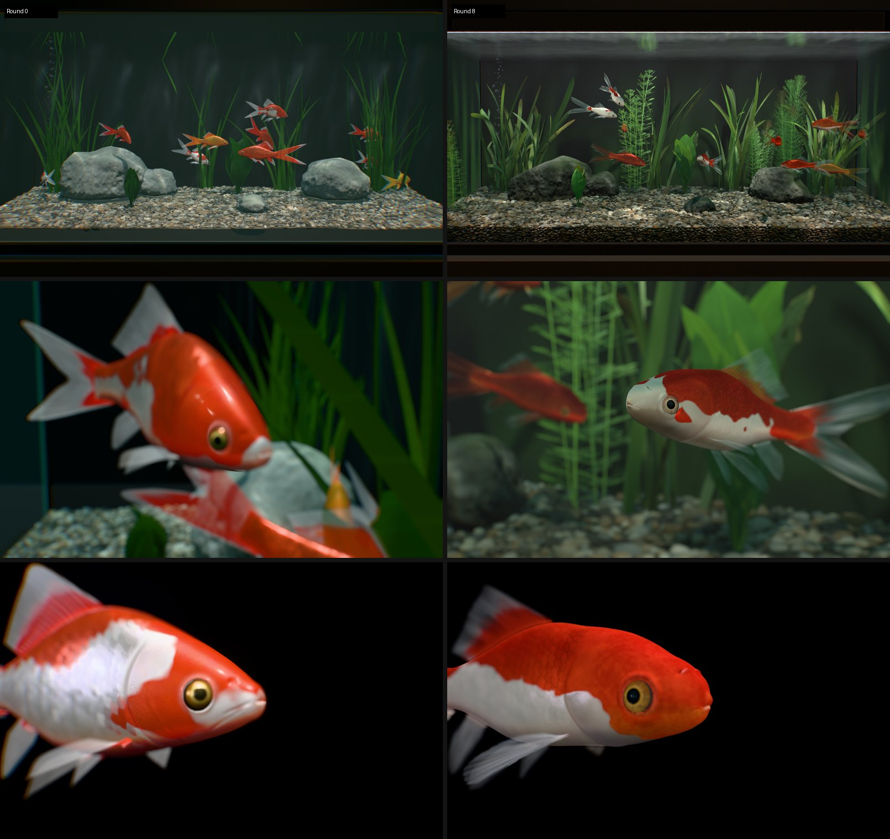

# 検証・比較・性能レポート（STEP 6–10）

## 1. 検証環境と方法

| 項目 | 内容 |
|---|---|
| ブラウザ | ヘッドレス Chromium（Playwright 同梱ビルド）、WebGL2（ANGLE → SwiftShader：**ソフトウェア GPU**）。CPU は Xeon 2.1 GHz × 4 |
| 静止画 | `?test=1&t=<秒>`：指定秒数を固定 dt でシミュレーションしてから描画（決定的） |
| 動き | `strip=N&stripDt=…`：N 時刻を 1 枚のグリッドに描画するフィルムストリップ |
| 行動統計 | `probe=<秒>`：描画なしで AI を回し、状態・歩容・速度・水深・尾拍周波数・壁との最小距離・接触・摂餌・処理時間を集計 |
| 実ループ | `tools/dev/live.mjs`：GUI 付きの通常起動で給餌・クリック・タップを行いコンソールエラーを収集 |
| 性能 | `npm run perf`（`tools/perf.mjs`） |

## 2. 実写資料との比較（STEP 7）と修正（STEP 8）

黒背景のスタジオモード（`?mode=studio`）を写真の構図に合わせ、p06・p40・p01・p42・p11 と並べて比較した（参照写真は権利者に帰属するためリポジトリには含めていない）。

| # | 観察された差異 | 修正 |
|---|---|---|
| 1 | 吻が円錐状に尖る | 吻端 0.01 SL で半高 0.03 SL の鈍い吻へ（写真 p06/p42/p11 の頭部拡大で再計測）、唇ブレンドを四分楕円に |
| 2 | 鱗がレンガ状（縁が直線） | 鱗の距離計量を「1 列の高さで円弧を描く」形に変更 → 自由縁が明瞭なスカラップ状に |
| 3 | 鱗がモザイク（鱗ごとの明暗差が大） | ドーム・揺らぎ・反射率のばらつきを縮小、縁の影を弱く |
| 4 | 鰭が黒い櫛・紙のカード状 | 膜を「連続した乳白の半透明膜」に：膜 α と鰭条 α の差を縮め、遠位の切り欠き帯を削除、前方散乱・拡散透過・プリーツ法線を追加 |
| 5 | 体が細長く頭が長い | 体高 0.355→0.37、腹を丸く、頭長 0.296→0.285、眼を吻側へ |
| 6 | 胸鰭・腹鰭が真横から棒状に見える・短い | 鰭面の向きを体側寄り（側面から面が見える）に、腹鰭 0.34 SL・尖った扇形、胸鰭 0.30 SL |
| 7 | 背鰭がサメのように尖って高い | 高さ 0.25 SL、後方鰭条を長く、傾き 0.66→0.40 rad の帆形 |
| 8 | 鰓蓋の溝が縫い目のように強い | 溝深さ 0.0048→0.0028 SL、閉鎖時の暗さを弱く |
| 9 | 赤がサーモンピンク、白が暖色の灰 | AgX → Khronos Neutral トーンマップ、赤 #d0290c・白 #e6eaee（冷たい真珠色） |
| 10 | 頭部がプラスチック的 | 鱗の無い頭部に微細凹凸と色素の斑、腹部に黄色素の淡い色 |

結果画像：`docs/images/studio_side.jpg`、`studio_head.jpg`、`closeup_in_tank.jpg`。

## 3. 動きの検証

| 項目 | 結果 |
|---|---|
| 巡航（上面フィルムストリップ） | 頭部の小さな反動と尾柄に向かって大きくなる進行波、長い尾鰭の遅れ（遠近で尾鰭の見かけの大きさが周期的に変化） |
| C スタート（10 ms 間隔、`docs/images/cstart_filmstrip.jpg`） | 約 25 ms で頭と尾が同じ側へ曲がる C 字、約 40 ms で反転ストローク、回頭 ≈ 100°、尾鰭は大きく畳まれて追従 |
| 旋回（上面） | 体が円弧状に曲がり、頭が先行して尾が遅れる |
| 摂餌 | 口の O 字の突出、唇、暗い口腔、鰓蓋の外転が遅れて続く |
| 水面採餌・底での採餌 | 頭を上げて吸い込み波紋、頭を下げてついばみ砂粒を吐く |

## 4. 行動統計（120 秒、10 尾、30 秒ごとに給餌・40 秒ごとにタップ）

| 指標 | 結果 | 文献の目安 |
|---|---|---|
| 状態 | wander 21 %、shoal 20 %、approachFood 13 %、wallFollow 10 %、forage 10 %、freeze 8 %、rest 7 %、cruise 5 %、pause 3 %、startle 2 %、surfaceFeed 2 % | 遊泳・探索が最多、採餌と静止が続く |
| 歩容 | swim 73 %、hover 20 %、coast 6 %、burst/C スタート 1 % | ホバリングが多い |
| 速度 | 中央値 0.11 BL/s、90 % 0.83 BL/s、最大 8.2 BL/s（逃避） | 追跡データの平均 6–36 mm/s（0.06–0.36 BL/s）、通常遊泳 0.5–1.5 BL/s |
| 尾拍周波数 | 中央値 2.2 Hz、90 % 3.4 Hz | 低速で 2–5 Hz |
| 水深（水面までの割合） | 中央値 0.35 | 好む水深 0.3 |
| 壁との最小距離 | 0.27 BL（クランプ 0.28 BL の直前まで回避） | – |
| 摂餌 | 14 個 | – |
| 処理時間 / 尾 | 脳 7.8 µs、運動 11.2 µs、鰭物理 77 µs | – |

## 5. 発見して修正した不具合

| 症状 | 原因 | 対策 |
|---|---|---|
| 画面の半分を覆う白いグレア | 泡の小さな三角形で MSAA が varying を外挿 → 非正規化ベクトルで `x^40` が HalfFloat を超え Inf/NaN → ブルームで拡散 | フラグメントで正規化・clamp、出力の上限、`spow`（log 領域で指数をクランプ）で全 `pow` を置換 |
| 尾が常に 14 Hz | 障害物回避・分離ベクトルを「速度」として加算 | 回避は方向のみ変更し、危険度に応じて減速 |
| 水面の全反射が真っ暗 | 反射パスが影マップ生成前に描画され、影を受けるドローが失敗 | 反射をメイン描画の後に実行（1 フレーム遅延） |
| 上から見ると鰭が消える | 半透明の鰭は transmission バッファに含まれず、水面が深度を書く | 上面の水面は深度書き込み無し |
| 岩・小石がカクカク | 非インデックスジオメトリで平面法線 | `mergeVertices` 後に変位 |
| 餌の周囲で体が重なる | 分離が弱い | 分離半径・強さの調整＋頭／胴の 2 球による柔らかい非貫通 |

## 6. 性能（STEP 9）

`npm run perf`（1600×900、SwiftShader、10 フレーム平均）：

| シナリオ | CPU シミュレーション | ドローコール（全パス） | 三角形（全パス） | LOD 0/1/2 |
|---|---|---|---|---|
| 1 尾 スタジオ接写 | 0.16 ms | 17 | 83k | 1/0/0 |
| 10 尾 水槽（既定） | 1.4–2.8 ms | 116 | 2.6 M | 0/10/0 |
| 20 尾 | 3.1 ms | 116 | 3.5 M | 0/20/0 |
| 40 尾 | 7.6 ms | 116 | 5.2 M | 0/40/0 |
| 20 尾 LOD0 強制 | 4.3 ms | 116 | 7.9 M | 20/0/0 |
| 20 尾 LOD2 強制 | 4.7 ms | 116 | 2.1 M | 0/0/20 |

- ドローコールは尾数に依存せず一定（LOD ごとのインスタンス描画）。全パス＝影マップ、メイン、水面反射（半解像度）、透過バッファ、ブルーム、コースティクス。
- 三角形数の多くは影・反射・透過パスで再描画される底砂と魚。
- CPU 時間はこのコンテナ（ソフトウェア GPU と同居する低速 CPU）での値。デスクトップ CPU では概ね 1/2–1/3 と見込まれる（推定）。
- **GPU 時間はソフトウェアラスタライザのため意味を持たず、ここでは報告しない**。実 GPU での計測は `node tools/perf.mjs --gpu --chrome <Chrome のパス>`。
- 想定（推定）：ミドルレンジ PC GPU・1080p で 10–20 尾 60 fps。重い要素は LOD0 の鱗シェーダ（接写時）、4× MSAA の HDR ターゲット、反射パス。GUI の「LOD」「surface TIR reflection」「post-processing」で調整可能。

## 7. 第 2 ラウンド：体の透明感・レンズ・シネマカメラ

### 7.1 実写との比較（白いコメット p11_1・p12_0）と修正

| # | 観察された差異 | 修正 |
|---|---|---|
| 1 | 体が不透明で、白い部分が紙や塗装のように見える | 体内の光輸送を追加（TECH_DESIGN 4.2.1）。胴の断面を楕円柱とみなして画素ごとに弦長を求め、赤が遠くまで届く組織の消散で薄い部位（尾柄・背と腹の縁・鰭の付け根・吻）を透過させる。白い部分は肉色がにじみ、鰓蓋は鰓の血色で赤みを帯びる |
| 2 | 鰭が不透明な灰白色で、ヘアライン加工の金属のよう | 膜の α を 1 層 0.15（2 層で約 0.28）に下げ、鰭条との差を縮め、膜内の散乱による乳白の発光、鰭条に沿った濃淡のむら、先端ほど透明、プリーツと鏡面の筋を弱くする |
| 3 | 白い体がスパンコールのモザイク（鱗ごとにピンク・緑・灰色） | 白い鱗は薄膜の厚みを揃える（360–410 nm）、傾きのばらつきを 30 %、起伏を 65 % に |
| 4 | 鱗が六角形のタイル状 | 同じ列では背側の鱗が腹側の鱗に重なる規則を追加（境界がすべて丸い自由縁になる） |
| 5 | 接写で鱗が気泡緩衝材のように膨らむ | ドームを約半分に（鱗は薄い平板。見え方は板ごとの傾きと巻いた縁で決まる） |
| 6 | 黒背景の撮影で腹の縁に赤茶色の帯 | 背景光を半球光の近似から実際の環境プローブに変更（黒背景なら透過光も暗い） |
| 7 | スタジオで頭部の上に大きなにじみ | スタジオのブルームを弱く（強さ 0.05、しきい値 1.6） |

結果：`docs/images/translucency_white.jpg`、`studio_side.jpg`、`studio_head.jpg`、ローアングル `cinematic_low_angle.jpg`（水面の光が背・縁を赤く透過）。

### 7.2 レンズ・カメラの検証

| 項目 | 結果 |
|---|---|
| 被写界深度の深度 | デバッグ（`?dofDebug=1`）で MSAA 4× でも深度テクスチャが解決されることを確認 |
| 鰭のぼけ | 半透明の鰭は深度を書かないため、背景の深度でぼけていた → 鰭の後に深度だけを書く描画を追加して解消 |
| シネマの構図 | 初版は被写体に追いつかず（位置の平滑化による遅れ ≈ 0.6 SL）、画面外の被写体に合焦していた → 魚の速度でカメラを動かす方式に変更し、全ショットで被写体がフレーム内・眼に合焦 |
| 縦長画面 | 390×844（タッチ）で GUI を隠し、操作ボタンを 1 行に、寄りのショットは引きを最大 1.9 倍に |
| 自動画質 | ソフトウェア GPU では high → medium → lower と段階的に下がることを確認（実 GPU では high 以上を想定） |
| 公開用ビルド | `npm run artifact` で JS をインライン化した 1 ファイル（約 790 KB）。静的サーバでエラー無し（favicon の 404 のみ） |

ヘッドレス検証の注意：コード変更直後の最初の読み込みで Vite が依存関係を再最適化してページを再読み込みし、読み込み画面のまま撮影されることがある（アプリの不具合ではない。2 回目以降は正常）。

## 8. 第 3 ラウンド：口・鰓・鱗の作り込みとあくび

検証用に、スタジオに接写ビュー（`view=face / mouthfront / gill / gillrear / flank`）と、口・鰓蓋の開きを固定する `mouth=`・`operc=`、ワイヤーフレーム `wire=1` を追加した。

| # | 観察された差異（写真 p09_1・p42_1 と比較） | 修正 |
|---|---|---|
| 1 | 開いた口が細い円筒（パイプ）で、中が黒い | 唇の縁を 3 状態で定義（閉口・開口・前上顎骨の突出）。開口は角の丸い縦長ぎみの形で、下顎が下がって後ろに回る。開口を顔の中に収め（ラッパ状に突き出さない）、唇を肉厚に。口腔は淡いピンク → 血色 → 暗い咽頭、舌骨の膨らみ、口蓋の皺、奥に鰓弓 |
| 2 | 唇が顔の前面全体に淡く広がる | 唇の色を縁だけに限定し、下唇と顎を最も淡く、上唇の外側は体色 |
| 3 | 鰓蓋を開いても鰓が見えない | 鰓弁・鰓条膜・鰓蓋の薄い縁・主鰓蓋骨の条線を追加。外転量を 0.0105 → 0.0125 SL に |
| 4 | 開いた鰓孔の縁がギザギザ（歯状） | 鰓蓋の持ち上がりを自由縁の後ろ数行にわたってなめらかに戻す。鰓弁の縞を画面上の周波数でフェードし、位相を不規則に |
| 5 | 鱗がコインのよう（中央に点、同心円） | 鱗の半径を 0.7 → 1.0 にして後半部だけを露出、焦点を隠し、露出域は放射溝と縁に平行な隆起線、粒状の起伏は控えめに。再生鱗、側線の管と開口 |
| 6 | 下唇の中央に継ぎ目 | 背腹中線で反転する接空間の法線摂動をフェード |

あくびの検証（`docs/images/yawn_filmstrip.jpg`、0.25 秒間隔）：ゆっくり開口 → 喉が膨らみ背鰭・胸鰭が開き頭が上がる → 保持 → 一気に閉じる。120 秒・10 尾の行動統計ではあくび 14 回（調整前）→ タイマーを平均 4 分に延ばし、水槽全体でおよそ 15–20 秒に 1 回（1 尾あたり 1 時間に十数回。実際の金魚よりは多めで、見せるための設定）。処理時間は変化なし（脳 8.5 µs、運動 11.9 µs、鰭 76.8 µs / 尾）。

結果：`docs/images/yawn.jpg`、`mouth_front_yawn.jpg`、`gill_flare.jpg`、`scales_flank.jpg`。

## 9. 第 4 ラウンド：CG 感の除去と「動と静」（評価ループ R0–R8）

### 9.1 方法

「CG っぽさ」「ずっとバタバタしている」「びくびくした動き」「顔が写真に似ていない」という指摘を受け、役割を分けて反復した。

- **調査担当**：CG に見える原因を画像と計測から洗い出す（R1・R2）。
- **評価担当**：毎ラウンド同じ条件で採点する。固定 9 ビュー（`node tools/dev/render-set.mjs <出力先> [ビュー名]`：aq_overview、aq_follow、cine_head34、cine_profile、cine_low、studio_side、studio_head、studio_white、aq_motion_strip）と、動きの計測（`/?test=1&probe=120&fish=10` の `rhythm`）を使い、11 カテゴリと動き 2 項目を 10 点満点で評価する。**合格は総合 8 以上かつ全カテゴリ 7 以上**。顔は支給写真（p09_1・p29_0・p05_1・p25_0 ほか）と、ユーザー提供の錦鯉の骨格図（計測のみに使用）と見比べる。
- **修正担当**：FACE（顔・眼）、FISH（肌・鰭・色）、SCENE（光・水・カメラ・水草）、MOTION（動き・AI）が並列に作業する。各自が独立した git worktree と Vite サーバーを持ち、統合は `--no-ff` マージで行う。

### 9.2 スコア推移

| ラウンド | R0 | R1 | R2 | R3 | R4 | R5 | R6 | R7 | R8 |
|---|---|---|---|---|---|---|---|---|---|
| 総合 | 3 | 4 | 5 | 5 | 6 | 6 | 6 | 7 | 7 |

| カテゴリ | R4 | R5 | R6 | R7 | R8 |
|---|---|---|---|---|---|
| 光と露出 | 6 | 6 | 6 | 7 | 7 |
| 色とグレーディング | 6 | 6 | 6 | 7 | 7 |
| 体の質感 | 6 | 6 | 7 | 7 | 7 |
| 鱗 | 6 | 6 | 7 | 7 | 7 |
| 鰭 | 6 | 7 | 6 | 7 | 7 |
| 眼 | 6 | 6 | 6 | 7 | 7 |
| 形と姿勢 | 6 | 6 | 6 | 6 | **6** |
| 環境 | 6 | 6 | 6 | 6 | 7 |
| 水と空気感 | 6 | 6 | 6 | 6 | 7 |
| カメラとレンズ | 6 | 6 | 5 | 7 | 7 |
| 動きのリズム（動と静） | 7 | 7 | 8 | 8 | 8 |
| 動きのなめらかさ | 6 | 7 | 8 | 8 | 8 |

R8 で 7/10。**合格基準（総合 8・全カテゴリ 7 以上）には未達**で、7 未満は「形と姿勢」（正面から見た顔）の 1 項目のみ。ユーザーの指示により R8 の状態で完成とした（R9 は着手したが、未検証のため統合していない）。

### 9.3 動き：動と静、びくびく感

組み込みプローブ（120 秒・10 尾・給餌とタップあり）：

| 指標 | 目標 | R0 | R8 |
|---|---|---|---|
| 静止に近い時間の割合 stillFrac | 0.40–0.55 | 0.152 | 0.482 |
| 尾が止まっている時間の割合 tailQuietFrac | 0.40–0.65 | 0.021 | 0.636 |
| 静止区間の長さ p50 / p90 | ≥ 4.5 s / ≥ 12 s | 1.83 / 11.67 s | 5.63 / 16.23 s |
| 活動区間の長さ p50 | ≤ 10 s | 3.52 s | 5.82 s |
| 胸鰭の平均振幅 | ≤ 0.18 | 0.277 | 0.088 |

びくびく感の計測（シード 2024/11、120 秒、静穏時のフレームのみ）：

| 指標 | 目標 | R5 開始時 | R6 終了時 |
|---|---|---|---|
| 歩容の切り替え（回/尾・分） | ≤ 20 | 48.1 | 15.6 |
| 急な方位変化 >25°（回/尾・分） | ≤ 8 | 23.9 | 1.0 |
| 旋回の反転（給餌あり、回/尾・分） | ≤ 10 | 24.7 | 8.5 |
| 眼のサッカード（回/分） | ≤ 20 | 69.3 | 11.3 |
| 静穏時の旋回速度 p95 | ≤ 2 rad/s | 4.53 | 1.37 |
| 頭の首振り（0.7–6 Hz、p95） | < 6° | 19.1° | 約 5.1°（6 シード平均） |
| 尾のしゃっくり（遊泳中の 0.6 s 未満の停止） | ≈ 0 | 8.6 | 0.5 |

主な原因と修正：

- **常に尾を振っていた** → 尾を数回打って滑空する間欠推進、胸鰭でのホバー、保持、休息を AI に組み込んだ。
- **頭の首振り** → 方位制御の減衰比が約 0.54 で、旋回のたびに行き過ぎて体全体が約 0.9 Hz で振れていた。全緊急度で 0.8–0.9 に調整した。静穏時の旋回速度に上限を設けた。
- **向きの指令が毎フレーム反転** → 指令を角度でなく方向ベクトルで平滑化する。相反する引きは打ち消し合い、迷った指令では弱くしか回らない。障害物回避の逃げ側は 1.5 秒保持する。
- **歩容の細かい切り替え** → ヒステリシス、デバウンス、最小滞在時間を設けた。制動は一度始めたら 0.6 秒続ける。
- **眼がきょろきょろ** → サッカードは平均 3.4 秒に 1 回にし、間は滑らかな追跡にした。
- **逃避後のスピン** → C スタート後に残る約 10 rad/s の回転を、静止時に強く制動する。
- **静止時間の不足**（R5）→ 減衰した旋回では餌を行き過ぎて周回し、追跡 63 回中 7 回しか捕食できなかった。修正として、餌に向きを合わせてから滑り込むようにし、餌を食べる一連の行動を中断せず続ける。満腹度を設け、各餌を一部の個体だけが追う。給餌接近の時間は 30 % から 11 % に減った。

### 9.4 見た目：CG に見えた原因と修正

| 症状 | 原因 | 修正 |
|---|---|---|
| 鰭越しの水草がくっきり、ぼけた尾が手前の頭までぼかす | 半透明の鰭が 1 画素 1 深度の被写界深度に混ざっていた | 鰭を独立したレイヤーに描き、鰭自身の深度でぼかしてから合成（`render/FinLayer.js`） |
| 尾鰭に黒い円盤 | 浮遊粒子が不透明パスで深度を書き、鰭レイヤーの深度テストで鰭に丸い穴を開けていた | 粒子を鰭レイヤーへ移し、加算のみ・深度書き込みなし |
| 頭の横に黒い点の渦、ぼけた魚の眼に黒い染み | シルエットの非有限画素（NaN/Inf）を被写界深度の収集が黄金角状に広げていた | 被写界深度と鰭合成で非有限サンプルを除外（発生源は未特定） |
| 水面近くで魚の体が切れる | 下から見た水面裏を透明パスで描き、奥の魚より後に重ねていた | 水面下からは水面を不透明パスで描く |
| 赤がビニール、白がプラスチック | 一様な鱗格子、単一の帯状ハイライト、影で灰色になる白 | 不規則に重なる鱗、鱗ごとの明度と色相、背の斑、背から腹への赤の階調。白は影でも真珠色。赤の彩度 −10 % と個体差。白い頭は不透明に、鰓蓋と頬だけ真珠光沢 |
| 赤い魚に縦の黒い帯 | 10 cm 上の魚の影が点光源の影として鋭く落ちていた | 近い遮蔽物の影は鋭く、遠い遮蔽物の影は広く 30 % だけ暗くする（`fishKeyShadow`） |
| 顔が漫画的 | 眼が前向き、眼のまわりのピンクの暈、つややかな額、口が笑顔 | 顔の目印を写真で計測して側面を再現。眼軸を外側 77°・上 6°、平たい眼球キャップ、毎画素で切る円形の眼窩、真鍮色（赤）と銀灰色（白）の暗い虹彩、つや消しの額と吻、正面で水平から下向きの口角 |
| 照明が均一 | 上からの光の勾配がない | 背は明るく腹は暗いアンビエント勾配、上向き面のコースティクスを強める |
| 水面が分からない | 俯角の小さい全面視では水面裏の全反射が暗い奥壁しか映さなかった | 水面下に銀色の帯（ぼかした全反射と散乱光）、前面ガラスのメニスカス線 |
| 構図の失敗 | 追従カメラが魚にめり込む、枠が横切る、手前のぼけた魚が画面を覆う、ローアングルでランプが白飛び | 追従カメラは全個体から距離を取り、ぼけた前景の被覆を 20 % 以下に抑える。ランプ、眼や吻のはみ出し、正面向きを実際のカメラでも監視して撮り直す。水面越しの LED はトーンカーブの肩より下に抑える |
| 水草の浮き葉が針金やさやに見える | 薄い帯が水平に近い角度で見えていた | 浮き葉をやめ、根のある葉は水面の 5–9 cm 下で終える |

### 9.5 未解決（R8 評価担当の指摘）

1. **正面から見た顔**が口をとがらせた人の顔に見える。鼻孔の隆起が正中近くで眉のように弧を描き、口の上の膨らみが鼻、白く光る下唇が口紅のように見える。輪郭が額で最も高い卵形になる（写真は眼の位置で最も幅広く、口へ細くなる）。
2. 水面下の帯が鏡より霧に見える。像をもっと鋭くし、下端をはっきりさせ、高さを水槽の 6–9 % にする（現在 12–13 %）。
3. 中距離の赤い体がなめらかなサテンに見える。視角で変わる鱗ごとのきらめきが要る。
4. 白い頭：吻の暖色の斑、頭と胴の白の明るさと光沢の差。
5. 正面と斜めから見たときの、眼のまわりの赤橙色の輪。
6. ローアングルの右上に水槽の角の継ぎ目。

## 10. 既知の制限と今後の改善

- 実 GPU でのフレーム時間は未計測（環境の制約）。
- 鰭と胴・他個体の衝突判定は無い（鰭が体に一瞬めり込むことがある）。
- 水面の屈折は three のスクリーン空間 transmission（半透明物体は屈折しない）。
- 夜間の休息・繁殖期の追尾行動は未実装（研究レポートに設計のみ記載）。
- 前面ガラスによる屈折（見かけの距離短縮）は未再現。
- 体の透明感は断面を楕円柱で近似した解析的な厚みによる（頭部・鰭の付け根は近似が粗い）。他の魚越しの透過や、体内の骨格・浮袋の影は再現していない。
- 被写界深度は 1 パスの収集型で、手前のぼけた物体の縁は完全ではない。鰭は独立レイヤーで自身の深度によりぼかすが、体の輪郭の後ろを通る鰭は画素単位で切れ、深度の違う鰭が重なると最も手前の鰭の深度でぼける。鰭レイヤーは 1080p・MSAA 4× で約 100 MB の GPU メモリを追加で使う。
- 口腔は閉じた袋で、奥の鰓弓はシェーディングのみ（鰓耙・咽頭歯の立体は無い）。極端な接写では口腔入口の段差と鰓孔下端の多角形が見える。
- あくびの頻度は観察しやすさを優先して実際より多い（`src/ai/Brain.js` の `yawnTimer`）。
- 正面から見た顔の再現はまだ不十分（9.5 の 1）。体のシェーダは眼窩を毎画素で切るため `discard` を含み、一部の GPU では早期深度判定が効かなくなる。
- 画面上の非有限画素は被写界深度と鰭合成で除外しているが、発生源は特定していない（後処理なしの表示では 1 画素残り得る）。
- 満腹の個体は残りの餌を無視するため、給餌後しばらく底砂に餌が残る（後で底をつついて食べる）。
