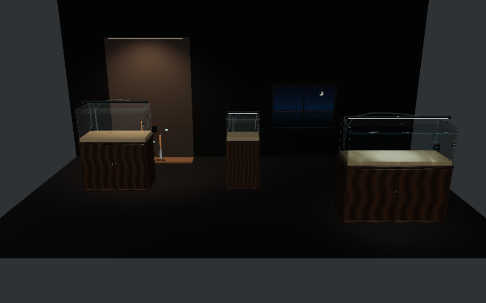
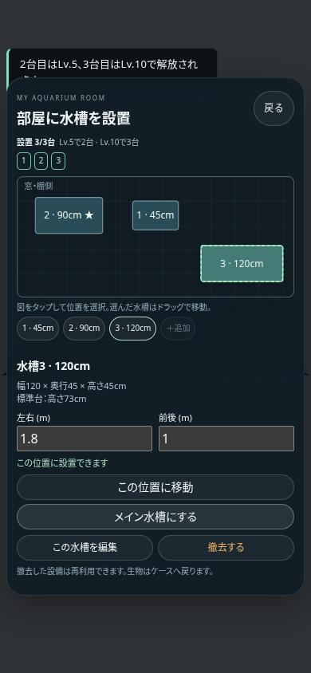
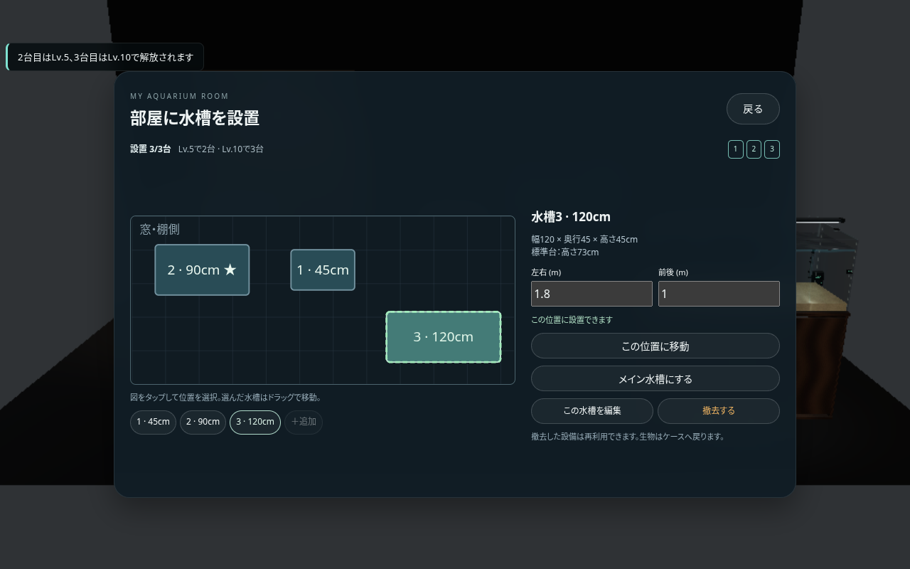
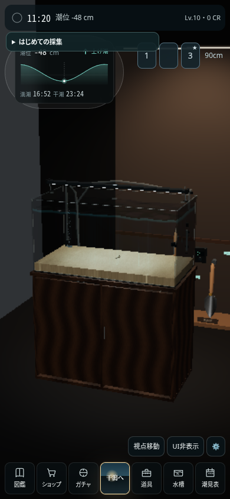

# 部屋の水槽 — v0.25.0

水槽編集の「部屋に設置」から配置画面を開きます。配置図で選択・ドラッグ、または左右／前後の数値入力で位置を変更できます。水槽と台、付属設備のための余裕を含めて、重なりや部屋の外への設置を防ぎます。

| 水槽 | 幅 × 奥行 × 高さ | 水深 | 標準台の高さ |
| --- | --- | --- | --- |
| 45cm | 45 × 30 × 30cm | 25cm | 73cm |
| 60cm（既存） | 60 × 30 × 36cm | 30cm | 73cm |
| 90cm | 90 × 45 × 45cm | 39cm | 73cm |
| 120cm | 120 × 45 × 45cm | 39cm | 73cm |

- Lv.1〜4：1台。Lv.5〜9：2台。Lv.10以上：3台。
- 各サイズの標準水槽・木製台は初期設備として使用可能。色違いの水槽・台は既存の設備ガチャに追加しました。90／120cmの台は中央補強を持ちます。
- 各水槽は生物・底床・飾り・設備・位置を個別に保存します。生物の実寸は水槽のサイズ変更でも維持します。設備の接続は従来どおりプリセットで自動接続します。
- 「メイン水槽にする」で干潟からの帰宅時・ゲーム再開時の水槽を指定します。ホーム／水槽編集の1・2・3ボタンは閲覧中の水槽だけを切り替えます。
- 60cmを含むすべての水槽を撤去できます。生物はケースに戻し、設備は再利用できます。ケースに空きが足りない場合は撤去しません。0台の部屋も保存でき、ホームの「水槽を設置」から再設置できます。
- ガチャ設備の所持数は部屋全体で共有します。1個しか持っていない設備を複数水槽に重複設置できません。初期設備は各水槽で利用できます。

## 保存と描画

従来のセーブは既存の60cm水槽・生物・配置を1台目へ移行します。`aquariumRoom`を部屋の保存元とし、従来の`tank`にはメイン水槽を反映します。ケースと全水槽の生物ID、設置位置、最大3台、設備の所持数を検証します。インポート・保存失敗時の既存の保護機能も維持します。

閲覧中の1台だけを既存の水面・生物シミュレーションで描画し、周囲の水槽には簡易な水面とLOD2の生物を使用します。ホームと干潟の独立した画質設定は継続して利用できます。

## 確認方法

```sh
npm ci
npm run check
npm run build
npm run smoke:room
node tests/smoke/mobile.mjs --editor-lite
npm run smoke:recovery
```

ブラウザテストはChromiumが必要です。`CHROMIUM_PATH`で実行ファイルを指定できます。CIとPagesの公開前チェックにも部屋のテストを追加しています。

`smoke:room`は60cm撤去とケースへの返却、ケース満員時の撤去拒否、0台の再読込、サイズ変更でも生物の実寸維持、Lv.5／10の追加枠、異なる水槽の生物、メイン指定、衝突判定、配置図のドラッグ、共有在庫、保存再読込、スマホ縦横4サイズでのボタン到達性を確認します。








