# 走水海岸〜観音崎 — 狭い潮間帯・一定の緩斜面・歩いて入れるアマモ場

2 枚目のマップ `hashirimizu`（走水）。横須賀・走水海岸から観音崎にかけての浜をモチーフに、**小さな砂浜 → 潮干狩りの砂泥 → 胴長で入るアマモ場 → 深場**が 30 m ほどの一つの緩い斜面に並ぶ、狭くて生き物の密な浜を作りました。実在地の再現ではなく、衛星写真から読める「狭い潮間帯＋緩い一定斜面＋歩いて入れるアマモ場」という性格を圧縮したものです。葛西の広い平らな干潟とは逆に、**短い距離に濃い探索**が詰まっています。

- 遊び方: 出かける画面で「走水海岸」を選ぶ（潮位は横須賀）。マップを切り替えると前の浜は片付けられます。
- デバッグ（F3）: 「浜」「汀線」「アマモ場」「貝床」へ移動、潮位の上書きで干満を見比べる。
- 図の作り直し: `node tools/terrain/figures-hashirimizu.mjs`（plan.png / profile.svg）。地形を変えたら `node tools/terrain/bake-hashirimizu.mjs`。

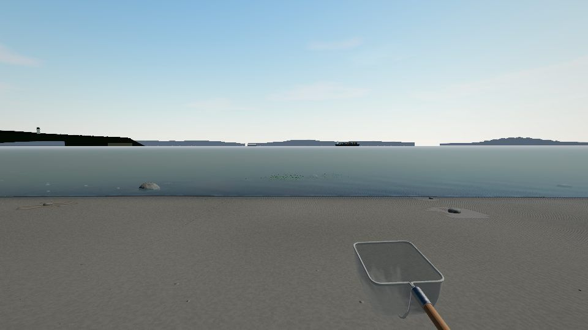

## 1. 実在地から何を取ったか

| 見たもの | 分かったこと | マップへの反映 |
|---|---|---|
| 衛星写真（走水海岸） | 道路と低い護岸の下に幅の狭い砂浜。水際から沖へ暗いアマモ場が帯状・斑状に続き、その間に明るい砂地が点在する。北（観音崎側）は岩と礫が多い | 沿岸 80 m × 沖 30 m に圧縮。護岸・砂浜・潮干狩り帯・アマモ場の帯をそのまま並べ、北側に小岩と牡蠣殻を集める |
| 神奈川県の資料（走水海岸の藻場） | 水深 1 m 以浅の潮間帯〜浅海にアマモ・コアマモの群落。湾奥より水質・底質の悪化が少なく、群落が比較的安定。ケフサイソガニ、ユビナガホンヤドカリ（2 cm ほど、右のはさみが大きい）などが見られる | 探索の潮位でアマモ場の水深を 30〜80 cm に設計。カニ・ヤドカリを新しく追加 |
| 地勢 | 浜は東向きで浦賀水道に面し、朝日は海から昇る。北東すぐに観音崎（灯台）、対岸に房総の丘（富津岬〜鋸山）、湾口に第二海堡、南に走水の漁港、背後に三浦の丘。東京湾を出入りする大型船が絶えず通る | 世界座標で海を +x（東）に。遠景（`skyline.ts`）に房総・観音崎と灯台・第二海堡・走水の家並み・三浦の丘を描き、コンテナ船・タンカー・自動車運搬船・東京湾フェリーを航路に沿って動かす |
| 潮位 | 湾口の横須賀は東京より潮差がやや小さく、潮時が少し早い | 潮位観測点 `jma_yokosuka` を追加（下記 9 章の注意） |

## 2. 地形: 一定の緩い斜面

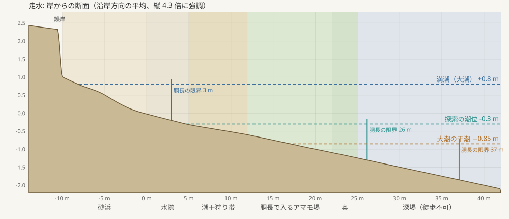

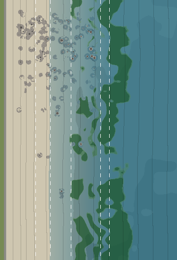

形はすべて `src/world/maps/hashirimizu/shape.ts` の純関数で、地形 PNG の焼き込み（`tools/terrain/bake-hashirimizu.mjs`）とゲーム（アマモ場・貝床・岩・生息環境）が同じ関数を使います。岸からの距離 d（m）で:

| d | 区分 | 勾配 | 探索の潮位 -0.3 m での水深 | 作り |
|---|---|---|---|---|
| -10.6〜-10 | 護岸 | — | — | 高さ 1.3 m のコンクリート護岸（2 m ごとの目地、足元に濡れ・フジツボ・緑藻、上に手すり）。裏は草地と道路 |
| -10〜0 | 砂浜 | 1/9 | 陸 | 高潮線の小さなバーム、打ち上げられたアマモの帯（ウラック）、貝殻、流木 |
| 0〜5 | 水際 | 1/17 → 1/25 | 汀線（4.8 m）より岸側は干出 | 寄せ波の届く濡れた砂 |
| 5〜12 | 潮干狩り帯 | **1/25（少し緩い）** | 1〜30 cm | 砂〜砂泥。アサリの貝床 18 か所、ハマグリ、ミズヒキゴカイ |
| 12〜22 | 胴長で入るアマモ場 | 1/20 | 30〜80 cm | 密な帯 → 裸地 → 疎ら → 小さな砂地 → 再び密（3 章） |
| 22〜25 | アマモ場の奥 | 1/20 | 80〜95 cm | 胴長の限界が近い |
| 25〜 | 深場 | 1/20 のまま | 95 cm〜 | 崖も段差も作らず同じ斜度で深くなり、胴長（限界 1.0 m）で進めなくなる |

斜面には沿岸方向に ±4 cm のゆるい起伏と、岩のまわりの浅い洗掘（干潮で潮だまりになる）だけを足しています。単体テストで「0.25 m ごとに 1/7 より急な所がない」「浜より沖で段差になる上りがない」「5〜12 m が前後より緩い」を確かめています。

### 潮と探索範囲

地形は潮位 -0.3 m（平均水面より少し下、昼の探索でよく出会う潮）で設計しました。潮が動くと、潮干狩り帯の露出・アマモ場の水深・歩いて行ける範囲が一緒に変わります。

| 潮位 | 汀線 | 胴長の限界（水深 1.0 m） | 見えるもの |
|---|---|---|---|
| +0.8 m（大潮の満潮） | 砂浜の中 | 3 m | 砂浜と水際だけ。アマモ場は 1.4 m 以上の水の下で大きくなびく |
| -0.3 m（探索の潮位） | 4.8 m | 26 m | 潮干狩り帯は浅い水の下、アマモ場に胴長で入れる |
| -0.85 m（大潮の干潮） | 17 m | 37 m | 潮干狩り帯が干上がり、アマモ場の浅い側は倒れて濡れた敷物に。奥のアマモ場まで歩ける |

プレイヤーの胴長はマップ定義の `wading`（`maxDepth_m: 1.0`）で、深くなるほど歩みが遅くなり、限界を超えると進めません。カメラは水面より下に潜らないようにしています。

## 3. アマモ場のパターン

`eelgrassField()` が沖へ向かって「密な帯（12〜17 m）→ 裸地 → 疎らな株（18〜21 m）→ 小さな砂地 → 再び密（22〜34 m）」を作り、帯の境界は沿岸方向に揺らぎ、クローンの切れ目（ノイズ）と斑で途切れます。岩の多い北側では生えにくく、南（右）ほど濃くなります。既存の `AmamoMeadow` にこの場の関数と閾値を渡すだけで、群落の生成・InstancedMesh・LOD・距離に応じた揺れの更新頻度低下・ストリーミングはそのまま使っています（`MeadowLayout`）。

d 12〜30 m の内訳は密 34 %・疎ら 5 %・小さな株 4 %・裸地 58 %。生き物が集まるのは**群落の縁と裸地の境目**なので、縁が長くなるよう裸地を多めにしています。

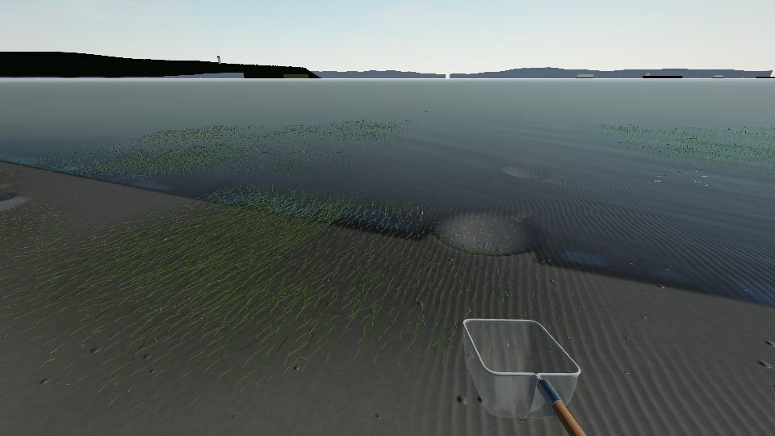

## 4. 生息環境とホットスポット

生息環境（`Habitat`）に、潮に関係なく決まる地物のタグを 2 m の粗いセルごとに加えました（`featureTagsOf`）。

| タグ | 条件 | 主な生き物 |
|---|---|---|
| `eelgrass` | アマモの被度 0.4 以上 | シラタエビ |
| `eelgrass_edge` | 群落の縁（疎らなセル、裸地に接する密なセル、群落に接する裸地） | マハゼ、シラタエビ、ボラの幼魚、ケフサイソガニ、ユビナガホンヤドカリ |
| `bare` | アマモが生えうる帯の裸地 | マハゼ、ボラの幼魚、アラムシロ。アカエイの食み跡（摂餌痕）もここに掘られる |
| `rocky` | 小岩・牡蠣殻・礫 | ケフサイソガニ、ユビナガホンヤドカリ、アラムシロ、マガキ |
| （既存）`shallow` `exposed_sand` `waterline` `small_pool` | 潮干狩り帯 | アサリ（貝床）、ハマグリ、ミズヒキゴカイ、ユビナガホンヤドカリ、アラムシロ |

左（北・観音崎側）は小岩・牡蠣殻・カニ・ヤドカリ、中央は砂泥と潮干狩り、右（南）はアマモが濃く小魚・エビが多い、という勾配を、岩の分布とアマモの濃さから連続的に作っています（バイオームの境界は作っていません）。種の出現規則は `maps: ["hashirimizu"]` 付きで各種の JSON に追加し、葛西の規則には `maps: ["kasai_west"]` を付けて葛西の挙動は変えていません（エドハゼは泥干潟の種なので走水には出しません）。

**出会いの密度**（`forceSpawn` で浜全体を埋めて、歩ける範囲を 2 m 格子で調べた値。鳥を除く。ほかにアサリの貝床が 442 個）:

| 潮位 | 個体数 | 5 m 以内に生き物がいる地点 | 10 m 以内 | 最寄りまでの中央値 |
|---|---|---|---|---|
| -0.3 m | 約 300 | 94 % | 100 % | 2.3 m |
| -0.85 m | 約 270 | 78 % | 97 % | 2.9 m |

「5〜10 m 歩けば何かに出会う」を満たしています。生き物は岩の中には置かれません（`Habitat.solids`）。

## 5. 新しい生き物

いずれも手続きモデルを個体ごとに実寸で作り、専用ドライバで動かします（`src/creatures/species/shore/`）。行動は図鑑の「行動」に記録でき、ケース・水槽・図鑑のプレビューでもそのまま動きます。カニ・ヤドカリ・巻貝は 3 m より遠いと関節つきのモデル（カニで約 40 部品）を 1 枚に焼き込んだメッシュに替え、ボラは遠いと目と小さな鰭を省き、離れるほど脚や尾の動きの計算も減らします（観察中と水槽では常に全部）。

| 種 | 大きさ | どこで | 動き | 採り方 |
|---|---|---|---|---|
| ケフサイソガニ | 甲幅 0.8〜3.2 cm | 小岩・牡蠣殻のまわり、群落の縁 | 4 対の脚を交互に運ぶ横歩き、はさみで交互に摂餌、近づくとはさみを振り上げて威嚇、さらに近づくと横走りで逃げて身を伏せる。オスははさみが大きく毛房がある | 網 |
| ユビナガホンヤドカリ | 殻長 0.6〜2.8 cm | 岩のまわり・水際・潮だまり・群落の縁 | 細長い巻貝の殻を揺らしながら歩く、触角を振る、驚くと殻に引っ込み、しばらくして目から出てくる | 網 |
| アラムシロ | 殻高 0.6〜1.6 cm | 潮干狩り帯の浅い水・岩のまわり | 足をすべらせてゆっくり這い、水管を振って匂いを探る、砂に潜って水管だけ出す、触れそうになると殻に引っ込む | 網 |
| ボラ（ハク〜スバシリ） | 春 2〜4.5 cm、夏 4〜9.5 cm、秋 8〜16 cm | 群落の縁・浅瀬・裸地の水面近く | 同じ群れの個体が同じ 8 の字の道筋をそれぞれの位置で泳ぐ群泳、近づくと散ってまた集まる、水面をついばむ、ときどき跳ぶ | 網（素早い） |
| ミズヒキゴカイ | 4〜15 cm | 潮干狩り帯の砂泥（干出しても） | 巣穴のまわりに赤い糸（鰓と触手）を広げ、近づくと引っ込める。掘り出すと身をくねらせる | スコップ |
| マガキ | 3〜15 cm | 小岩の根元、岩のまわりの殻の塊 | 水中で殻を少し開けて濾過し、影や振動で閉じる。干出すると閉じたまま | 観察のみ（岩に固着） |

モデルの確認用ビューア: `npm run dev` → `/gerupamasini/reference/shore-viewer/`。

| ケフサイソガニ | ユビナガホンヤドカリ | ミズヒキゴカイ |
|---|---|---|
| 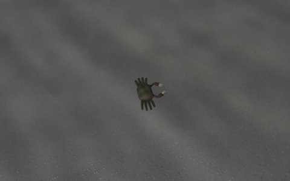 | 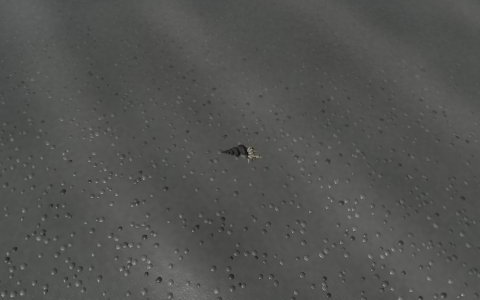 | 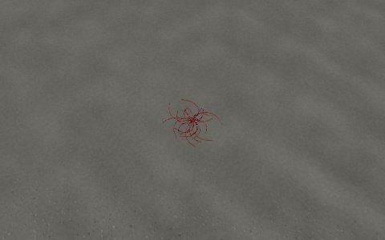 |
| **アラムシロ** | **ボラ** | **マガキ** |
| 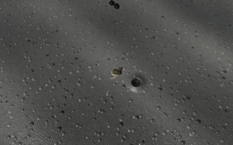 | 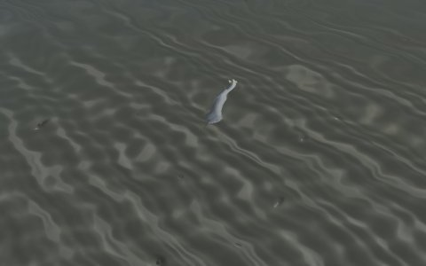 | 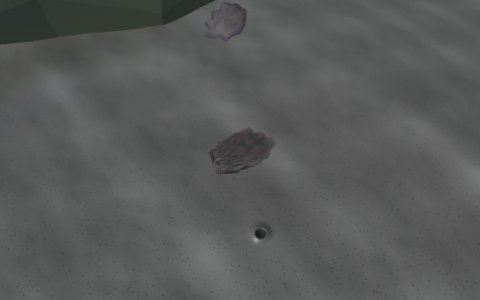 |

## 6. 景観（控えめに）

`props.ts` が浜に置くもの: 低い護岸と手すり、小岩（5 形状の InstancedMesh、北側に群れる）とその根元の牡蠣、ばらけた牡蠣殻、アサリ・ハマグリの殻（高潮線と潮干狩り帯）、白っぽく晒された流木、高潮線に打ち上げられたアマモの帯、護岸の裏の草。遠景は `skyline.ts`（房総の丘・鋸山、観音崎と灯台、第二海堡、走水の家並みと漁港、三浦の丘、航路を動く船）。観光地の再現ではなく、東京湾の自然な海岸に見えることを優先しています。

| 大潮の干潮の潮干狩り帯 | 胴長でアマモ場へ（-0.3 m） |
|---|---|
| 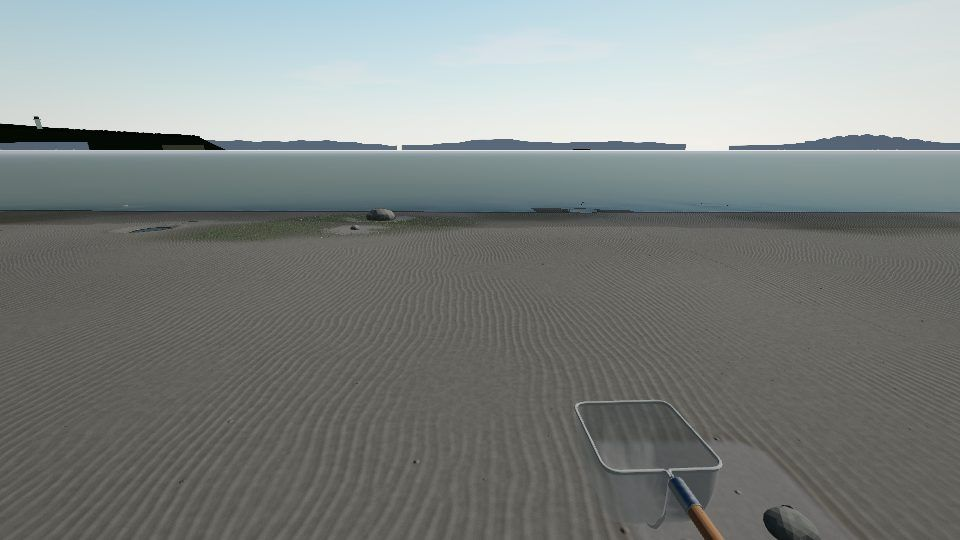 | 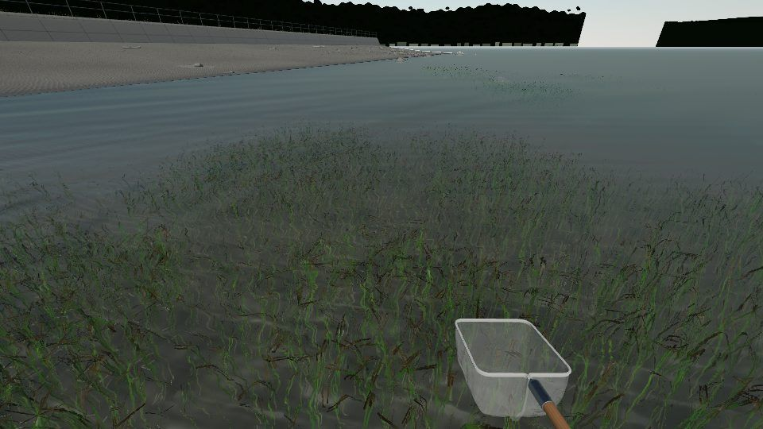 |
| **干潮の北側の岩場** | **満潮（+0.8 m）** |
| 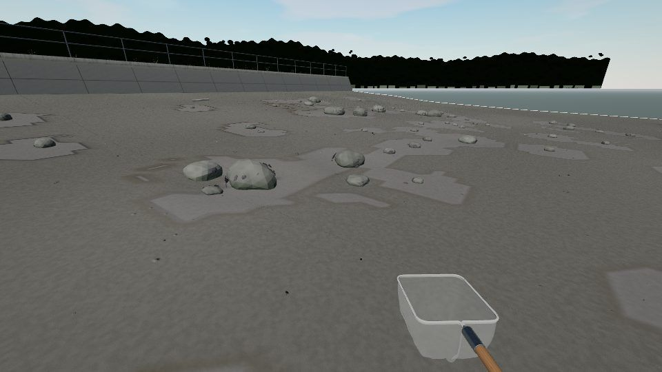 | 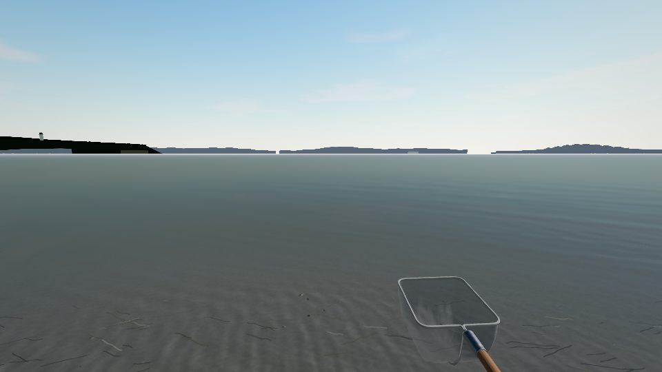 |

## 7. 既存システムへの統合

大きな作り替えはせず、マップ定義から差し込める口を足しました。

- **マップ定義**（`public/data/maps/hashirimizu.json`）: `layout`（浜固有の配置）、`wading`（装備と限界水深）、`habitat`（粗いセル 2 m・最小出現距離 4 m）を任意項目として追加。
- **World**: `LAYOUTS[map.layout]` があればアマモ場の関数、貝床・アカエイの摂餌痕の位置、陸の高さ、小道具、障害物、岩の足跡を使う。マップごとに遠景を切り替え、`dispose()` で浜を片付ける。
- **App**: 別のマップへ出かけると前の浜（生き物・貝床・道具・ケース・World）を解放して作り直す。潮位観測点もマップに合わせて替える。
- **Terrain**: 陸に変わる高さ（`setLandLevel`）、礫を「きれいな石の浜」として描く切り替え（`setStonyGravel`）、砂の色味（`setSandTint`。湾口の砂は葛西より暗く褐色がかる）。葛西の見え方は変わらない。
- **Habitat / Spawner**: 地物タグ、岩の足跡、規則の `maps`、干出した地面に住む種の水深範囲（負の下限）。マップにいない種はアカエイの摂餌痕にも入らない。
- **種**: `aquatic` 項目（這う巻貝を水中に留める）。ドライバ登録は `src/creatures/drivers/index.ts` の 6 行。
- **プレイヤー**: 胴長の限界水深、岩の障害物、水面より下にカメラを入れない。
- **観察**: 1〜2 cm の生き物ではカメラを近くから始める。

描画負荷の目安（中画質、1 フレームの全パスのドローコール数。影・水のパスを含む）: 浜 365、干潮の潮干狩り帯 342、胴長でアマモ場 706、干潮の岩場 96、満潮 147。浜全体に 270〜340 個体がいて、描かれるのは種ごとの視認距離（8〜18 m）内の 30〜65 個体です。

## 8. ファイル

| ファイル | 内容 |
|---|---|
| `src/world/maps/hashirimizu/shape.ts` | 地形・底質・岩・アマモの帯の純関数（焼き込みとゲームで共有） |
| `src/world/maps/hashirimizu/index.ts` | `ShoreLayout`（アマモ場・貝床・摂餌痕・陸の高さ・障害物・小道具） |
| `src/world/maps/hashirimizu/props.ts` / `skyline.ts` | 浜の小道具 / 遠景と船 |
| `src/creatures/species/shore/` | 6 種のモデル（`models.ts`）とドライバ（`ShoreDriver.ts`、`crawlers.ts`、`others.ts`） |
| `public/data/maps/hashirimizu.json`、`public/data/maps/hashirimizu/*.png` | マップ定義と焼き込んだ地形 |
| `public/data/species/*.json`、`public/data/behaviors/{crab_shore,hermit_shore,snail_crawl,fish_school}.json` | 種と行動ツリー |
| `public/data/tide/stations/jma_yokosuka.json` | 横須賀の調和定数（暫定） |
| `tools/terrain/bake-hashirimizu.mjs`、`tools/terrain/figures-hashirimizu.mjs` | 地形の焼き込み、この文書の図 |
| `tests/unit/hashirimizu.test.ts` | 斜面・水深・胴長の範囲・アマモの帯・タグ・生き物の出現と動き |
| `reference/shore-viewer/` | 新しい生き物のビューア |

## 9. 限界と今後

- **横須賀の潮汐調和定数は暫定値**です。作業環境から気象庁の表に接続できなかったため、東京の主要 4 分潮から湾口側の振幅比と位相の進みを当てて推定しました。公式の値で `jma_yokosuka.json` を置き換えてください（潮時が数十分ずれる可能性があります）。
- アカエイは摂餌痕（裸地の穴）だけで、本体のモデルはありません。
- ゴカイ類はミズヒキゴカイ 1 種で代表させています。
- 生き物は岩の中には出現しませんが、歩いて岩を通り抜けることはあります。
- ボラの群れは「同じ道筋を各自の位置で泳ぐ」近似で、個体どうしの相互作用（分離・整列）はしていません。
