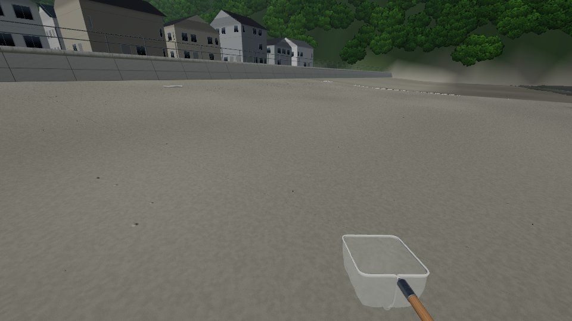
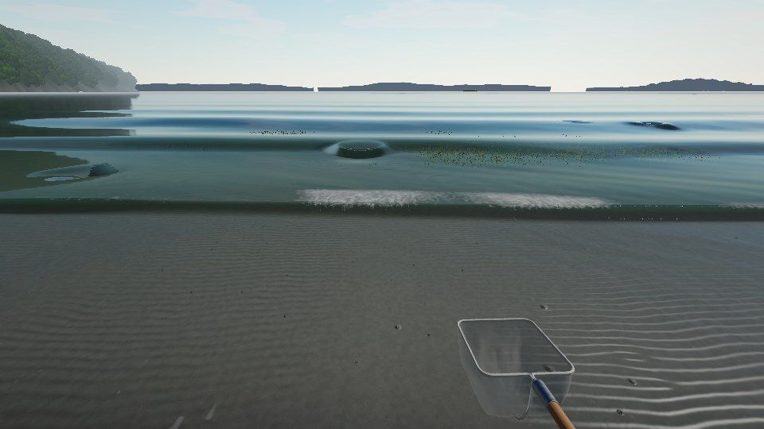
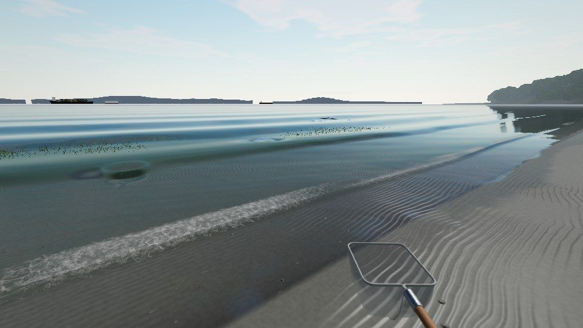
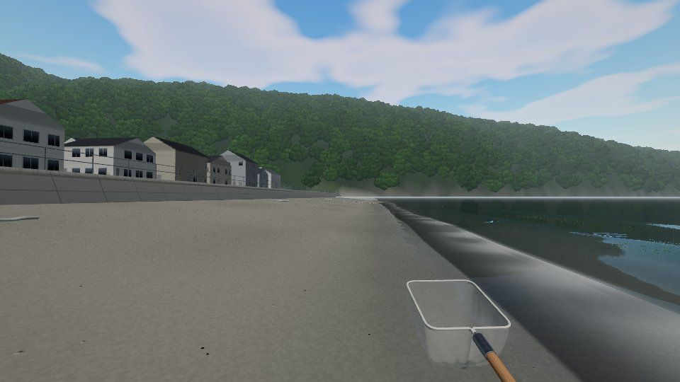
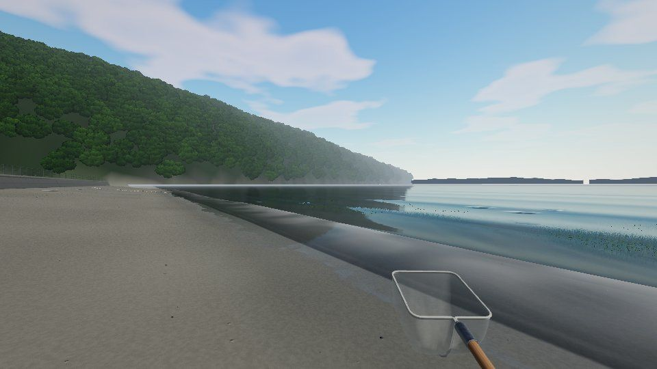
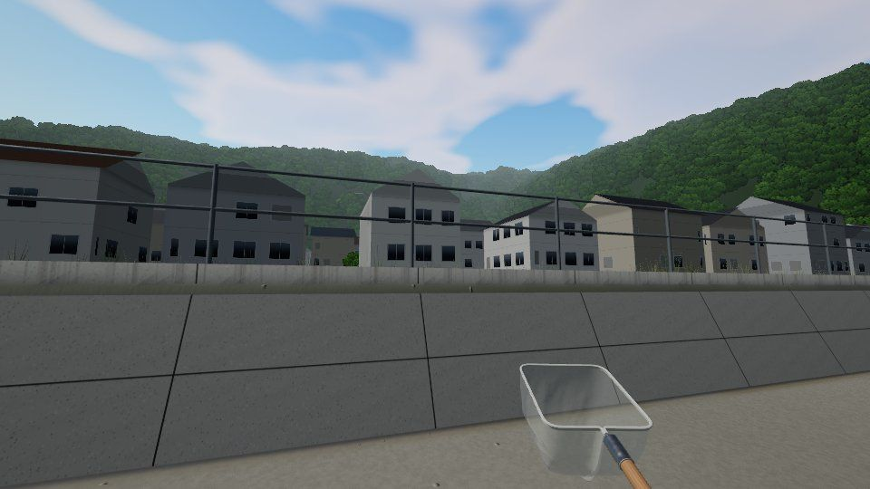
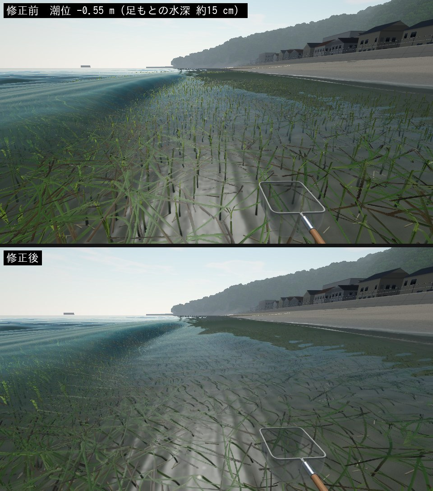

# 走水海岸〜観音崎 — 狭い潮間帯・一定の緩斜面・歩いて入れるアマモ場

2 枚目のマップ `hashirimizu`（走水）。横須賀・走水海岸から観音崎にかけての浜をモチーフに、**小さな砂浜 → 潮干狩りの砂泥 → 胴長で入るアマモ場 → 深場**が 30 m ほどの一つの緩い斜面に並ぶ、狭くて生き物の密な浜を作りました。実在地の再現ではなく、衛星写真から読める「狭い潮間帯＋緩い一定斜面＋歩いて入れるアマモ場」という性格を圧縮したものです。葛西の広い平らな干潟とは逆に、**短い距離に濃い探索**が詰まっています。

- 遊び方: 出かける画面で「走水海岸」を選ぶ（潮位は横須賀）。マップを切り替えると前の浜は片付けられます。
- デバッグ（F3）: 「浜」「汀線」「アマモ場」「貝床」へ移動、潮位の上書きで干満を見比べる。
- 図の作り直し: `node tools/terrain/figures-hashirimizu.mjs`（plan.png / profile.svg）。地形を変えたら `node tools/terrain/bake-hashirimizu.mjs`。

## 1. 実在地から何を取ったか

| 見たもの | 分かったこと | マップへの反映 |
|---|---|---|
| 衛星写真（走水海岸） | 道路と低い護岸の下に幅の狭い砂浜。水際から沖へ暗いアマモ場が帯状・斑状に続き、その間に明るい砂地が点在する | 沿岸 80 m × 沖 30 m に圧縮。護岸・砂浜・潮干狩り帯・アマモ場の帯をそのまま並べる。岩と牡蠣は置かず、護岸から沖まで砂と砂泥だけの浜にした |
| 神奈川県の資料（走水海岸の藻場） | 水深 1 m 以浅の潮間帯〜浅海にアマモ・コアマモの群落。湾奥より水質・底質の悪化が少なく、群落が比較的安定。ケフサイソガニ、ユビナガホンヤドカリ（2 cm ほど、右のはさみが大きい）などが見られる | 探索の潮位でアマモ場の水深を 30〜80 cm に設計。カニ・ヤドカリを新しく追加 |
| 地勢 | 浜は東向きで浦賀水道に面し、朝日は海から昇る。北東すぐに観音崎（灯台）、対岸に房総の丘（富津岬〜鋸山）、湾口に第二海堡、南に走水の漁港、背後に三浦の丘。東京湾を出入りする大型船が絶えず通る | 世界座標で海を +x（東）に。近くの陸（`land.ts`）は実際の地面: 砂浜の後ろの町、その奥の木の茂った三浦の丘、北の観音崎の岬、南の低い岬と漁港の堤防。遠景（`skyline.ts`）は航路を動くコンテナ船・タンカー・自動車運搬船・東京湾フェリーと、ときどき通る護衛艦（すぐ北の横須賀から）・ごくまれに原子力空母。対岸の房総と第二海堡は置かず、沖は水平線まで開けている |
| 潮位 | 湾口の横須賀は東京より潮差がやや小さく、潮時が少し早い | 潮位観測点 `jma_yokosuka` を追加（下記 9 章の注意） |

## 2. 地形: 一定の緩い斜面

形はすべて `src/world/maps/hashirimizu/shape.ts` の純関数で、地形 PNG の焼き込み（`tools/terrain/bake-hashirimizu.mjs`）とゲーム（アマモ場・貝床・生息環境）が同じ関数を使います。岸からの距離 d（m）で:

| d | 区分 | 勾配 | 探索の潮位 -0.3 m での水深 | 作り |
|---|---|---|---|---|
| -10.6〜-10 | 護岸 | — | — | 高さ 1.3 m のコンクリート護岸（2 m ごとの目地、足元に濡れ・フジツボ・緑藻、上に手すり）。裏は草地と道路 |
| -10〜0 | 砂浜 | 1/9 | 陸 | 高潮線の小さなバーム、打ち上げられたアマモの帯（ウラック）、貝殻、流木 |
| 0〜5 | 水際 | 1/17 → 1/25 | 汀線（4.8 m）より岸側は干出 | 寄せ波の届く濡れた砂 |
| 5〜12 | 潮干狩り帯 | **1/25（少し緩い）** | 1〜30 cm | 砂〜砂泥。アサリの貝床 18 か所、ハマグリ、ミズヒキゴカイ |
| 12〜22 | 胴長で入るアマモ場 | 1/20 | 30〜80 cm | 密な帯 → 裸地 → 疎ら → 小さな砂地 → 再び密（3 章） |
| 22〜25 | アマモ場の奥 | 1/20 | 80〜95 cm | 胴長の限界が近い |
| 25〜 | 深場 | 1/20 のまま | 95 cm〜 | 崖も段差も作らず同じ斜度で深くなり、胴長（限界 1.0 m）で進めなくなる |

斜面には沿岸方向に ±4 cm のゆるい起伏と高潮線の小さなバームだけを足しています。単体テストで「0.25 m ごとに 1/7 より急な所がない」「浜より沖で段差になる上りがない」「5〜12 m が前後より緩い」を確かめています。

### 潮と探索範囲

地形は潮位 -0.3 m（平均水面より少し下、昼の探索でよく出会う潮）で設計しました。潮が動くと、潮干狩り帯の露出・アマモ場の水深・歩いて行ける範囲が一緒に変わります。

| 潮位 | 汀線 | 胴長の限界（水深 1.0 m） | 見えるもの |
|---|---|---|---|
| +0.8 m（大潮の満潮） | 砂浜の中 | 3 m | 砂浜と水際だけ。アマモ場は 1.4 m 以上の水の下で大きくなびく |
| -0.3 m（探索の潮位） | 4.8 m | 26 m | 潮干狩り帯は浅い水の下、アマモ場に胴長で入れる |
| -0.85 m（大潮の干潮） | 17 m | 37 m | 潮干狩り帯が干上がり、アマモ場の浅い側は倒れて濡れた敷物に。奥のアマモ場まで歩ける |

プレイヤーの胴長はマップ定義の `wading`（`maxDepth_m: 1.0`）で、深くなるほど歩みが遅くなり、限界を超えると進めません。カメラは水面より下に潜らないようにしています。

## 3. アマモ場のパターン

`eelgrassField()` が沖へ向かって「密な帯（12〜17 m）→ 裸地 → 疎らな株（18〜21 m）→ 小さな砂地 → 再び密（22〜34 m）」を作り、帯の境界は沿岸方向に揺らぎ、クローンの切れ目（ノイズ）と斑で途切れます。南（右）ほど濃くなります。既存の `AmamoMeadow` にこの場の関数と閾値を渡すだけで、群落の生成・InstancedMesh・LOD・距離に応じた揺れの更新頻度低下・ストリーミングはそのまま使っています（`MeadowLayout`）。

d 12〜30 m の内訳は密 34 %・疎ら 5 %・小さな株 4 %・裸地 58 %。生き物が集まるのは**群落の縁と裸地の境目**なので、縁が長くなるよう裸地を多めにしています。

## 4. 生息環境とホットスポット

生息環境（`Habitat`）に、潮に関係なく決まる地物のタグを 2 m の粗いセルごとに加えました（`featureTagsOf`）。

| タグ | 条件 | 主な生き物 |
|---|---|---|
| `eelgrass` | アマモの被度 0.4 以上 | シラタエビ、イソスジエビ、アミメハギ、ヨウジウオ、ケフサイソガニ |
| `eelgrass_edge` | 群落の縁（疎らなセル、裸地に接する密なセル、群落に接する裸地） | マハゼ、ヒメハゼ、シラタエビ、イソスジエビ、ボラの幼魚、アミメハギ（幼魚）、ヨウジウオ、ケフサイソガニ、ユビナガホンヤドカリ |
| `bare` | アマモが生えうる帯の裸地 | マハゼ、ヒメハゼ、ボラの幼魚、アラムシロ、ユビナガホンヤドカリ、イシガレイの若魚、アカエイ（28 回目）（走水にはアカエイの摂餌痕は置かない） |
| （既存）`shallow` `exposed_sand` `waterline` `small_pool` `pool` | 潮干狩り帯と水際、潮だまり | アサリ（貝床）、ハマグリ、ミズヒキゴカイ、ユビナガホンヤドカリ、アラムシロ、ケフサイソガニ、ヒメハゼ（浅い砂底）、イソスジエビ（夜は水際まで）。走水には潮だまりが無いので `small_pool` `pool` だけの規則は効かない、イシガレイの若魚、アカエイ（28 回目） |
| （既存）`deep` | 水深 0.6 m を超える沖の砂底 | アカエイ（28 回目） |

沖へ向かって潮干狩り帯（貝・ゴカイ・ヤドカリ）→ アマモ場の縁と裸地（ハゼ・エビ・ボラ・カニ）→ 群落の中（エビ・カニ）と移り、南（右）ほどアマモが濃く小魚・エビが多くなります。境界はアマモの濃さから連続的に決まり、バイオームの線は引いていません。種の出現規則は `maps: ["hashirimizu"]` 付きで各種の JSON に追加し、葛西の規則には `maps: ["kasai_west"]` を付けて葛西の挙動は変えていません（エドハゼは泥干潟の種なので走水には出しません）。

**出会いの密度**（`forceSpawn` で浜全体を埋めて、歩ける範囲を 2 m 格子で調べた値。鳥を除く。ほかにアサリの貝床が 442 個）:

| 潮位 | 個体数 | 5 m 以内に生き物がいる地点 | 10 m 以内 | 最寄りまでの中央値 |
|---|---|---|---|---|
| -0.3 m | 約 260 | 93 % | 100 % | 2.3 m |
| -0.85 m | 約 250 | 74 % | 97 % | 3.3 m |

「5〜10 m 歩けば何かに出会う」を満たしています。

## 5. 新しい生き物

いずれも手続きモデルを個体ごとに実寸で作り、専用ドライバで動かします（`src/creatures/species/shore/`）。行動は図鑑の「行動」に記録でき、ケース・水槽・図鑑のプレビューでもそのまま動きます。カニ・ヤドカリ・巻貝は 3 m より遠いと関節つきのモデル（カニで約 40 部品）を 1 枚に焼き込んだメッシュに替え、ボラは遠いと目と小さな鰭を省き、離れるほど脚や尾の動きの計算も減らします（観察中と水槽では常に全部）。

| 種 | 大きさ | どこで | 動き | 採り方 |
|---|---|---|---|---|
| ケフサイソガニ | 甲幅 0.8〜3.2 cm | アマモ場の縁と株の間、潮だまり、水際 | 4 対の脚を交互に運ぶ横歩き、はさみで交互に摂餌、近づくとはさみを振り上げて威嚇、さらに近づくと横走りで逃げて身を伏せる。オスははさみが大きく毛房がある | 網 |
| ユビナガホンヤドカリ | 殻長 0.6〜2.8 cm | 水際・潮だまり・群落の縁・裸地 | 細長い巻貝の殻を揺らしながら歩く、触角を振る、驚くと殻に引っ込み、しばらくして目から出てくる | 網 |
| アラムシロ | 殻高 0.6〜1.6 cm | 潮干狩り帯の浅い水・裸地 | 足をすべらせてゆっくり這い、水管を振って匂いを探る、砂に潜って水管だけ出す、触れそうになると殻に引っ込む | 網 |
| ボラ（ハク〜スバシリ） | 春 2〜4.5 cm、夏 4〜9.5 cm、秋 8〜16 cm | 群落の縁・浅瀬・裸地の水面近く | 同じ群れの個体が同じ 8 の字の道筋をそれぞれの位置で泳ぐ群泳、近づくと散ってまた集まる、水面をついばむ、ときどき跳ぶ | 網（素早い） |
| ミズヒキゴカイ | 4〜15 cm | 潮干狩り帯の砂泥（干出しても） | 巣穴のまわりに赤い糸（鰓と触手）を広げ、近づくと引っ込める。掘り出すと身をくねらせる | スコップ |

25 回目に加わった種（走水だけ。ヒメハゼは葛西にも出る）:

| 種 | 大きさ | どこで | 動き | 採り方 |
|---|---|---|---|---|
| ヒメハゼ | 全長 3〜10 cm | 浅い砂底、群落の縁の砂地 | マハゼと同じリグで着底・ダッシュ・あくび・警戒・逃走。5〜9 月の成魚の雄は第 1 背鰭の第 1 棘が糸状に伸びた繁殖期の形 | 網 |
| イソスジエビ | 全長 2.5〜5.5 cm | 昼は浅場にまばら、夜は水際まで群れで、アマモ場 | シラタエビの共有モデルの種プロファイル（縞、歩脚の輪、尾扇の斑）。静止・歩行・短く泳ぐ・摂餌・後方へ跳んで逃走 | 網 |
| アミメハギ | 全長 1.4〜6.5 cm | 群落の葉の間（春〜秋）、縁に幼魚 | 背鰭と臀鰭を波打たせて定位、ゆっくり泳ぐ、ついばむ、葉に隠れる、逃避、夜は葉をくわえて眠る。通ると葉がよける | 網 |
| ヨウジウオ | 全長 9〜28 cm | 群落の中と縁 | 中層での静止、背びれで泳ぐ、アマモの葉に沿って揺れる、ピボット摂餌、草陰へ逃げる | 網 |

モデルの確認用ビューア: `npm run dev` → `/gerupamasini/reference/shore-viewer/`。

| ケフサイソガニ | ユビナガホンヤドカリ | ミズヒキゴカイ |
|---|---|---|
|  |  |  |
| **アラムシロ** | **ボラ** | |
|  |  | |

## 6. 景観（控えめに）

`props.ts` が浜に置くもの: 低い護岸と手すり、アサリ・ハマグリの殻（高潮線と潮干狩り帯）、白っぽく晒された流木、高潮線に打ち上げられたアマモの帯、護岸の裏の草。観光地の再現ではなく、東京湾の自然な海岸に見えることを優先し、人は置いていません。

**まわりの陸**（`land.ts`）は絵ではなく世界に固定された地面で、浜の断面（砂浜・護岸・道路）をそのまま海岸沿いに延ばし、その上に町と丘と岬を盛っています。
- 砂浜の後ろ: 海岸通りから奥へ約 120 m の町。海岸に平行な通り 4 本と 46 m ごとの横道、2〜3 階の家（白・ベージュ・灰の外壁、瓦や鋼板の屋根）約 130 棟、ところどころに 4 階の集合住宅と木のある庭。地面は丘へ向かってゆるく上る。
- 町の奥: 急な斜面で立ち上がり、さらに 200〜280 m 奥で稜線（高さ約 100 m）になる三浦の丘。
- 北: 観音崎に倣った岬。浜の北端から 70 m 先で立ち上がり、東へ海に張り出す（山頂 約 70 m、足もとは波に洗われる岩）。塔や灯台は置いていません。
- 南: 低い岬と漁港の堤防。浜と護岸は両端の岬まで続く。
- 森は常緑広葉樹（スダジイ・タブ）の丸い樹冠 約 7,400 本を、描いた樹冠アトラスの「視点を向く板」として 1 回のインスタンス描画で描きます。手前ほど密に小さく、奥ほど疎に大きく置いて林冠を閉じ、海岸から見えない裏斜面と稜線の向こうには置きません。光は空からの上向き主体で、日の向きで少し陰ります。
- 地面は頂点色の格子 2 枚（近く 4 m、遠く 16 m。深い海底は省く）。影は落とさず、霞は場面の霧より薄い専用のもので、数百 m 先の丘ははっきり、1 km で柔らかくかすみます。
- 負荷: 加わるのは 1 フレームにドローコール +10〜12、三角形 +3.5 万（中画質、全パス）。読み込みは樹冠の配置に約 0.2 秒。

遠景は `skyline.ts`（航路を動く船。対岸の房総や第二海堡の島影は置かず、沖は水平線まで開けている）。

航路は 5 本で、船は航路を一巡するたびに入れ替わります。どの船が来るかは航路と「何巡目か」から決まる乱数で、ゲームの時刻は実時刻なので、同じ時刻なら誰が見ても同じ船です。

- フェリーの航路を除く 4 本では、一巡の 15 % が護衛艦です。こんごう型（格子の三脚マスト）、あたご／まや型（棒マストとヘリ格納庫）、もがみ型 FFM（一本の統合マストのなめらかな艦影）が同じ割合で来ます。航路全体で 1 時間に 1〜2 隻ほどです。
- 岸に近い入港側の 2 本（3.0 km・3.4 km、横須賀へ向かう）では、一巡の 3 % が原子力空母（ニミッツ級、横須賀の CVN-73 のような艦影: 張り出した飛行甲板、艦橋、甲板に並ぶ艦載機）です。数時間に 1 度ほどです。
- 同じ絵の船は航路をまたいで 1 枚のテクスチャを共有します。表示するのは各航路で 1 隻だけで、描画回数は増えません。
- これまで船は船尾を先にして進んでいたので、艦首（商船は船首）が進む向きを向くように直しました。

| 大潮の干潮の潮干狩り帯 | 胴長でアマモ場へ（-0.3 m） |
|---|---|
|  |  |
| **干潮の北（観音崎側）の端** | **満潮（+0.8 m）** |
|  |  |

### 海と光

参考にした夕暮れの海岸のシーン（映り込み・寄せ波と泡・濡れて光る砂・立体的な雲）に寄せて、海は従来の画面空間の水（深度バッファから水面と底を求める方式）を土台に次を足しました。

- **陸と空の映り込み**（`src/render/Mirror.ts`）: 水面で反転したカメラで、空・丘・森・町・遠景・護岸だけ（`LAYER_MIRROR`）を画面の 4 割（中画質）／5 割（高画質）の解像度で描き、水面の波で歪ませて引きます。水面より下は斜めの近平面で切ります。低画質・超軽量は従来どおり空のキューブマップ。
- **反射率**: 足もと（〜5 m）は従来のゲーム向けの控えめな反射のまま（偏光グラスで底が見える）、20 m より先は物理的なフレネル（偏光グラスでは通る p 偏光の分）に移ります。遠くの海は丘と町を映す鏡になり、近くは見通せます。
- **寄せ波**（`src/world/Surf.ts`、`ShoreLayout.surf`。走水だけ、葛西は無し）: 浅瀬で √(gD) に遅れて間隔の詰まる波頭が岸へ寄せ、波ごとに高さが違います（7 波ほどのセット）。波頭は一直線にならず、約 70 m・18 m・5 m の 3 段階で曲がり（その曲がりも波ごとに少しずつ移る）、沖で斜めに入ってきた波頭は浅くなって遅くなるにつれ岸と平行に向きを変えます（屈折。岸沿いの位相の傾きは深さによらず、波の間隔だけが縮むため）。高さも波頭に沿って数 m ごとに大きく変わり、波頭は途切れ途切れに見え、崩れるのも一部だけ、崩れた後の段波も場所によって強弱があります。波はこの寄せ波だけです（以前は別の方向からの短い波もまだらに重ねていましたが、斑が流れてくると海一面に細かい網目の縞が出て水中も見づらくなったので外しました）。浅くなるにつれて峰が尖って谷が平らになり（クノイド波）、前へ傾いて前面が立ち、薄くなった波頭が光を透かします。水深がほぼ波高になる所（この勾配と周期での砕波指標 約 1.05）で崩れ、頂が白くなり、小さな段波になって泡の転がる前面を押し出しながら水深とともに小さくなり、汀線で遡上波に変わって浜を駆け上がり、止まり、引いていきます。泡は少しだけ: 崩れる頂の白い帯、段波の前面、その後ろに薄いレースの名残、遡上の先端の途切れた泡の線。高さ 0.24 m・周期 3.4 s（湾口の風浪と航跡波）。
  - **立体の波**: 視点の近く（約 35 m 以内）で視線が波の高さの帯を通る所だけ、視線を波面に対してたどり（中画質 12 歩・高画質 16 歩と数回の割線法。低画質・超軽量は平面に描くだけ）、波頭が奥の水面を隠し、前面が面として見えます。前面は空の光を遮られて暗く、砂を巻き上げた濁った緑に、薄い頂は青緑に透けます。
  - 波打ち際: 遡上の先端に手のひら 1〜2 枚分の幅の白い泡の帯が常にあり、駆け上がる間は厚く、止まって引くと薄いレースに。後ろの水膜も少し泡を運ぶ。
  - 泡のテクスチャは、歪めて所々を途切れさせたボロノイの縁（2 段階の大きさ）と大小の泡の輪。波ごとに模様をずらし、回転させた 2 段目の大きさと重ねるので網目には見えません。
  - 近くの波の陰影は波面そのものから傾きを測るので、曲がった波頭もその向きのとおりに光ります。
  - 負荷: 波打ち際が画面の多くを占める視点で、ソフトウェア描画の計測（中央値）で、平面に描くだけの寄せ波は 1 フレームの約 1 %、立体の計算が約 9 %（中画質）／14 %（高画質）。描画回数は増えません。ノイズはサインを使わない算術ハッシュで、波の番号による引数は有界にしてあるので、長く遊んでも精度は落ちません。
- **濡れる砂**: 地面のシェーダが同じ遡上の関数を使い、直近 3 波が届いた所は水膜で光り、大きな波が届く帯は湿って暗くなります（帯の縁は浜に沿って舌状に出入りする）。
- **アマモと波**: 水の描く寄せ波の水面を、地形全体を覆う 25 cm 間隔の高さの場（384×384、毎フレーム描き直す）にも描き、アマモがそれを読みます。水面に届いた葉はその水面に沿って浮くので、波とともに上下し、谷で水面から突き出ることはありません。葉鞘（茎に見える部分）も水面の下に収め、鞘の丈より浅い所（波の谷を含む）では株が根元から沖側へ倒れて、鞘の口が水面下に来る角度まで傾きます。葛西（寄せ波なし）では場を作らず、従来どおり平らな水面です。水面より上に出た点を赤く塗る確認で、アマモ場を低い視点から見た画面の赤は修正前の 1,500〜16,000 画素から 0〜74 画素（崩れた波の前面の足もとの点）になりました。ソフトウェア描画の比較で、場の描画とアマモでの読み取りを止めても 1 フレームは速くならず（波の谷から出ていた葉が水中に寝る分、むしろ 14〜16 % 軽い）、追加の負荷は計測の誤差に埋もれます。
- **水の色**: 葛西の泥っぽいオリーブ色に対し、湾口の澄んだ青緑（濁りは葛西の 0.55 倍。`ShoreLayout.water`）。
- **風紋（砂漣）の向き**: 地面の砂漣は葛西の岸（x 方向）に峰が平行になるように作られていたため、走水では 90° ずれていました。マップごとの回転（`ShoreLayout.rippleAngle`）を持たせ、峰が汀線に平行になるようにしました。
- **砂の色**: 褐色がかった明るい砂（`sandTint [0.98, 0.9, 0.74]`。まわりの陸の地面色も合わせた）。
- **町の家**: インスタンスの拡大率からメートル単位の外壁座標を出し、窓（アルミ枠、上の方に空が映るガラス、雨戸の閉じた窓、窓のない柱間）、階ごとの帯、集合住宅のベランダ、基礎と軒下の陰、屋根の瓦の列をシェーダで描きます。窓が数ピクセルを切る距離では平均色に溶かし、ちらつかせません。
- **空**: three の雲層（太陽側の縁が光り、自己影があり、地平線で霞む積雲）に切り替え、曇りで量と厚みが増えます。雲はゆっくり流れ、海の映り込みにも入ります。

負荷: 映り込みのパスは 1 フレームにドローコール +20〜35、三角形 +3〜5 万（中画質、定常状態）。寄せ波と泡は水と地面のシェーダの中だけで、描画は増えません。

| 波打ち際で崩れる波（-0.3 m） | 段波と遡上 |
|---|---|
|  |  |
| **北の浜（観音崎側を見る）** | **岬の映り込み** |
|  |  |
| **町の家** | **浅いアマモ場（上: 修正前、下: 修正後。潮位 -0.55 m）** |
|  |  |

### 軽量化

計測（ソフトウェア描画、中画質）で重さの内訳を出し、効いていた所を削りました。

- **アマモの影**: 影のパスが見えている葉より多くの三角形（約 160 万）を描いていた。中画質は影なし、高画質は最も近い段だけ。中画質の詳細の距離も少し縮めた（5/16/40 m → 4.5/13/36 m）。
- **小さな生き物の影**: 体長 8 cm 未満は影を落とさない（観察中の個体を除く）。部品の多いエビなどが影のパスで描き直されていた。
- **水中の生き物の描画距離**: 種ごとの指定がない水中の生き物は 14 m まで（それより先は水に紛れて見えない）。ハゼ 1 尾が 10 部品で、浜から沖を見るだけで 280 回描いていた。
- **アカエイの摂餌痕**を走水から外した（穴と散った殻の描画もなくなる）。
- **解像度**: 中画質の上限を 1.5 倍 → 1 倍、高画質を 2 倍 → 1.5 倍に（高密度画面で中画質の画素数が約半分）。
- **シェーダの準備**: 地形・水・波のシェーダを読み込み画面の間にまとめてコンパイル（対応ブラウザでは並列）し、最初の 1 フレームで止まらないように。波の立体の計算は 1 つのループにまとめ、ドライバが展開して巨大化しないように。
- **読み込み**: 生き物のモデルはこの浜に出る種だけを先読み。泡のテクスチャは 1 回のセッションで 1 度だけ作る。

結果（同じ視点、1 フレーム）: 浜から沖を見る 描画回数 442 → 150・三角形 132 万 → 70 万・時間 −36 %、胴長でアマモ場 610 → 233・406 万 → 170 万・−22 %。

## 7. 既存システムへの統合

大きな作り替えはせず、マップ定義から差し込める口を足しました。

- **マップ定義**（`public/data/maps/hashirimizu.json`）: `layout`（浜固有の配置）、`wading`（装備と限界水深）、`habitat`（粗いセル 2 m・最小出現距離 4 m）を任意項目として追加。
- **World**: `LAYOUTS[map.layout]` があればアマモ場の関数、貝床・アカエイの摂餌痕の位置、陸の高さ、砂の色、小道具を使う。マップごとに遠景を切り替え、`dispose()` で浜を片付ける。
- **App**: 別のマップへ出かけると前の浜（生き物・貝床・道具・ケース・World）を解放して作り直す。潮位観測点もマップに合わせて替える。
- **Terrain**: 陸に変わる高さ（`setLandLevel`）、砂の色味（`setSandTint`。湾口の砂は葛西より褐色がかる）、砂漣の向き（`setRippleAngle`）、寄せ波（`setSurf`。遡上で濡れる砂）。葛西の見え方は変わらない。
- **WaterPass**: 映り込み（`setMirror`。画質の `mirror` で解像度）、寄せ波（水と地面で共有する `uSurf`）、水の色と濁り（`setBody`）。
- **Habitat / Spawner**: 地物タグ、規則の `maps`、干出した地面に住む種の水深範囲（負の下限）。マップにいない種はアカエイの摂餌痕にも入らない。
- **種**: `aquatic` 項目（這う巻貝を水中に留める）。ドライバ登録は `src/creatures/drivers/index.ts` の 5 行。
- **プレイヤー**: 胴長の限界水深、水面より下にカメラを入れない。
- **観察**: 1〜2 cm の生き物ではカメラを近くから始める。

描画負荷の目安（中画質、1 フレームの全パスのドローコール数。影・水・映り込みのパスを含む）: 浜 267、干潮の潮干狩り帯 399、胴長でアマモ場 393、干潮の北の端 111、満潮 184、沖から陸を見る 529。浜全体に 250〜300 個体がいて、描かれるのは種ごとの視認距離（8〜18 m）内の 30〜70 個体です。

## 8. ファイル

| ファイル | 内容 |
|---|---|
| `src/world/maps/hashirimizu/shape.ts` | 地形・底質・アマモの帯の純関数（焼き込みとゲームで共有） |
| `src/world/maps/hashirimizu/index.ts` | `ShoreLayout`（アマモ場・貝床・摂餌痕・陸の高さ・砂の色・砂漣の向き・寄せ波・水の色・小道具） |
| `src/world/maps/hashirimizu/props.ts` / `land.ts` / `skyline.ts` | 浜の小道具 / まわりの町（窓のある外壁）・丘・岬・森 / 遠景と船 |
| `src/world/Surf.ts` | 寄せ波・段波・遡上の GLSL（水と砂で共有）と泡のレースのテクスチャ |
| `src/render/Mirror.ts` | 海の映り込み（反転カメラと斜めの近平面） |
| `src/creatures/species/shore/` | 5 種のモデル（`models.ts`）とドライバ（`ShoreDriver.ts`、`crawlers.ts`、`others.ts`） |
| `public/data/maps/hashirimizu.json`、`public/data/maps/hashirimizu/*.png` | マップ定義と焼き込んだ地形 |
| `public/data/species/*.json`、`public/data/behaviors/{crab_shore,hermit_shore,snail_crawl,fish_school}.json` | 種と行動ツリー |
| `public/data/tide/stations/jma_yokosuka.json` | 横須賀の調和定数（暫定） |
| `tools/terrain/bake-hashirimizu.mjs`、`tools/terrain/figures-hashirimizu.mjs` | 地形の焼き込み、この文書の図 |
| `tests/unit/hashirimizu.test.ts` | 斜面・水深・胴長の範囲・アマモの帯・タグ・生き物の出現と動き |
| `reference/shore-viewer/` | 新しい生き物のビューア |

## 9. 限界と今後

- **横須賀の潮汐調和定数は暫定値**です。作業環境から気象庁の表に接続できなかったため、東京の主要 4 分潮から湾口側の振幅比と位相の進みを当てて推定しました。公式の値で `jma_yokosuka.json` を置き換えてください（潮時が数十分ずれる可能性があります）。
- 走水にはアカエイの摂餌痕（昼寝跡）を置いていません（`ShoreLayout.pits` の数を 0 に）。葛西には残っています。
- ゴカイ類はミズヒキゴカイ 1 種で代表させています。
- ボラの群れは「同じ道筋を各自の位置で泳ぐ」近似で、個体どうしの相互作用（分離・整列）はしていません。
