# アカエイ（Hemitrygon akajei）— 手続き生成の SkinnedMesh と行動（Three.js）

`src/creatures/species/akaei/` にあります。形・色・質感はすべて実行時の手続き生成（写真テクスチャなし）で、体盤は格子状のボーンに解析的な波を流す SkinnedMesh、尾は追従チェーンです。ゲームでは春〜秋の満ち潮の浅い砂底・澪に現れ、底で休み、砂に潜り、頭を砂に押しつけて餌を掘り、近づくと砂を巻き上げて逃げます。毒棘があるので網では捕れません（観察で図鑑に登録）。

```bash
npm run dev  →  http://localhost:5173/gerupamasini/reference/akaei-viewer/   # ビューア（5 つの行動、腹面、LOD）
npm run render:akaei                   # この文書の画像を作り直す（ヘッドレス Chromium）
```

ゲーム内で確かめるには、デバッグコンソールで `__higata.debugSpawn('hemitrygon_akajei')`（プレイヤーの前の水中に 1 尾）。

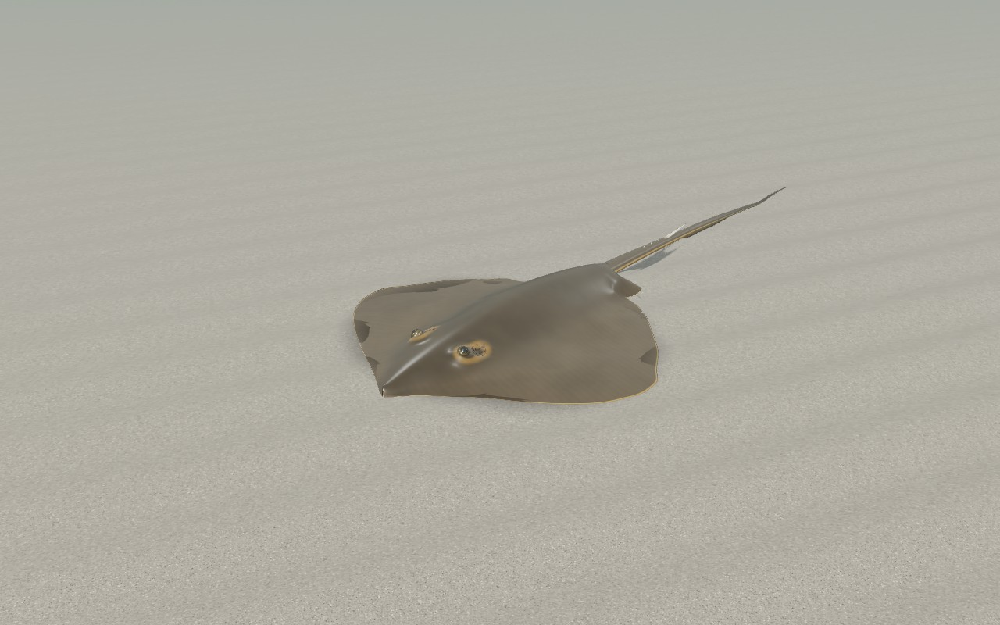

## 1. 実物の調査

写真資料 70 枚（iNaturalist の研究グレード観察を中心に、生体・採集個体・水族館、背面・腹面・側面）と文献で確かめた点です。写真番号は資料の通し番号。

| 調べたもの | 分かったこと | モデルへの反映 |
|---|---|---|
| 体盤の形（Last et al. 2016, FishBase、写真 006・014・035・045・047） | 菱形で幅は長さの 1.1〜1.2 倍。前縁はほぼ直線、吻はやや尖って突出、外角は広く丸い、後縁は凸 | `morphology.ts`: 吻端 z=0.47、外角 z=0.06、体盤後端 z=−0.36（DW=1 単位、DW/DL=1.2）。前縁は吻の後ろでわずかに凹んで外角へ向けて凸、外角は滑らかな最小値（smin）で丸め、後縁は指数 1.75 の凸曲線。腹鰭は体盤の後ろに小さく張り出す |
| 体盤の厚み（写真 005・056・069） | 「比較的厚い」体盤。体幹（頭骨・鰓・内臓）が背側に盛り上がり、胸鰭は縁へ向けて薄くなる。腹面は平ら | 体幹の背高 0.067 DW・腹側 0.031 DW（合計 ≈0.1 DW）。胸鰭は付け根 0.02 DW から縁の丸い薄縁へ。体幹の盛り上がりは傾き 0 で胸鰭へ移る関数 |
| 眼・噴水孔（写真 005・006・011・027・056） | 眼は小さく盛り上がった眼窩に乗り、すぐ後ろに眼より大きな噴水孔。周りの皮膚は黄〜橙色 | 眼は吻端から約 1/4 DL、両眼の間隔 0.16 DW。噴水孔は眼の 0.054 DW 後ろ、外後方へ 15° 傾いた楕円の窪み。周囲を黄橙色に |
| 腹側の口・鰓孔（写真 045〜052、055） | 口は眼の下あたりの横長の弧。その前に鼻孔と鼻弁（ひだのある幕）。鰓孔 5 対は小さな S 字で、後ろへ向かって狭まる弧に並ぶ | `MouthAndGillArea`: 口（唇つきの溝、開口モーフ）、鼻孔 2、鼻弁、鰓孔 5×2（鰓蓋の唇、拡張モーフ）。遠景用に同じ配置を皮膚シェーダにも描く |
| 尾と尾棘（写真 007・012・014・029・035、FishBase） | 尾は体盤長の約 1.5 倍で付け根が扁平、棘のあたりまで細まり、その先は鞭状。尾棘は 1 本、鋸歯つき、尾の付け根から約 3 割の背面。棘の前に小さな槍形の棘列、棘の後ろに腹側の皮褶と低い背側隆起 | 尾長 1.45 DW（個体の 14 % は先端が切れた短い尾）。断面は付け根で扁平な楕円、背側に棘（長さ 0.14 DW、両縁に基部向きの鋸歯 26、中央溝、先端がやや浮く）、その前に小棘 3、後ろに腹側皮褶と背側隆起 |
| 背面の色・質感（写真 001〜006、015、030、056） | 灰褐色〜オリーブ褐色、体幹が暗く縁へ向かって明るい。ぼんやりした斑、縁に細い黄色の線。濡れて強い艶、粘液のむら | 背の地色 2 系統（明るい灰褐 / 濃い茶褐）を個体ごとに混ぜ、体幹を暗く、大小の斑、鰭条の微かな筋、縁の黄線。粗さのむら＋クリアコート（粘液膜）＋弱いシーン |
| 腹面の色（写真 045〜052、055、FishBase） | 白〜クリームで、縁が黄色〜橙褐色（和名の由来）。帯は前で細く後ろで太く、境目は滑らか。薄い縁は光を透かして橙色に光る | 縁からの距離で帯（前 0.035 → 後 0.13 DW）。境目に斑点、顎と鰓のまわりにわずかな赤み。薄い縁は太陽の逆光で透過色を足す |
| 砂底での定位と砂潜り（写真 009〜011、037、061；Shibuya et al. 2019） | 体盤を砂に沿わせて伏せる。潜るときは頭をポンプのように上下させ、胸鰭をはためかせて腹の下の砂を巻き上げ、その渦を背にかける。背の 60〜97 % が覆われても眼と棘は出たまま。輪郭は砂の起伏として残る | 着底では格子の各ボーンをその下の砂（周囲 4 点の最大）に沿わせる。砂潜りは 4〜6 回のはためき（1.9 Hz）と頭のポンプ、はためきごとに縁から背へ砂を投げ上げ、体幹を沈め、砂の被覆を 0.92 まで。眼と噴水孔のまわりは被覆しない |
| 遊泳（Blevins & Lauder 2012、Rosenberger 2001） | 胸鰭の縁を前から後ろへ波打たせる undulation（体盤上に約 1 波）。振幅は前後方向には体盤中央まで増えてその後一定、内外方向には縁ほど大きい。速くなると主に周波数と波速が上がる | `AkaeiPose`: y = amp·A(s)·m(u)·sin(φ − 2π·waves·s − 0.7·m)。A(s) は頭で 0.18、中央で 1。m(u) は体幹で 0、縁で 1。速さに合わせて周波数 0.75〜2.4 Hz・振幅 0.045〜0.11 DW。旋回では外側の鰭を強く、位相を進め、体を内側へ傾ける |
| 摂餌（干潟の食痕、Save Our Seas の摂餌痕研究） | 頭を砂に押しつけ、口から吸い、口と鰓孔から水を吹いて砂を流動化し、胸鰭のはためきと合わせて餌を掘り出す。楕円の窪みが残る | 低くゆっくり頭を下げて探し、止まって 3〜6 回の「押しつけ＋吸い込み（口が開く）＋鰓孔からの噴出」。頭の下と体盤の脇から砂煙、地面に掘り跡（暗い楕円と明るい縁）が残る |
| 警戒・逃避 | 驚くと砂を噴き上げて飛び出し、強い羽ばたきで素早く低く泳ぎ去る | 体盤全体からの砂の噴出、最大 5.5 rad/s の旋回、0.14 DW・3.1 Hz の打ち、4.2 DW/s まで加速、1.25 s 後に巡航へ減速 |

参考: [FishBase — *Hemitrygon akajei*](https://fishbase.net.br/summary/940)、[Blevins & Lauder 2012, Rajiform locomotion: three-dimensional kinematics of the pectoral fin surface during swimming (J. Exp. Biol.)](https://sites.harvard.edu/glauder/files/2022/03/Blevins.Lauder.2012.pdf)、[Rosenberger 2001, Pectoral fin locomotion in batoid fishes: undulation versus oscillation (J. Exp. Biol.)](https://cob.silverchair.com/jeb/article/202/24/3523/8283/Functional-morphology-of-undulatory-pectoral-fin)、[Shibuya et al., The ocellate river stingray exploits vortices of sediment to bury into the substrate (bioRxiv)](https://www.biorxiv.org/content/10.1101/834986.full.pdf)、[Save Our Seas — ray size and feeding pit size](https://saveourseas.com/update/does-size-matter-unravelling-the-relationship-between-ray-size-and-feeding-pit-size/)

## 2. 構造

```
Akaei               Group（CreatureSystem のホルダー: 位置・向き・ピッチ・ロール）
└── AkaeiRoot       Group（scale = 体盤幅 DW。+Z が吻、+Y が背、+X が左。原点は体幹中央の縁の高さ）
    ├── AkaeiSpine  Bone（ルート）
    │   ├── Disc_r_c   体盤の格子ボーン 12 行 × 9 列（吻 → 後端、右縁 → 左縁）
    │   └── Tail_j     尾のボーン 22
    ├── DiscBody        SkinnedMesh: 背面・縁・腹面が閉じた 1 枚の殻
    ├── Tail            SkinnedMesh: 尾（腹側皮褶・背側隆起つき）
    │   └── TailSting   SkinnedMesh: 尾棘と小棘（尾のボーンに追従）
    ├── Eye_L / Eye_R   SkinnedMesh: 角膜のドーム（瞳孔と弁、虹彩のテクスチャ）
    ├── Spiracle_L / _R SkinnedMesh: 開口（暗い内部）と弁（モーフ「開く」）
    └── MouthAndGillArea SkinnedMesh: 口・鼻孔・鼻弁・鰓孔 5 対（モーフ「口」「鰓」）
```

すべての部位が 1 つの Skeleton を共有し、体盤上の頂点（眼・噴水孔・口を含む）は bind 姿勢の (z, u) で 4 つの格子ボーンに双一次で重み付けされます。格子ボーンは毎フレーム解析的な姿勢場（波・はためき・反り・頭のポンプ・呼吸・地面への沿わせ）から位置と傾きを決め、鰭の弦の長さが保たれるように内側へ引き寄せます（波が大きくても鰭が伸びない）。

| ファイル | 役割 |
|---|---|
| `morphology.ts` | 輪郭・厚み・眼・噴水孔・口・鰓孔・尾・棘の寸法（写真番号と文献の根拠つき） |
| `geometry.ts` | LOD ごとのジオメトリ（全個体で共有）、格子と尾のボーン配置、スキンウェイト、モーフ |
| `material.ts` | 皮膚シェーダ（背・腹・尾の色、粘液の艶、細かな凹凸、砂の被覆、薄い縁の透過）、眼のテクスチャ、内部・棘の材質 |
| `AkaeiModel.ts` | 個体ごとの骨格と部位、LOD の切り替え、`AkaeiPose` → ボーン |
| `AkaeiDriver.ts` | 5 つの行動、移動・高さ・姿勢、尾の追従チェーン、砂の演出、`Driver` の実装 |
| `SandFX.ts` | 砂煙（シーンの光で照らす点スプライト）、接地影、掘り跡 |

## 3. 個体差

個体の id から決まる乱数で: 尾の長さ（0.88〜1.08、14 % は 0.5〜0.75 の切れた尾）、体盤の縦横比（±3 %）、背の地色の明暗（明るい灰褐 ↔ 濃い茶褐）、色味（±4〜10 %）、斑の位相。全長（図鑑の「全長」）から体盤幅を逆算します（全長 82 cm で DW 約 37 cm）。

## 4. 表面

| ジオメトリ | シェーダ |
|---|---|
| 体盤の輪郭と厚み、眼窩の盛り上がり、噴水孔の窪み、背骨の微かな隆起、尾の断面・皮褶・隆起、棘の鋸歯、口・鰓孔の唇と溝 | 背・腹・尾の色と斑、縁の黄線、眼のまわりの黄橙色、腹面の帯と斑点、鰭条の筋、皮膚の細かな凹凸（距離でフェード）、粘液膜のクリアコートとむら、シーン、砂の被覆（粒 → 層）、薄い縁の逆光透過、遠景用の口と鰓孔 |

水中の減衰・屈折・色はゲームの既存のスクリーンスペースの水（`WaterPass`）が深度から付けます（エイは深度を書くので変更なし）。

## 5. LOD

| | 三角形 | 距離（プレイヤーから） | 内容 |
|---|---|---|---|
| LOD0 | 43,618 | 7〜8 m まで、観察中 | 全部位、物理マテリアル（クリアコート・シーン・凹凸・透過）、尾 2 反復、砂煙 |
| LOD1 | 12,360 | 20〜22 m まで | 同じ部位を粗く、砂煙あり |
| LOD2 | 1,666 | 視程 35 m まで | 体盤・尾・棘・眼のみ、標準マテリアル（凹凸なし）、噴水孔・口は皮膚の描き込み、尾 1 反復、砂煙なし |

ジオメトリは LOD ごとに 1 度だけ作って全個体で共有し、個体が持つのは骨格（130 ボーン）とマテリアルだけです。10 m 以内では毎フレーム、その先は 2 フレームおき（`DRIVERS.akaei.smoothNear`）に更新します。接地影は 10×10 のパッチを地形に沿わせて乗算で描くので、影の解像度が粗い品質設定や影なしでも体が浮きません。

## 6. 行動

| 行動（図鑑の id） | 流れ | 見どころ |
|---|---|---|
| GLIDE_SWIM（`glide_swim`） | 離底（強い 1 打、吻を上げ、砂を落とす）→ 底から 6 cm + 0.28 DW の高さを巡航 → 到着で減速・浮遊 | 前から後ろへ流れる体盤の波、頭はほとんど揺れない。旋回では外側の鰭が強く打ち、体が内へ傾き、尾が遅れて弧を描く |
| BOTTOM_REST（`bottom_rest`） | 低く減速 → 吻をわずかに上げて着地（縁から砂煙）→ 縁を砂に沿わせて伏せる | 噴水孔の弁が呼吸に合わせて開閉（安静時 毎分 36 回、警戒で遅く）、鰓孔がわずかに開く、ときどき縁にさざ波 |
| BURROW_IN_SAND（`burrow_in_sand`） | 着底 → 0.4 秒伏せる → 4〜6 回のはためきと頭のポンプ → 埋没 | はためきごとに縁から背へ砂が上がり、体幹が沈み、背が砂色の層になる。輪郭は低い起伏として残り、眼と噴水孔だけが出る。地面に掘り跡 |
| FORAGE（`forage`） | 頭を下げて低くゆっくり探索 → 着底 → 3〜6 回の押しつけ・吸い込み・噴出 → 少しずらして次の場所（最大 3 か所）→ 休む | 口が開き鰓孔が噴き、頭の下と脇から砂煙、食痕のような暗い楕円が残る |
| ESCAPE（`escape`） | 埋没・休息中なら砂を噴き上げて飛び出す → 1.25 秒の全力の打ち → 巡航へ減速 | 砂の被覆が一気に落ちる、強い旋回と傾き、尾がまっすぐ流れる |

行動ツリー `public/data/behaviors/ray_benthic.json`: 近づかれる（2.2 m、警戒・走り・個体の臆病さで変わる）と逃避、浅すぎれば深みへ、警戒中は伏せて固まる、ほかは休息 0.30・砂潜り 0.22・遊泳 0.24・摂餌 0.24。尾は推進に使わず、付け根と棘のまわりが硬く先が柔らかい追従チェーンで、旋回で遅れ、休むと砂の上に寝て、決して地面を貫きません。

## 7. ゲームへの統合（変更点）

| 既存 | 変更 |
|---|---|
| `public/data/species/hemitrygon_akajei.json`、`behaviors/ray_benthic.json`、`manifest.json` | 種と行動ツリーの追加。春〜秋の浅い砂・砂泥底と澪（0.12〜1.6 m）、夏の夕方〜夜の上げ潮に浅場へ。網では捕れない（`collectable: false`） |
| `src/creatures/drivers/index.ts` | `akaei` ドライバ（ホルダー、図鑑プレビュー、`smoothNear`） |
| `CreatureSystem` | `Floor.sampleAt` を渡す（砂煙と砂の色を底質に合わせる）。`smoothNear` のドライバは 10 m 以内で毎フレーム更新 |
| `Individual.minDepthFor`、種スキーマ `size.minDepthFraction` | 平たく尾の長いエイは全長の 7 % の水深で足りる（既定は 15 %） |
| 水・地形・潮汐 | 変更なし。高さは `Floor.heightAt`、水面は `Floor.waterAt`（潮位と潮だまり）、浅くなれば既存の `keepInWater` が深みへ戻す |

## 8. 画像

| | |
|---|---|
| 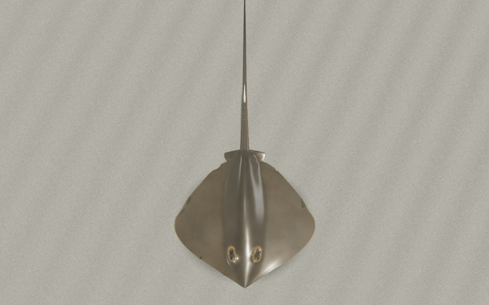 背面: 菱形の体盤、眼・噴水孔、尾と棘 | 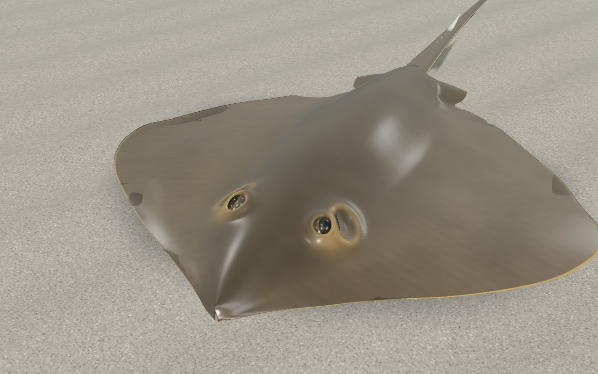 頭部: 眼窩、噴水孔、黄橙色の皮膚、砂粒 |
| 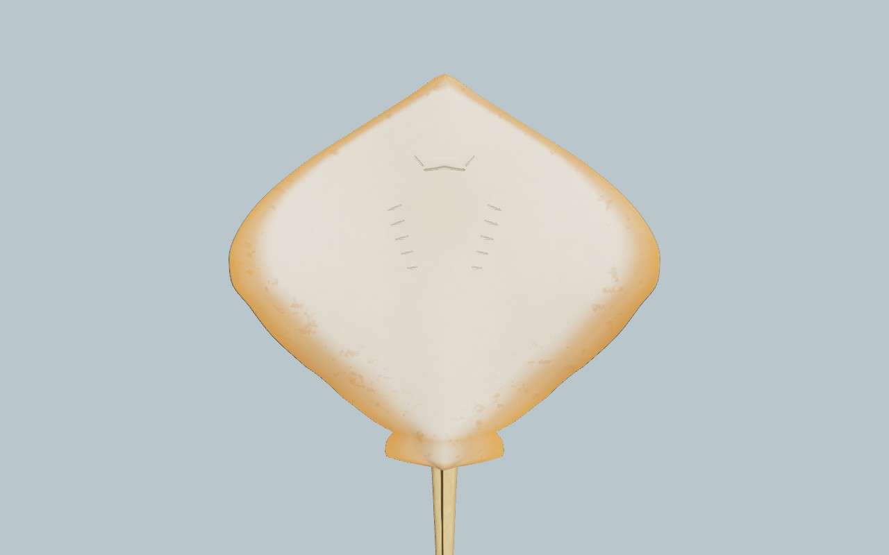 腹面: 白い腹と橙色の縁、口・鼻孔・鰓孔 | 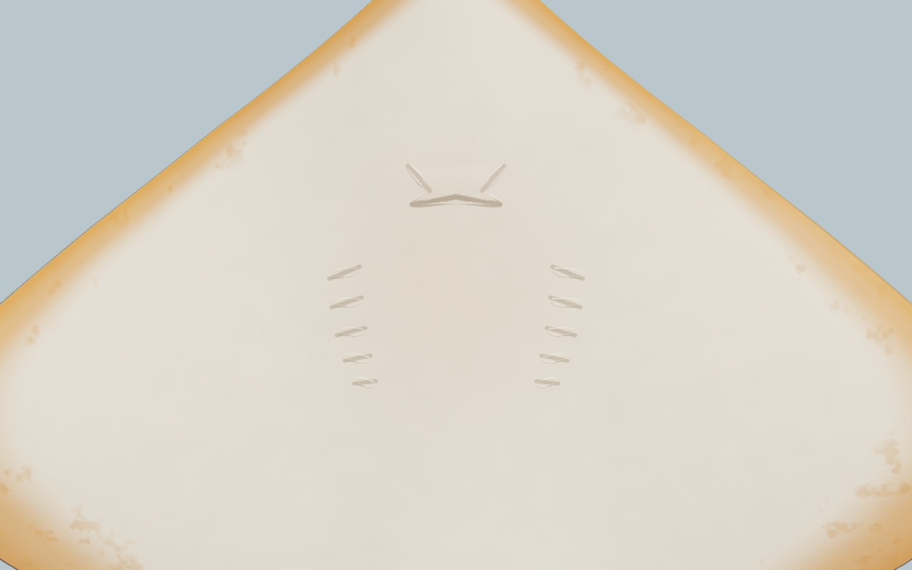 口、鼻弁、5 対の鰓孔 |
| 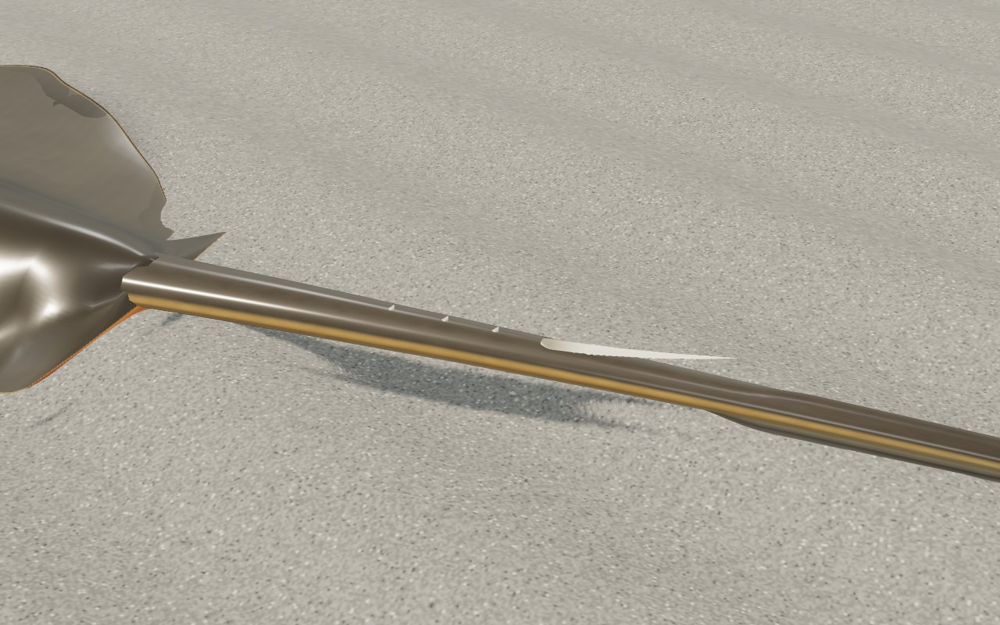 尾棘: 鋸歯の棘と前の小棘、尾の橙色の側帯 | 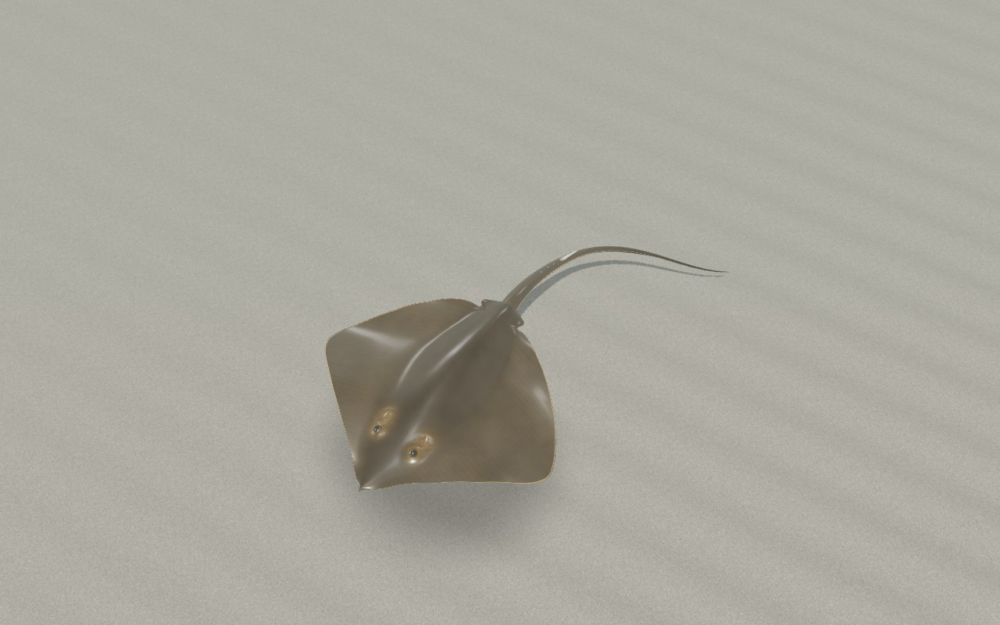 遊泳: 体盤の波 |
| 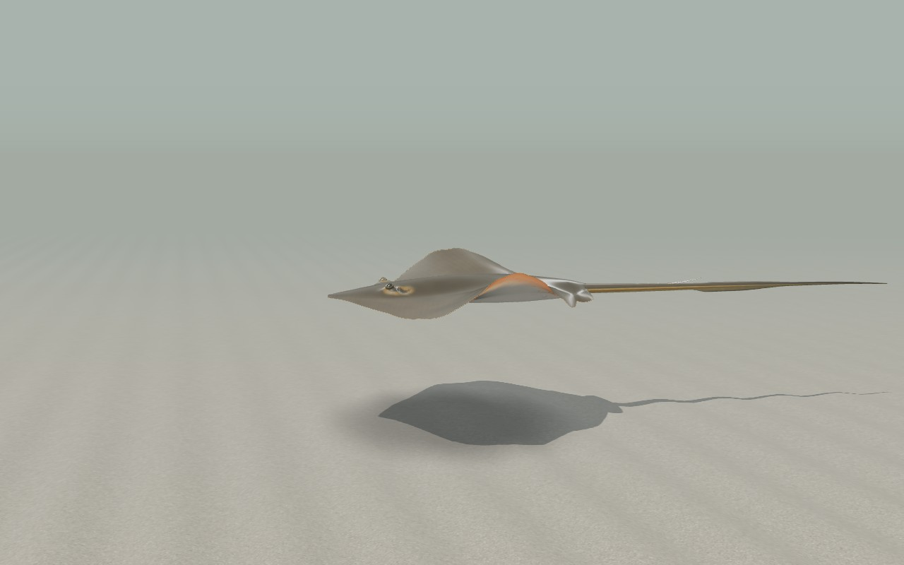 遊泳: 頭は静かに、縁と後方が大きく動く | 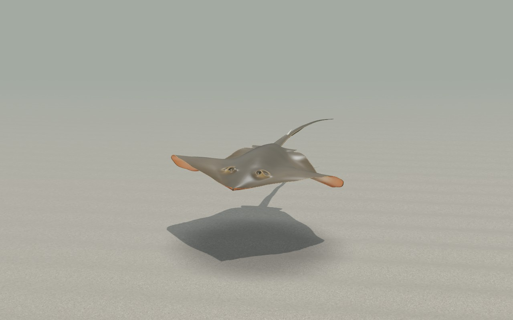 遊泳: 前から |
| 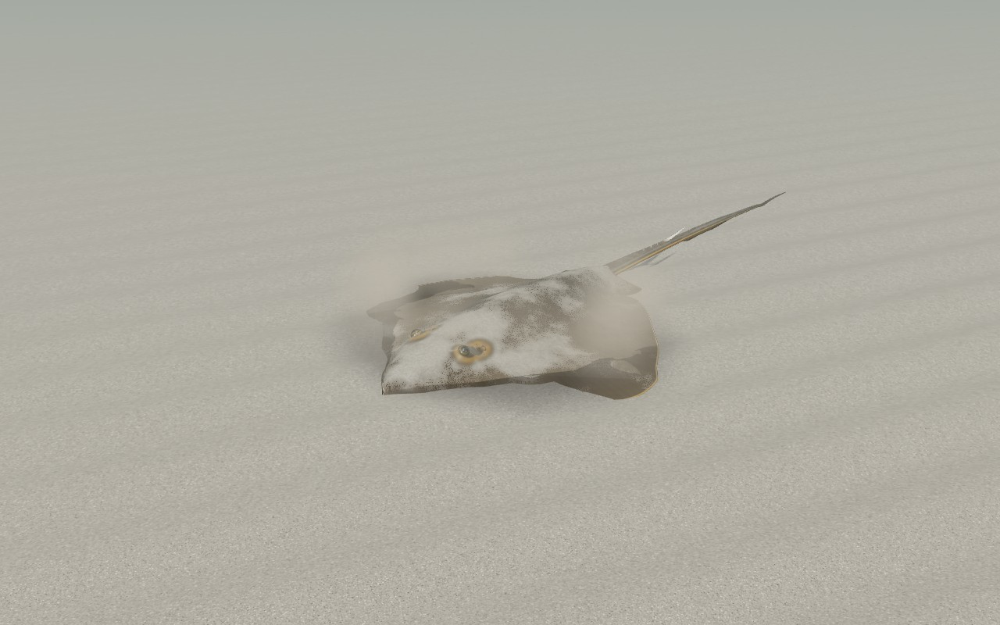 砂潜り: はためきと砂煙 | 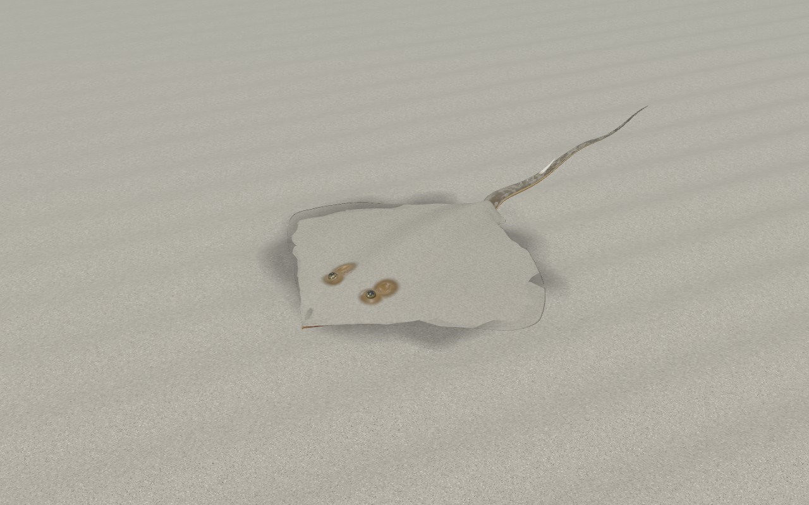 埋没: 輪郭だけが砂の起伏に |
| 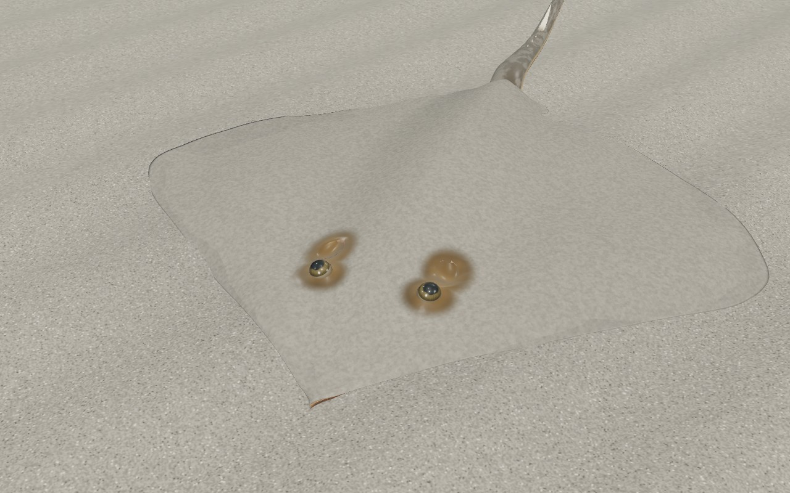 埋没: 眼と噴水孔だけが出る | 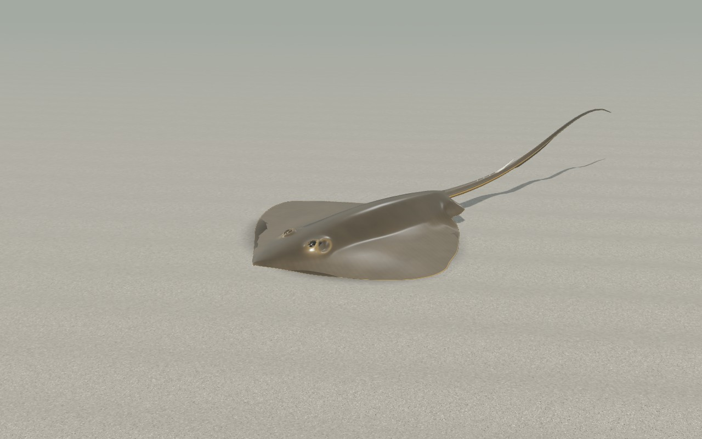 摂餌: 頭を押しつけて砂を噴く |
| 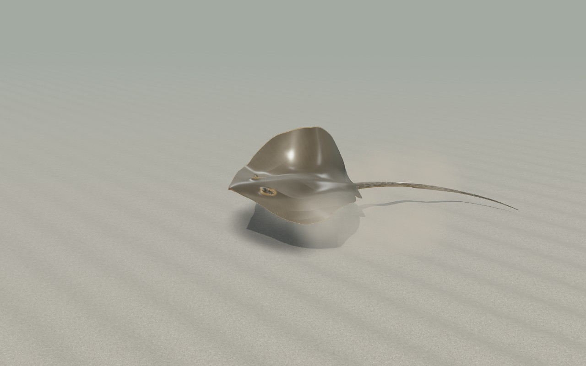 逃避: 砂から飛び出す | 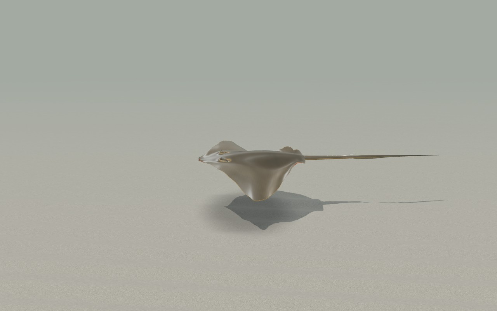 逃避後の低い滑空 |
|  LOD0 | 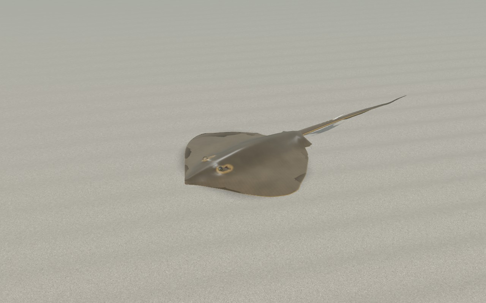 LOD1 |
| 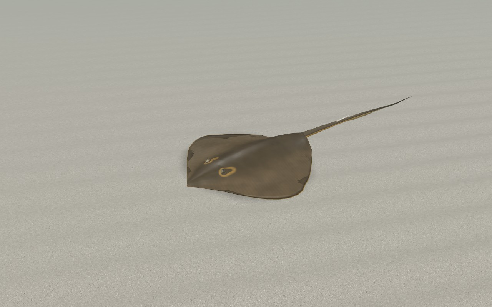 LOD2 |  ゲーム内（スクリーンスペースの水を通して） |
