# アマモ（Zostera marina）— 群落・しなり・潮の干満

`src/world/amamo/` にアマモの株・群落・アマモ場（植生システム）があります。形も色も揺れもすべて手続き生成とシェーダーで、写真テクスチャやボーンは使っていません。ゲームでは `World` が `AmamoMeadow` を持ち、潮位・潮の流れ・風浪に合わせて毎フレーム揺らします。

```bash
npm run dev  →  http://localhost:5173/gerupamasini/reference/amamo-viewer/   # ビューア（1 株〜群落の縁、潮・潮流・波・LOD）
npm run render:amamo                                                      # この文書の画像を作り直す（ヘッドレス Chromium）
```

ゲーム内ではデバッグ（F3）の「アマモ場」で、いちばん近い密な群落の岸側へ飛べます。潮位の上書きで満潮・浅水・干潮を見比べられます。

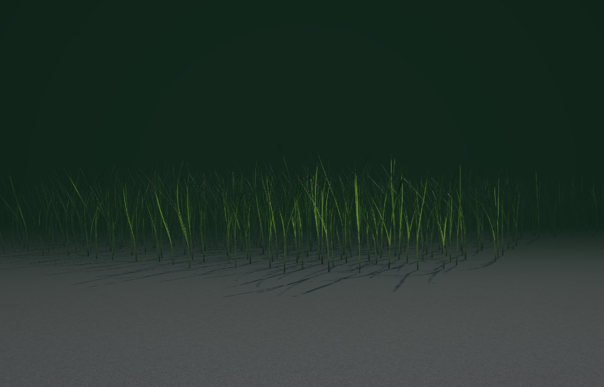

## 1. 実物の調査

参照: 写真資料 50 枚（全体・生育状態 17、葉・花・根元の形態 33。iNaturalist などで Zostera marina と同定されたもの）と、アマモの一般的な記載。

| 調べたもの | 分かったこと | モデルへの反映 |
|---|---|---|
| 葉の長さ | 潮間帯下部の浅い場所では 30〜60 cm、低潮線より深い場所ほど長く 1 m を超える（季節で変わり、夏に長い） | 株ごとの最長葉長を地盤高（T.P.）から決める（-0.6 m で 50 cm → -2.0 m で 92 cm。東京湾の夏の群落）。群落の中心の古い株ほど長く、縁の新しい株は短い（`SHOOT.lengthAt`、成熟度） |
| 葉の幅・厚み | 定規の写真（039–042）で 6〜8 mm。浅場の普通の株は 3〜6 mm、大型の株は 9 mm を超える。厚さ 0.2〜0.3 mm でごく薄い | 幅 3.5〜8.5 mm（長い株ほど広い）を実寸で描く。厚みは持たせず、幅方向にわずかな樋状の反り（中肋）を付けたリボン |
| 葉先 | 鈍頭で丸い（025・038・044）。古い葉は先が擦り切れて四角く切れ、褐変・白化する（017・019・028） | 葉先の丸みはフラグメントで切り抜き（MSAA のアルファ・トゥ・カバレッジで縁が滑らか）。古い葉の半数は先が折れて不揃いに切れ、先端から褐変 |
| 葉脈・質感 | 平行脈 3 本＋細い脈。逆光では気室の横壁が細かい格子に見える（041–044） | 5・7・9 本の平行脈と明るい中肋、近距離だけ格子（横脈）を描く。逆光の透過光が格子で少し遮られる |
| 色 | 若い葉は明るい黄緑、成熟葉は深い緑、古い葉はオリーブ〜褐色。鞘から出たばかりの基部は白っぽい（036・037）。干潮で日に当たると艶のある鮮やかな黄緑（011・012） | 齢（スロットと株の齢）で若葉 → 成熟 → 老葉の色を補間し、株ごとに明暗・黄みをずらす。基部 7〜12 cm を淡色に |
| 傷み・個体差 | 付着珪藻・泥の斑、葉先の枯れ、黒褐色の細長い病斑（アマモ立枯病。025・028）、まれに白い斑点、縁の食害 | 先端と老葉ほど厚い付着物の斑と細かい点、先端の褐変、葉に沿って伸びる暗色の病斑、白斑、老葉の縁の切れ込み。いずれも透過光を弱める |
| 根元のまとまり | 3〜7 枚の葉が扁平な葉鞘に重なって包まれ、二列に互い違いに出る（二列互生）。鞘は 5〜20 cm、根元は白〜淡黄緑で古い鞘が褐色の繊維になって残る | 株＝葉鞘 1 本と葉 2〜7 枚。葉は扇の左右へ交互に、外側ほど大きく開く。鞘は平たい管で、砂から出た所はクリーム色、上へ淡緑、ところどころ古い鞘の褐色繊維 |
| 地下茎・根 | 横に這う地下茎（径 2〜5 mm、節間 1〜3 cm、若い所は白〜淡黄、古い所は褐色）の節から根が 2 束（035–037）。群落の縁の洗われた所では砂の上に見える（014） | クローン成長のシミュレーションで株を地下茎に沿って並べ、縁・まばらな群落・パイオニア株では露出した節間と根を描く |
| 群生のしかた | 地下茎で広がるクローンのパッチが合わさって群落になる。密な中心、まばらな縁、裸地に点在する新しい株、群落の中の砂地の穴（005・006・014） | 密・疎・パイオニアの 3 種のパッチ、群落内の裸地の穴、重なるクローンは先にできた方が場所を取る（下記） |
| 水流・波での揺れ | 浮力のある葉は立ち上がり、流れで根元近くから曲がって先は流れに沿う。波では往復の流れで根元から先へしなりが伝わり、群落全体が波の列として揺れる（monami）。浅いと葉先が水面に浮いて流れに沿って寝る（007・008） | 下記 3 章 |
| 干潮・満潮での見え方 | 満潮では水中で大きく揺れる。浅くなると葉先が水面に浮く。干出すると葉は倒れて引き潮の方向（沖側）へそろって寝て、濡れた艶のある敷物になる（011・012・016・023・024） | 下記 4 章 |

## 2. 構成

```
AmamoMeadow（植生システム。World が持つ）
└── AmamoPatch（クローン 1 つ。Group、中心に置く）
    ├── LeafCluster    InstancedMesh: 1 インスタンス＝1 株（葉 2〜7 枚を頂点シェーダーで曲げる）
    ├── Base           InstancedMesh: 株ごとの葉鞘
    └── Root/Rhizome   Group: Rhizome（露出した節間）と Roots（根）
```

| ファイル | 内容 |
|---|---|
| `params.ts` | 調査から決めた寸法・色の段階・揺れの定数、潮の状態 `postureState()`。シェーダーも同じ定数を使う（`GLSL_PARAMS`） |
| `shader.ts` | 葉と鞘の頂点変形・表面・透過光の GLSL |
| `kit.ts` | 共有のユニフォーム、LOD 段ごとのマテリアル（影用の深度マテリアルつき）と頂点バッファ |
| `AmamoPatch.ts` | クローンの成長と 3 つの子、LOD の切り替え |
| `AmamoMeadow.ts` | 干潟への配置、近づいたクローンだけの生成、LOD、水中に沈んで見えない群落の非表示、底質への被覆テクスチャ |

1 株だけでも、パッチ単位でも使えます。

```ts
import { AmamoKit, AmamoPatch } from '@/world/amamo';
const kit = new AmamoKit();                                   // マテリアルとバッファ（全パッチで共有）
const ground = { heightAt: (x, z) => terrain.heightAt(x, z) };
const one = new AmamoPatch({ x, z, radius: 0.1, density: 1, kind: 'single', seed: 7, ground, kit, exposeRhizome: true });
const bed = new AmamoPatch({ x, z, radius: 2.2, density: 90, kind: 'dense', seed: 42, ground, kit });
scene.add(one, bed);
// 毎フレーム（AmamoMeadow を使うときはこれを肩代わりする）
kit.uniforms.uAmTime.value += dt;
kit.uniforms.uAmWater.value = waterLevel;                     // 水位（T.P. m）
kit.uniforms.uAmCurrent.value.set(0, 0.12);                   // 潮流 (m/s)
kit.uniforms.uAmWave.value.set(Math.cos(a), Math.sin(a), 0.12, 0.6); // 波の進む向き、軌道流速 (m/s)、突風の強さ
bed.setLod(0);                                                // 0〜2、-1 で非表示
```

## 3. 葉のしなり

板ポリを曲げるのではなく、頂点ごとに葉の中心線を根元から積分します（段数 12 / 7 / 4）。各点の向きは水平の「傾きベクトル」で決まり、その長さが鉛直からの角度（飽和する: 水中の葉は浮力で寝きらない）、向きが方位になります。長さは常に保存され、リボンの幅は曲がりの向きに直交するので、流れが向きを変えると葉は自然にねじれます。

- 傾き = 株の傾き ＋ 葉自身の扇からの開き（外側の葉ほど大きく、浮力で弓なり）＋ 流れ × 曲がりやすさ（鞘の中は硬く、鞘を出てから 12 cm ほどで曲がりきる）＋ 葉先の細かなはためき
- 流れ = 潮流（干潟全体の向きと強さを群落の中で蛇行させ、株ごとにも揺らす）＋ 波の軌道流（交差する 3 本の長峰波。峰は群落を横切って進み、その位相が根元から先へ遅れるので、しなりが根元から先端へ伝わる）
- 突風の群れ: 揺れの強い斑が風下へ流れ、同じ場所でも強く揺れる時と静かな時がある
- 株ごとに波への位相の遅れ・進み（±0.65 rad）と効き方（±25 %）が違い、葉ごとにねじれ・はためきの速さが違うので、全葉同時の sin 波にはならない
- 2 つの拘束: 水面より上へ出る分は水面に沿って浮き（浅水で葉先が水面に寝る）、砂に潜る分は砂に沿って寝る（干潮で倒れた葉が重なって敷き詰まる）。葉鞘も同じく水面の下に収まり、鞘の丈より浅いと株が根元から倒れて鞘の口が水面下に来るまで傾く
- 寄せ波のある浜（走水）では、水面は水のパスが描く波の水面そのもの（`WaterPass.surfField` の高さの場を各区間の終わりで読む）なので、浮いた葉は波とともに上下し、谷で水上に出ない

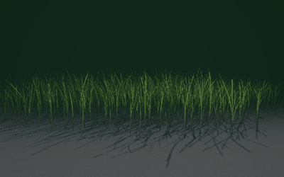

## 4. 潮の状態

株の根元の水深と最長葉長の比から 3 つの状態を連続的に混ぜます（`postureState`、シェーダーも同じ式）。

| 状態 | 条件 | 揺れ | 姿勢 | 見た目 |
|---|---|---|---|---|
| 満潮 | 水深 ≳ 葉長 × 1.5 | 波で大きくしなる（100 %） | 浮力で立ち、潮流で大きく傾く | 水中で緑〜黄緑、逆光で透ける |
| 浅水 | 水深 < 葉長 | 弱い（約 20 %） | 立ち気味（潮流の効きが約 45 %、弓なりも控えめ）。水面に届いた葉先は水面に沿って流れの向きに浮く | 水面直下に寝た葉先が見える |
| 干潮 | 干出 | なし | 鞘が根元から倒れ、葉は砂へ垂れて沖側（地盤の傾きの下る方向）へ、株ごとにそろって S 字に寝る | 濡れた艶（粗さ 0.34〜0.46）、少し暗く、ところどころ泥 |

潮だまり（干潮でも水が残るくぼみ）の株は、その水位で浮きます。

| 満潮（水面から） | 浅水 | 干潮 |
|---|---|---|
| 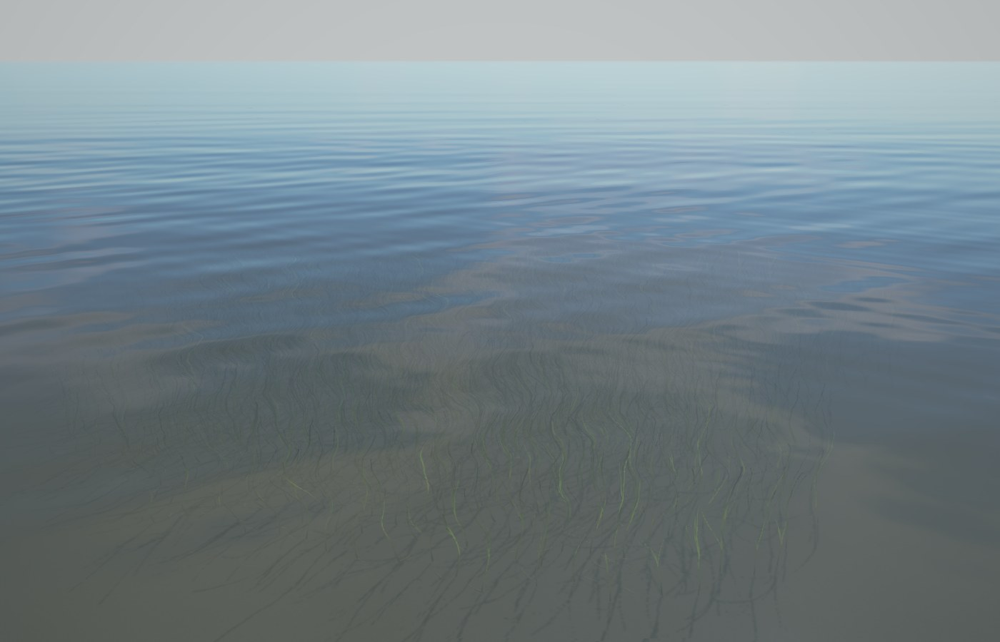 | 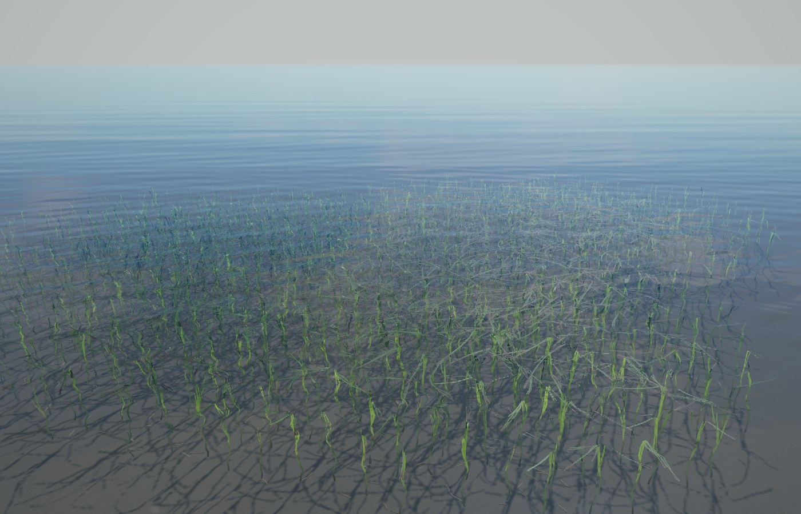 | 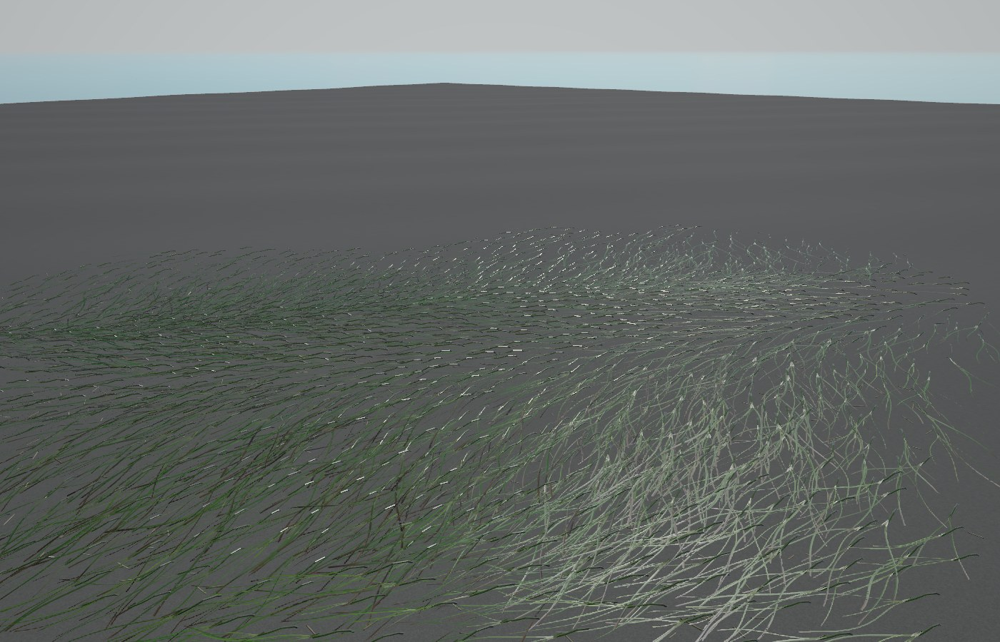 |

## 5. 群落の配置

- 生える場所: 地盤高が大潮の干潮線付近（T.P. -0.55 m）から干潟の沖側の端（-2.35 m）まで、砂・泥砂を好み（泥 0.55、礫 0.25、澪筋 0.12）、アカエイの穴には生えない
- 40 m 規模の群落と 10 m 規模の切れ目を作るノイズ場の値で、密なクローン（半径 1.5〜2.5 m、80〜110 株/m²）、その周りのまばらなクローン（1〜2 m、18〜34 株/m²）、裸地に点在するパイオニア株（0.25〜0.7 m）を置く。密な群落の中には数 m の砂地の穴（ブローアウト）
- 各クローンは数本の創始株から地下茎を伸ばして育てる（節間 2〜6 cm、節ごとに少し曲がり、15 % で分枝、縁に当たると折り返す）。株は地下茎の節に、場所が空いていれば付く。縁ほど若く短く、葉が少なく、まばら
- クローンが重なる所は、先に置かれた（密な）方の場所になる。どの順に生成しても同じ群落になる
- 底質: 群落の下は細かい泥・有機物・葉の陰で暗く、葉を描かない遠方では群落の色（干潮では寝た葉の緑）を被覆テクスチャで代わりに描く（`Terrain.setMeadowCover`）

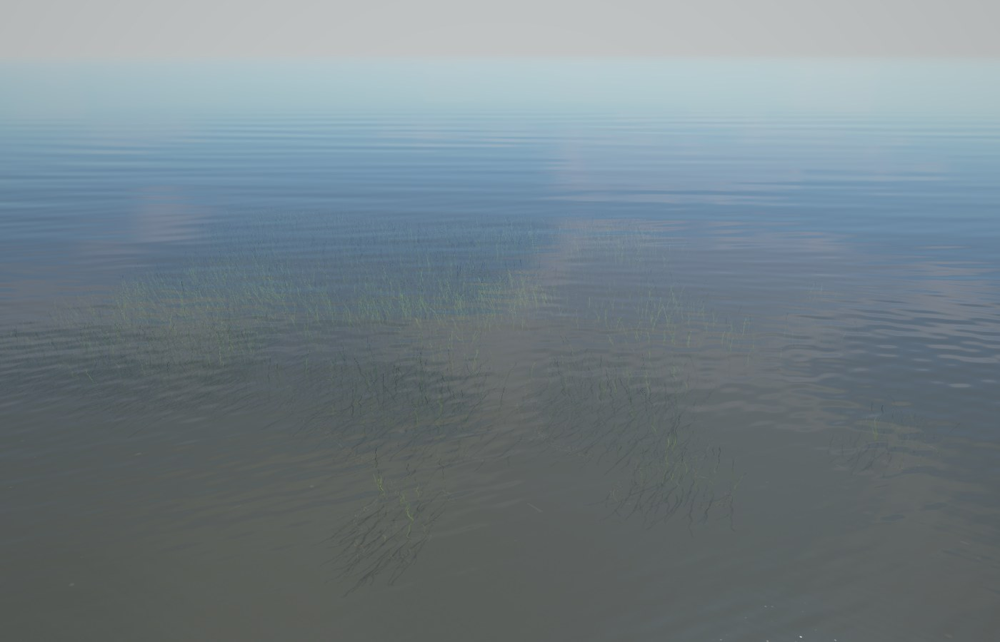
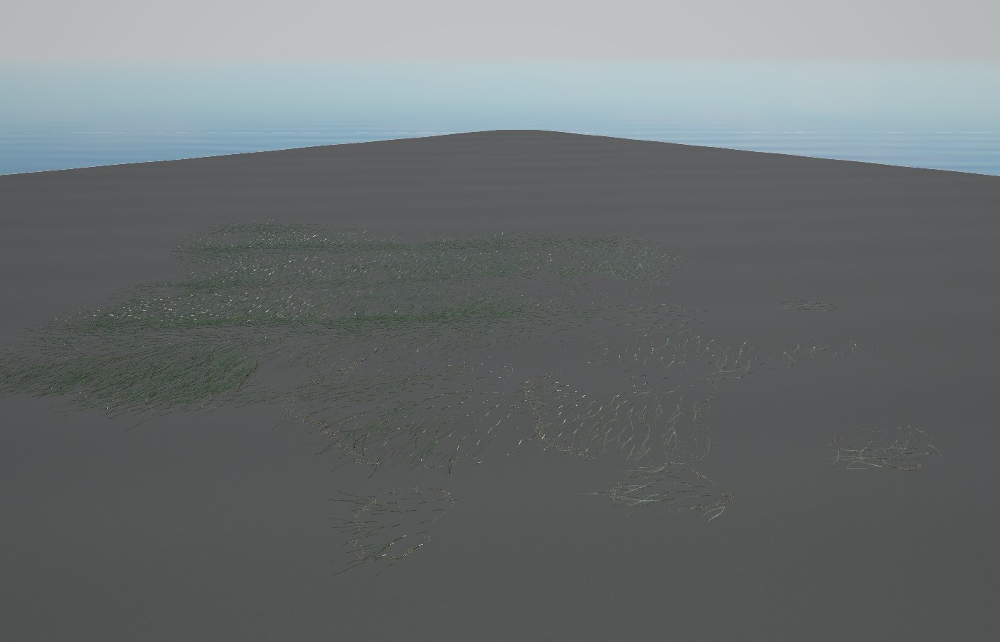

## 6. 大量配置

- 1 クローン＝3 ドローコール（LeafCluster・Base・Rhizome/Roots）。マテリアルと頂点バッファは全クローンで共有し、クローンが持つのは株ごとの属性（12 float）と行列だけ
- 株の並びはシャッフル済みなので、先頭から n 個を描けば一様に間引ける（遠い段・低品質）

| LOD | 距離（中品質、パッチの縁から） | 葉 | 段×幅方向 | 株 | 鞘 | 地下茎 | 揺れ |
|---|---|---|---|---|---|---|---|
| 0 | 〜5 m | 最大 7 枚 | 12 × 3（中肋の反り） | 100 % | 8 角 × 4 段 | 露出部 | 波 3 本＋はためき＋ねじれの揺らぎ |
| 1 | 〜16 m | 最大 5 枚（幅 1.18 倍） | 7 × 2 | 80 % | 4 角 × 2 段 | なし | 波 3 本 |
| 2 | 〜40 m | 3 枚（幅 1.75 倍） | 4 × 2 | 45 % | なし | なし | 波 2 本、鞘なしで根元から |
| — | それより遠く | 被覆テクスチャの色 | | | | | |

- 距離に応じた更新の間引き: 近いパッチ（12 m 以内）は毎フレーム、30 m までは 4 フレームごと、それより遠くは 12 フレームごとに LOD を見直す（1 m のヒステリシスつき）。揺れそのものは GPU で、遠い段ほど式が軽い
- 生成: クローンはカメラが近づいた時に 1 フレーム 4 ms までの時間予算で少しずつ育て（ジェネレーター）、離れたら捨てる。到着時とテレポート時は LOD1 の範囲までをすぐに作る
- 濁った水に沈んだ群落: 葉の上端まで視線が水中を 7 m 以上通る群落は描かない（水のパスが底をほぼ消すため）
- 品質プリセット `QualityPreset.vegetation`（`MEADOW_QUALITY`）: 超軽量 = 株 35 %、LOD 2.5 / 7 / 18 m、影なし ／ 低 = 60 %、3.5 / 11 / 28 m、影なし ／ 中 = 100 %、4.5 / 13 / 36 m、影なし ／ 高 = 100 %、7 / 22 / 52 m、LOD0 が影を落とす

| LOD0 | LOD1 | LOD2 |
|---|---|---|
| 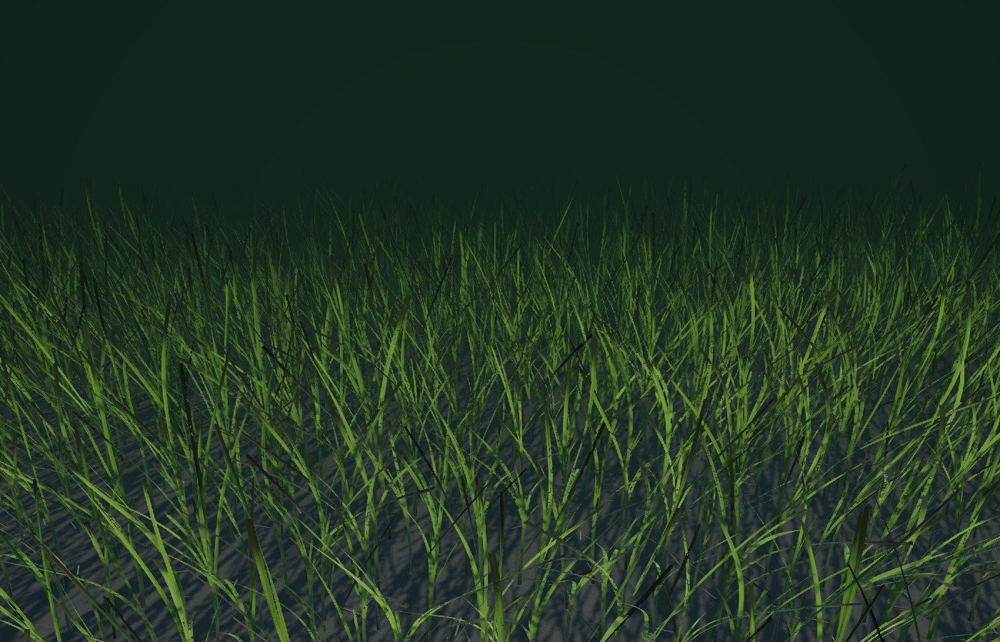 | 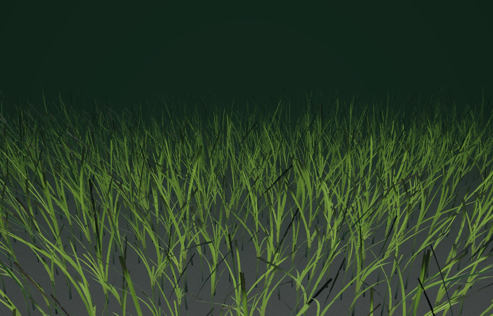 | 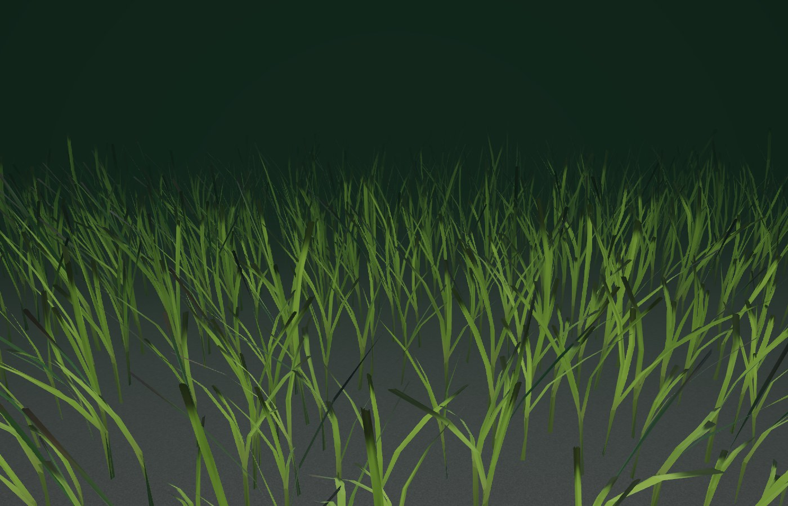 |

## 7. ゲーム内

デバッグの「アマモ場」で群落の岸側に立ち、潮位を上書きしたところ（中品質、ヘッドレス Chromium）。

| 中潮（水深 ≒ 葉長: 葉先が水面に届く） | 干潮（しゃがんで） |
|---|---|
| 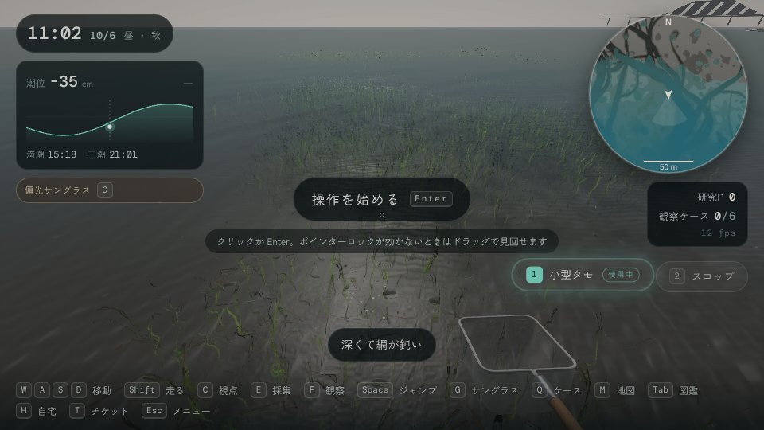 | 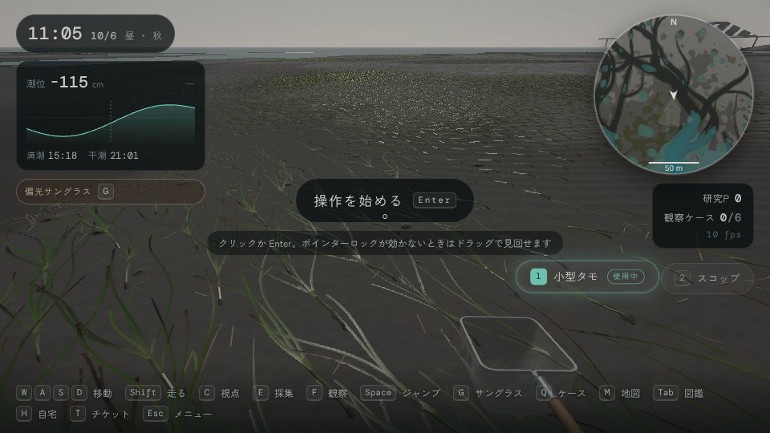 |

水のパス（`Water.ts`）は、水深が数 mm の所に汀線の光の縁と泡を描きます。水面直下に浮いた葉がこれで白く光らないよう、地面そのものが水に接する所だけに限りました（変更はこの 1 点）。

## 8. 画像

| | |
|---|---|
| 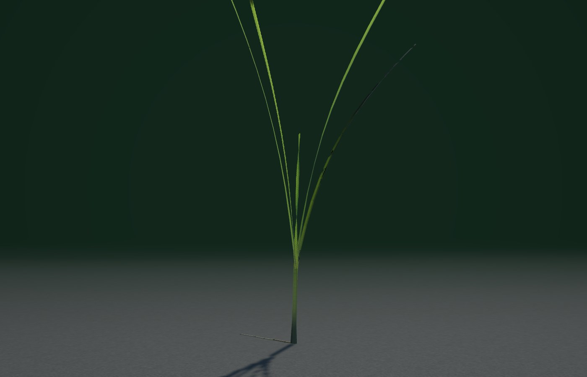 | 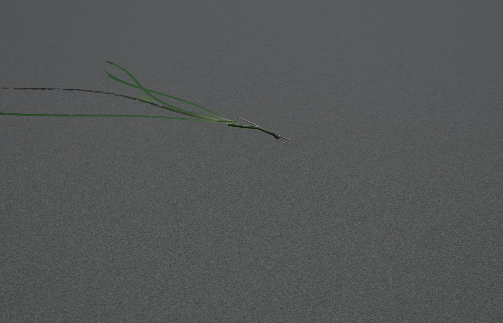 |
| 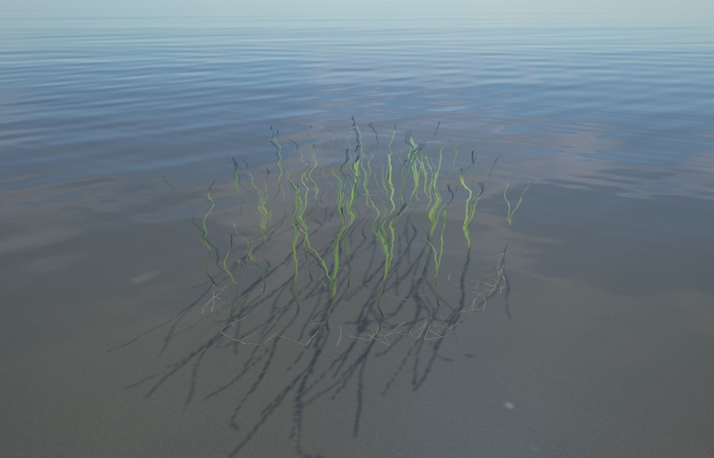 |  |

## 9. 既知の制限

- 葉は厚みのないリボン（両面描画）で、葉同士・プレイヤーとの衝突はありません（歩いても葉は押し分けられない）。
- 花枝（生殖株）と種子は作っていません。
- 揺れはその場の水深・潮流・波から決まる運動学的なもので、慣性や葉同士の干渉は計算していません。急に潮位を変える（デバッグの上書き・チケット）と姿勢も即座に変わります。
- 画像はヘッドレス Chromium のソフトウェア WebGL（SwiftShader）で描いたもので、ポストプロセスはかけていません。
