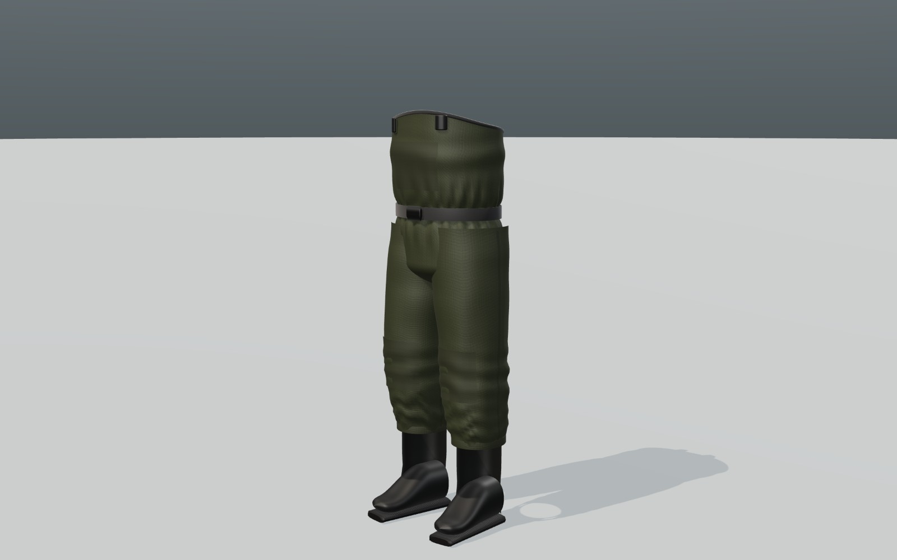
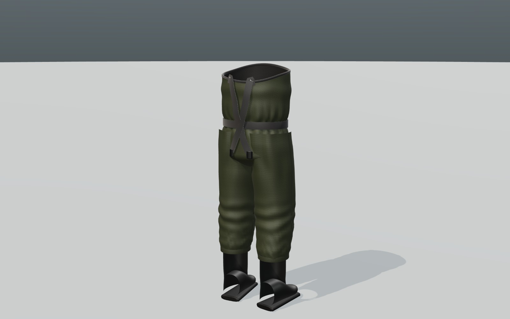
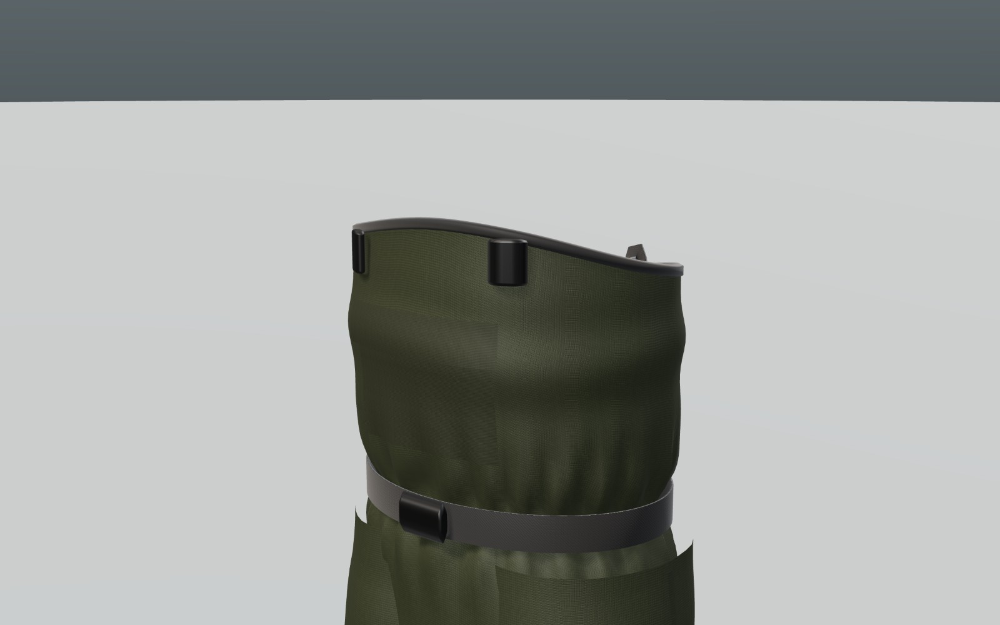
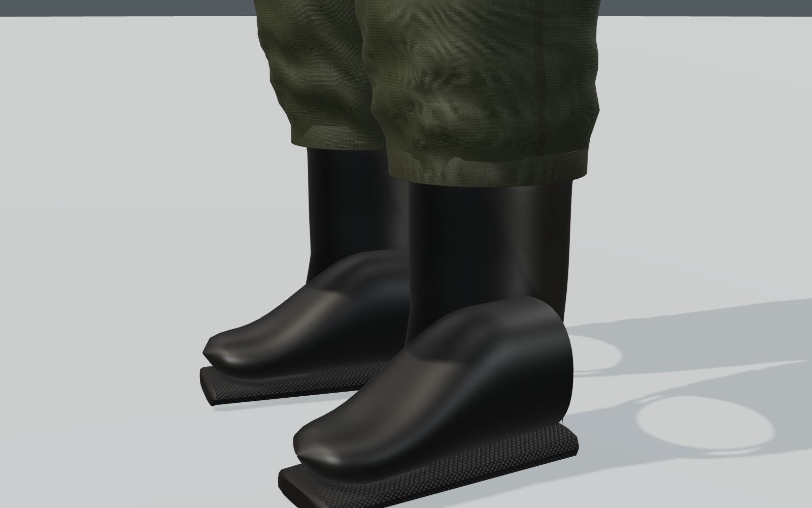
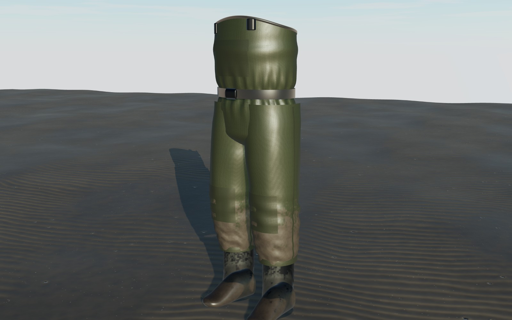

# 胴長（チェストウェーダー）— 3D モデル（Three.js / GLB）

`src/assets/models/apparel/wear_waders.{hero,lod1,lod2}.glb`。掘る道具と同じビルダーで作っています。

```bash
npm run model:apparel     # GLB と manifest.json を作り直す
npm run render:apparel    # この文書の画像を作り直す
```

| 項目 | 値 |
|---|---|
| 形式 | 長靴一体型（ブーツフット）のチェストウェーダー、身長 170 cm 前後の着用者向け |
| 寸法 | 胸の前端まで 130 cm（背中側は 7 cm 低い）、長靴 26.5 cm（ふくらはぎまでの筒） |
| 推定重量 | 2.4 kg |
| 構成 | マットな PVC コーティングのナイロン（オリーブ）。体型をなぞらないゆとりのある裁断で、長靴の上に生地がたまる段じわ、膝裏とすねのしわ、尻から垂れるドレープ、ベルトで絞ったギャザーを形状に入れ、左膝は少し緩めています。脚の内外のシームテープ、長靴に接着した裾、膝の補強当て、胸ポケットとフラップ、内側の裏地と黒い縁取り、腰のベルトとバックル、外したサスペンダー（前にバックル、ストラップは背中に垂れる）、ゴム長靴（足首のしわ、甲へのつながり、丸いつま先、少し外向き）とラグの靴底 |
| 三角形数 | hero 34.0k / lod1 13.3k / lod2 5.1k |

座標は **メートル、+Y 上、+Z がつま先の向き**、原点は両足の間の地面。着用者が立った姿勢の形です。ノードは `Hips`（腰の高さ）、`Chest_Top`（胸の前端）、`Foot_L` / `Foot_R`（靴底の母趾球の下）。濡れ・泥は `prepareNet()` がそのまま使え、`_DIRT` は足元ほど高いので、泥は長靴とすねに乗ります（`waterline` で水に浸かった高さまで濡らせます）。

## 既知の制限

- 静止メッシュでスキニング（ボーン）は入っていません。キャラクターに着せて歩かせるには、脚と胴にウェイトを付ける必要があります。
- 長靴はつやが少し強めで、足の甲と筒のつながりがまだ硬く見えます。

| | |
|---|---|
|  |  |
|  |  |
|  | |
