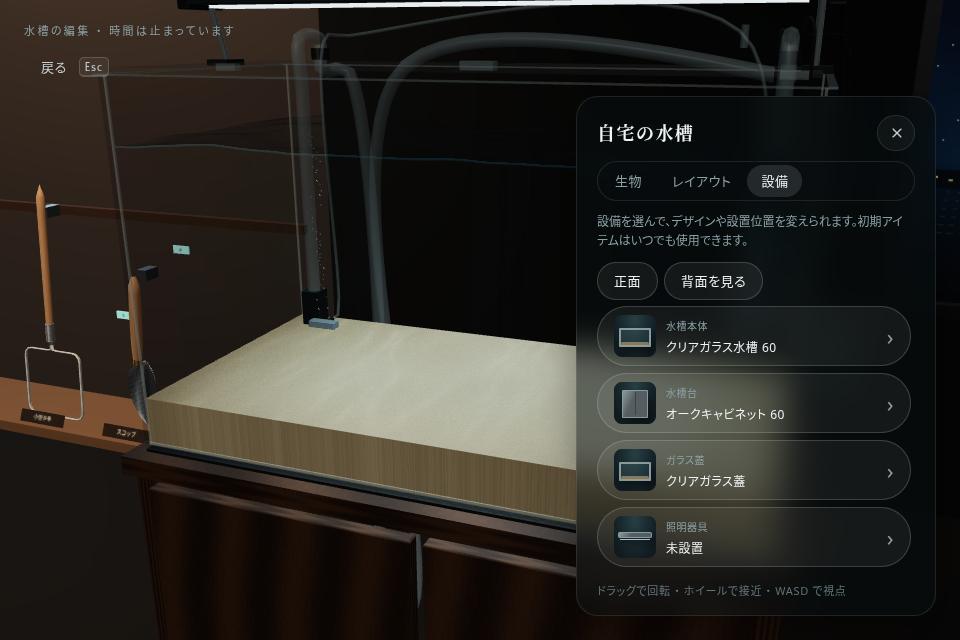
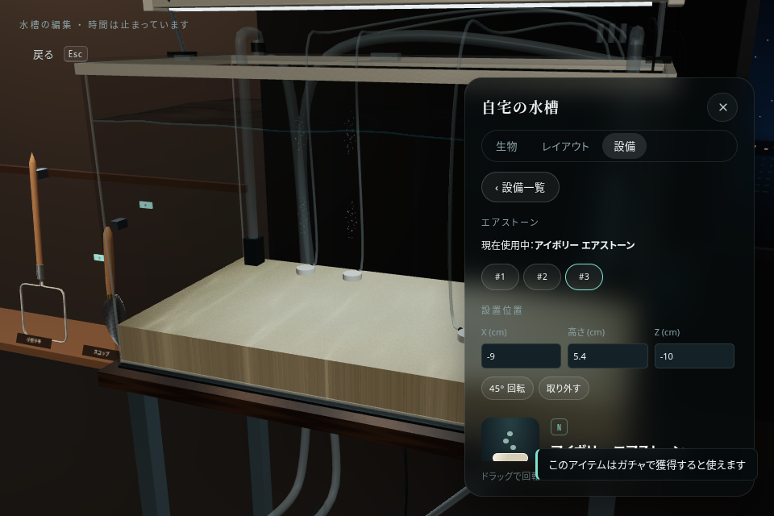
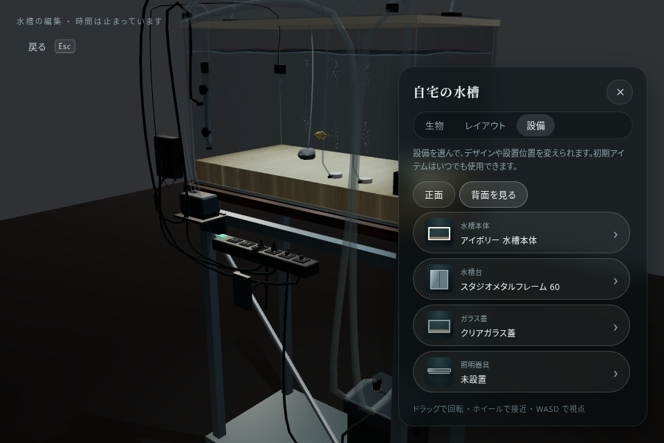
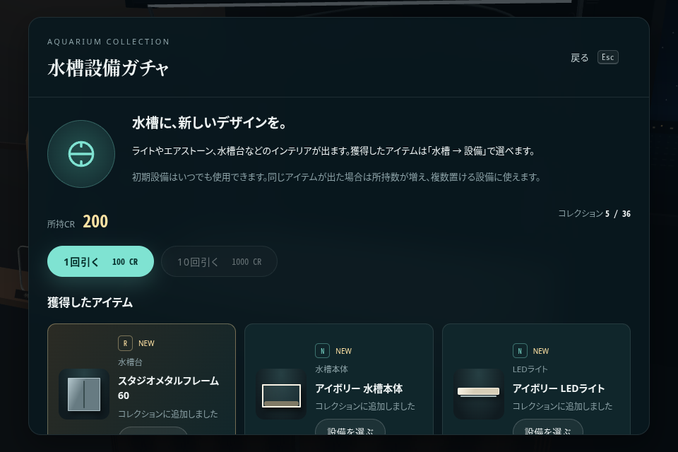
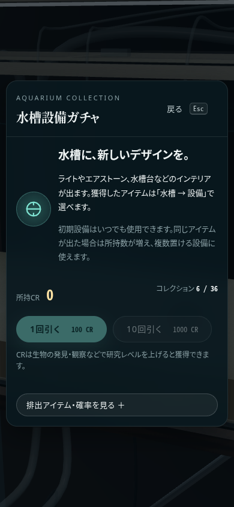

# 水槽設備・コレクション・ガチャの実装画面

実際のゲームをChromiumで起動して撮影した画像です。ガチャの確認にはブラウザテスト用のCRと固定した抽選結果を使用しています。

## 使用中アイテムの一覧

自宅 → 水槽 → 設備。水槽・台・床は73cm上へ移し、棚と窓は元の部屋座標を維持しています。

## アイテムの詳細と設置位置

現在使用中の名前、個体の切り替え、位置・回転、所持している候補からの入れ替えを表示します。

## 水槽台と背面の自動配線

獲得した金属フレームとエアストーン3個を設置した状態。配線・ホースはプリセットで自動接続します。

## 設備ガチャ

1回100 CR、10回1000 CR。獲得したアイテムと所持数を保存します。画面内をスクロールすると残りの獲得品と排出一覧を確認できます。

## モバイル画面

