# 干潟の掘る道具 4 種 — 写実 3D モデル（Three.js / GLB）

`src/assets/models/digging/` に 4 種 × 3 LOD（hero / lod1 / lod2）の GLB と `manifest.json` があります。タモ網と同じ手続き生成のパイプライン（`tools/models/nets/` の形状・PBR テクスチャ・マテリアル）を使い、写真テクスチャは使っていません。

```bash
npm run model:digging      # 12 個の GLB と manifest.json を作り直す（約 20 秒）
npm run render:digging     # この文書の画像を作り直す
npm run dev  →  http://localhost:5173/gerupamasini/reference/nets-viewer/   # タモ網と同じビューアで表示
```

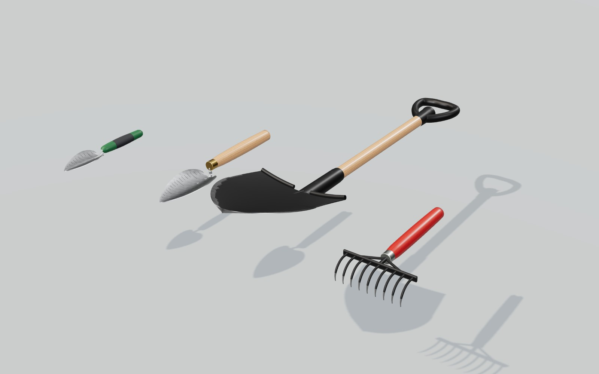

## 1. 設計

| 道具 | 刃/爪 幅×長 | 柄 | 全長 | 最大掘削深度 | 推定重量（目標） | 重心（グリップから） | 構成 |
|---|---:|---:|---:|---:|---:|---:|---|
| ミニスコップ `dig_mini` | 7×12 cm | 15 cm | 28 cm | 12 cm | 141 g（150 g） | 8 cm | ステンレス板厚 1.2 mm のプレス刃（1 cm 刻みの深さ目盛、5 cm ごとに長い線）、刃元を絞ったタング、PP の柄に TPR グリップ |
| スコップ `dig_trowel` | 10×18 cm | 25 cm | 44 cm | 20 cm | 322 g（320 g） | 14 cm | ステンレス板厚 1.3 mm の刃（深さ目盛）、Φ8.4 mm のステンレス丸棒のグースネックを刃裏の当て板にリベット留め、タモ材の柄にニス、真鍮の口金 |
| シャベル `dig_shovel` | 25×30 cm | 80 cm | 104 cm | 45 cm | 1433 g（1.4 kg） | 66 cm | 炭素鋼板厚 1.2 mm の剣先刃（黒塗装、刃先と両肩は塗装が剥げて地金）、踏み返し、筒状ソケットと刃裏の補強リブ、リベット、タモ材 Φ32 mm の柄、PP の D グリップ |
| 熊手 `dig_rake` | 18 cm・爪 8 cm | 25 cm | 33 cm | 8 cm | 349 g（350 g） | 12 cm | Φ5 mm 鋼丸棒の爪 9 本（黒塗装、爪先は摩耗して地金）、180×14×4 mm の横板にタングと 2 本の補強を溶接、亜鉛めっき口金、赤く塗ったブナの柄 |

- 寸法は表の値に合わせ、重量は各部品の体積（板は面積 × 板厚）× 材料密度で積算した推定値です（目標との差は 6 % 以内）。
- 移植ごての刃は「肩の丸い尖った楕円」＋断面の深いすくい（縁が持ち上がる）。シャベルの刃は柄に対して 15° の「リフト」が付いていて、柄を寝かせたとき刃が地面に沿います。熊手の爪は 1.4 cm 前へ出てから半径 3.5 cm で 108° 下へ巻き込み、先へ向かって細くなります。

## 2. GLB の構造

座標は **メートル、+Y 上（刃の掘る面が上）、+Z がグリップ → 先端**。**原点 = 利き手のグリップ中心**（シャベルは D グリップの横棒の中心）。

```
dig_xxx            (extras.higataTool: 寸法・重量・重心・最大掘削深度・材料)
├─ Tool            本体（材質ごとのプリミティブ）
├─ Grip_Main       利き手（原点）
├─ Grip_Support    添え手（シャベルは柄の中ほど）
├─ Tip             最初に地面に入る点（刃先・爪先）。掘る判定の基準に
└─ Blade_Center    刃の面の中央（すくった砂・貝を載せる位置）
```

- 頂点属性はタモ網と同じ `COLOR_0`（焼き込み遮蔽）と `_DIRT`（泥のたまりやすさ。刃先・爪先ほど高い）。`prepareNet(root)`（`src/assets/models/nets/netMaterials.ts`）がそのまま使え、`setSurface({ wet, mud })` で濡れ・泥を付けられます。
- 移植ごて 2 本の深さ目盛は刃面から 0.08 mm 浮かせた細い帯（刻印の色）で、刃先から 1 cm ごとに入っています。

## 3. LOD とデータ量

| 道具 | hero（三角形 / MB） | lod1 | lod2 |
|---|---|---|---|
| ミニスコップ | 15.1k / 1.0 | 3.3k / 0.3 | 0.8k / 0.1 |
| スコップ | 15.3k / 1.0 | 3.8k / 0.3 | 1.0k / 0.1 |
| シャベル | 19.2k / 1.3 | 4.7k / 0.4 | 1.4k / 0.1 |
| 熊手 | 8.3k / 1.0 | 2.8k / 0.4 | 1.3k / 0.1 |

lod1 / lod2 はテクスチャを 1/2・1/4 にし、lod2 では深さ目盛とリベットを省きます。

## 4. 画像

| | |
|---|---|
| 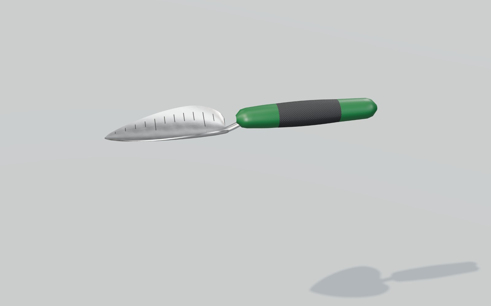 | 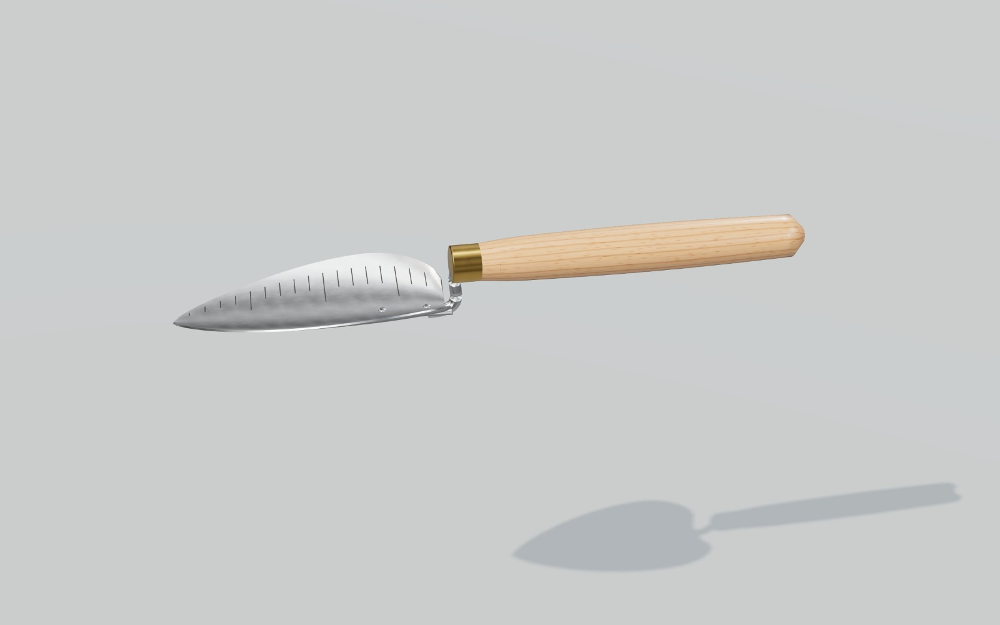 |
| 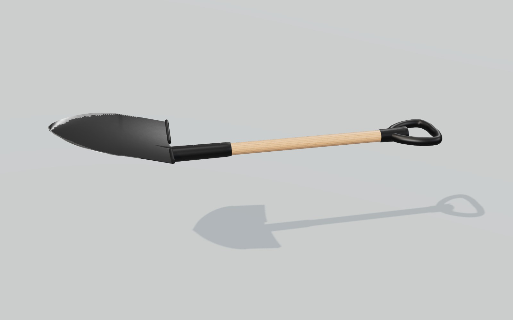 | 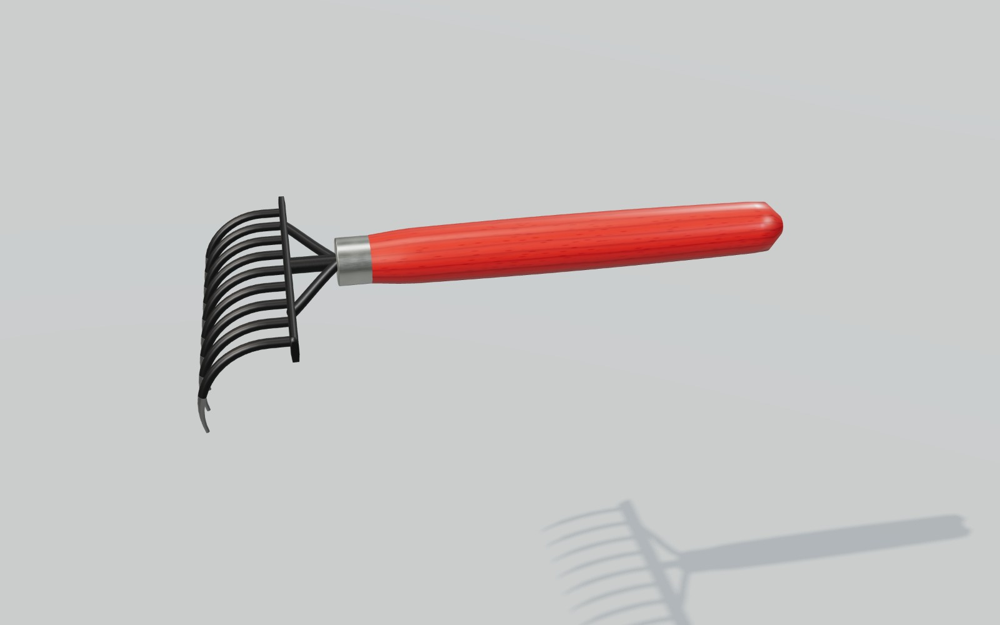 |
| 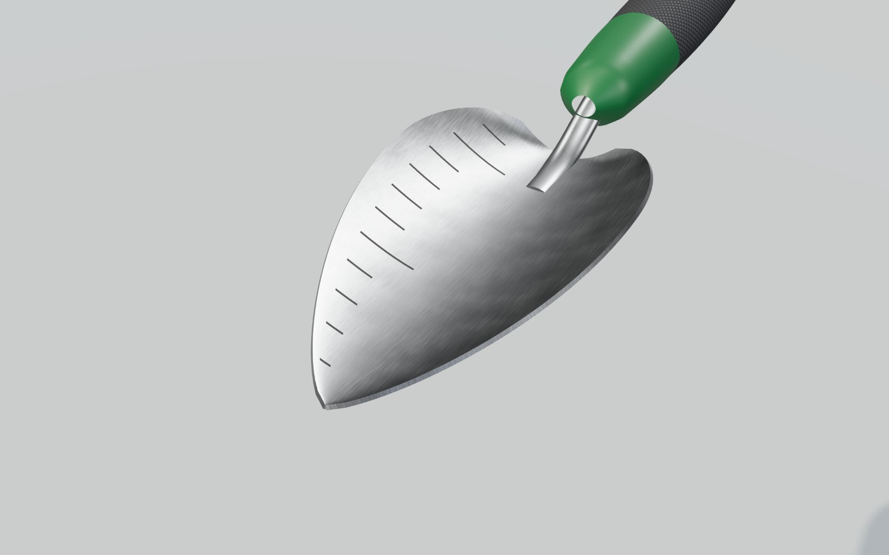 | 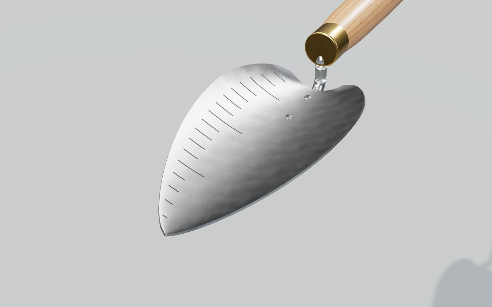 |
| 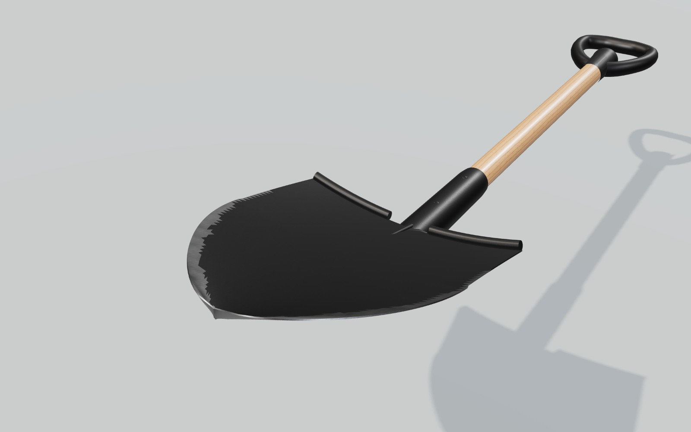 | 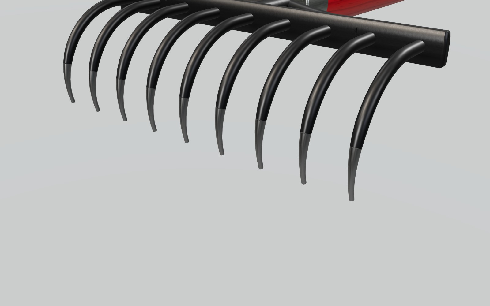 |
| 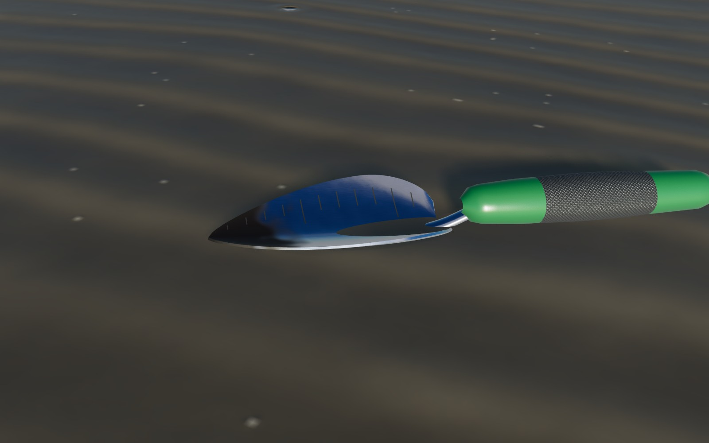 | 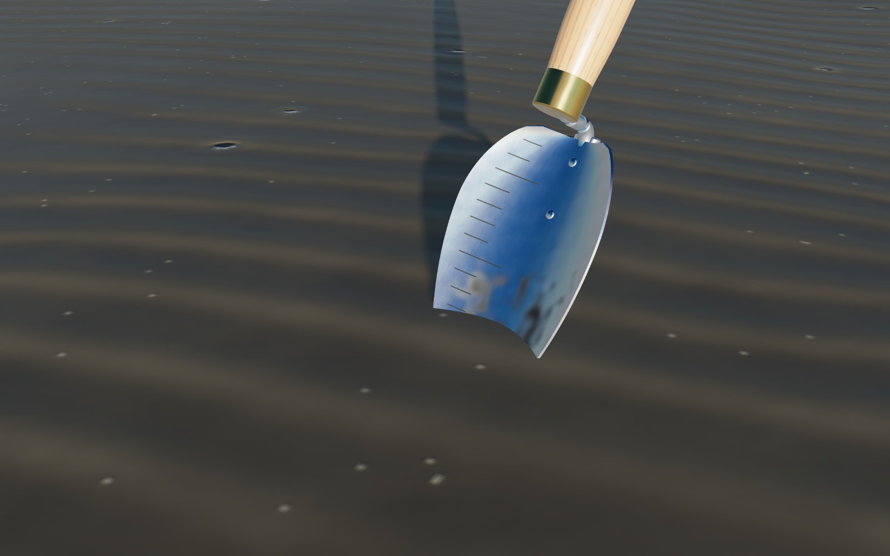 |
| 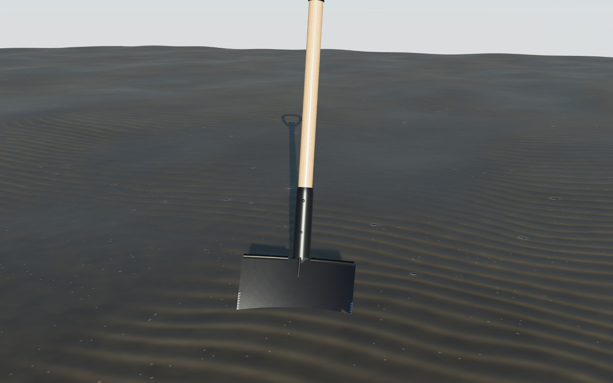 | 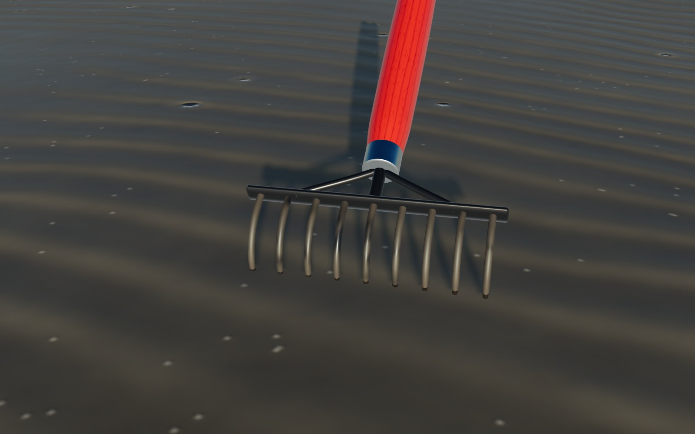 |

## 5. 既知の制限

- ゲーム本体の `ShovelView.ts`（一人称のスコップ）と道具棚は従来の表示のままで、この GLB には差し替えていません。`tools.json` の `shovel` との対応づけも未定です。
- 掘った穴や刃に載る砂はモデルに含めていません（`Blade_Center` を基準にゲーム側で載せる想定）。
