# イシガレイ（*Platichthys bicoloratus*）若魚 — 砂泥の浅場のカレイ

干潟の浅い砂泥底にすむ全長 5〜10 cm のイシガレイの若魚。Three.js の SkinnedMesh で、図鑑の種は `platichthys_bicoloratus`。泳ぎ回る魚ではなく、体の左側（無眼側）を下にして砂の上に伏せ、体色で底に溶け込み、ときどき砂に潜って眼だけを出す。動くときは背鰭・臀鰭の波で底すれすれを短く滑り、急ぐときだけ尾を強く打つ。

- コード: `src/creatures/species/ishigarei/`（`anatomy.js` 体形・眼・口・鰭の寸法、`geometry.js` 3 段階のジオメトリとリグ、`rig.js` 骨格と姿勢の適用、`behavior.js` 5 状態、`materials.ts` 皮膚・鰭・眼のマテリアルと底の高さのパッチ、`model.ts` 個体の組み立て、`IshigareiDriver.ts` ドライバ）
- データ: `public/data/species/platichthys_bicoloratus.json`、行動ツリー `public/data/behaviors/flatfish_sand.json`
- 確認用ビューア: `reference/ishigarei-viewer/`（`npm run dev` → `/gerupamasini/reference/ishigarei-viewer/index.html`。背面・側面・頭部・無眼側・撮影トレー・砂泥の浅場、LOD、口を開く・脅かす・潜る・摂餌・泳ぐ）
- 画像の再生成: `npm run render:ishigarei`（ビューア）、`node tests/smoke/ishigarei.mjs`（ゲーム内）
- テスト: `tests/unit/ishigarei.test.ts`（眼の位置と非対称、体の比率、写真に合わせた口、ジオメトリと重み、唇の骨、5 状態、脳の意図に従うこと、引き潮、骨格が砂紋に沿うこと）

ゲーム内では春〜夏の葛西臨海公園西なぎさ・走水の浅い砂底に出る（デバッグ F3 で `debugSpawn('platichthys_bicoloratus')` でも可）。

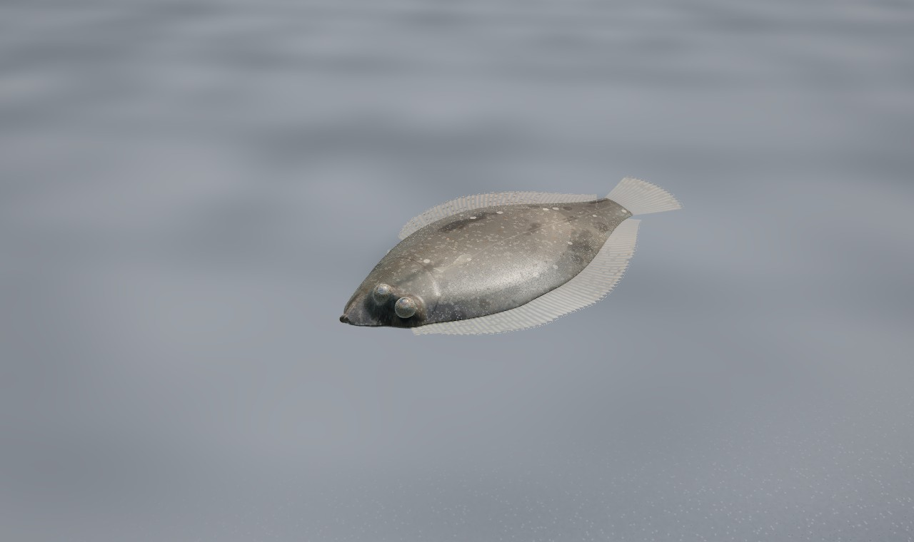

## 1. 調査（写真資料 70 枚と一般的な知見から）

写真資料は手のひら・トレー・水中の生きた個体が中心（有眼側の真上から、横から、頭部の拡大、無眼側）。**確認** は写真で直接確かめたこと、**推定** は写真から読み取れないため類縁種と一般知見から決めたこと。

| 部位 | 写真で確かめたこと | モデル |
|---|---|---|
| 大きさ | 多くは全長 5〜10 cm（定規で約 9.5 cm の個体、手のひらで約 6 cm）。着底直後の 2〜3 cm 個体も | 全長 70 mm で作り、個体の全長（図鑑の範囲）で拡大縮小 |
| 体形 | 楕円形、体高は体長（尾鰭を除く）の約 0.45。尾柄は短く高く、尾鰭は丸い〜切形。横から見ると薄く、有眼側は丸く盛り上がり、無眼側は平ら | 背縁・腹縁の輪郭関数と、上下非対称のレンズ形の断面（有眼側が厚い）。厚さは最大で体高の約 1/5、鰭の付け根に向けて急に薄くなる |
| 左右非対称の頭部・眼 | 右眼側が有眼側。両眼は頭の前寄りで近接し、上眼（移動してきた眼）は背縁にかかって下眼のやや後ろ。眼は盛り上がった眼窩（タレット）にあり、周りは皮膚が襟状。虹彩は暗いオリーブ灰色に金色の斑、瞳孔の上縁に虹彩の弁がかぶさって三日月形に見える | `Eye_UpperSide_1`（下眼）と `Eye_UpperSide_2`（上眼）は半径 1.55 mm、それぞれ骨で独立に動く。頭の皮膚が眼窩の襟になり、眼の間は狭い隆起。瞳孔は楕円から弁の楕円を引いた三日月形 |
| 口 | 吻端の小さな口。上から見ると口は吻のわずかに下眼側へ寄った先端にあり、口裂は斜め後ろ下へ約 20°。口角は有眼側では下眼の前縁の真下、無眼側ではそれより後ろ。唇は厚く、下唇（下顎）が上唇よりわずかに前へ出る。吻の背側は口のすぐ上で浅くくぼむ。閉じていても唇の輪郭と口裂の暗い線が見える | 口裂の線 `cleftX(s, side)` を吻端から有眼側の口角（s 3.7 mm）・無眼側の口角（s 4.4 mm）へ。唇は口裂に沿ったチューブ（Catmull-Rom）を頭のメッシュに合わせたもので、上唇は前上顎骨 `J_premax`（口角へ向けて頭の骨へ）、下唇は下顎 `J_jaw` に乗る。下唇が太く、前へ 0.18 mm 出る。背縁の輪郭に吻のくぼみ。開くと唇の内側に淡い肉色の細い縁、その奥は暗い口腔 |
| 背鰭・臀鰭 | 背鰭は上眼の上から尾柄まで、臀鰭は腹鰭の後ろから。どちらも中央後半が最も高い。膜は半透明の淡黄褐色、鰭条ははっきりして、条の上に黒い色素胞の短い筋 | 鰭条単位の膜（`DorsalFin` 68 条 / `AnalFin` 50 条）。付け根に沿った 14 本・10 本の骨（`J_D0..13`、`J_A0..9`）で波を前から後ろへ送る。鰭条と色素胞はシェーダーで描く |
| 胸鰭・腹鰭・尾鰭 | 有眼側の胸鰭は小さく、鰓蓋の後ろで体に沿って寝る。腹鰭は臀鰭の起点の前に小さく。尾鰭は丸い扇 | `PectoralFins`（有眼側と無眼側、骨 `J_pecE`/`J_pecB`）、`PelvicFins`（`J_pelE`/`J_pelB`）、`Tail`（18 条、`J_caudal`/`J_caudal2`） |
| 有眼側の模様 | 砂色〜オリーブ褐色に細かい黒点が密、砂粒のような淡色の小斑のモザイク、不規則な暗斑。成長とともにクリーム白の丸い斑（bicoloratus の特徴）が目立つが若魚では小さく疎ら。橙色の小斑もある | シェーダー内で手続き的に生成（Voronoi のモザイク、円斑、fbm の暗斑、黒色素胞）。画面で細かくなりすぎる模様は距離で消える。成魚の骨質板（「石」）はまだ小さいので低い小突起の列だけ（**推定**） |
| 無眼側 | 半透明の真珠白〜青白。筋節（W 字）と脊柱がかすかに透け、鰓のあたりは淡紅色 | 無眼側専用の色と筋節の線、透過 |
| 背景適応 | 底の明るさに合わせて体色が変わる | 個体の黒色素胞量を、足元の底質の明るさに合わせて数秒かけて変える（**推定**: カレイ類の一般的な性質） |
| 生息・行動 | 浅い砂底で静止、または砂に潜って眼だけ出す。潜った個体は輪郭がかすかに残る | 下記 2 章 |

## 2. 行動

`behavior.js` が姿勢（体の位置と向き、背骨の曲げ、鰭条の角度、顎、鰓蓋、眼、潜り具合）を書き、`rig.js` の `applyPose` が骨格に当てる。ゲームでは脳（行動ツリー）が意図を決め、魚はそれを実行して着底すると次の意図を待つ。

| 状態 | 内容 | 脳の意図 |
|---|---|---|
| `BOTTOM_REST` | 無眼側を下に、縁と鰭を底に押し付けて伏せる。体は砂紋に沿って曲がる（体の下の高さに最小二乗で平面を当て、各関節の曲げで残りを吸収）。動くのは鰓蓋（毎分約 70 回）、独立に動く両眼、ときどき背鰭・臀鰭を走るさざ波だけ。着底のあとは小さな波打ちと鰭のはためきで砂に体を据える | `rest` |
| `GLIDE_SWIM` | 頭から浮き上がり、浅い 2〜3 打。底から 0.5〜1.5 cm を、体はほとんど動かさず背鰭・臀鰭の後ろへ走る波で進む。ときどき短く尾を打つ。曲がるときは少し傾く。鰭を広げて減速し、着底 | `wander`、`moveTo` |
| `BURROW_IN_SAND` | 体全体の速く小さな波打ちと鰭のはためきを 2〜4 回。縁の砂が流動化して鰭と背に乗り、そのたびに少し沈む。最後は眼窩の上の眼と輪郭の一部だけが見える。しばらく潜ったまま、出るときは体を振って砂を落とす | `burrow`、`special: hide / sleep` |
| `FORAGE` | 頭を上げて眼で探し、鰭で底すれすれをにじり寄る → 止まって両眼で狙う → 頭を下げて突進、口を素早く開いて吸い込み → 噛んで鰓孔から砂を出す。獲物がなければ底をついばむ | `forage` |
| `ESCAPE` | 鉛直面の C スタート: 強い尾の打ちで底から急に浮き、底近くを体長の 3〜6 倍ほど突進、滑空、着地してすぐ潜るか、その場で固まる | `flee`（割り込み可） |

- 警戒: 脳の `display` で伏せたまま固まる（体を押し付け、眼を観察者へ向ける）。
- 体の波は横に倒れているので鉛直面。ゆっくりした移動は縁鰭（背鰭・臀鰭）の波、速い移動は尾。
- 潜った個体は、皮膚の上に砂がかぶる（縁から先、頭は最後、眼は出たまま）。砂の粒は世界座標の mm 単位で描くので、魚と一緒に動かない。
- 水の中に留まる: 引き潮で水深が減っても水面から出ない高さに抑える。観察ケースと水槽では枠の中に留まる。

行動ツリー `flatfish_sand`: 近すぎれば逃避（1.1 m）→ 水深 3 cm 未満なら深みへ → 警戒が高ければ固まる → 伏せる 46 %・潜る 26 %・移動 14 %・摂餌 14 %。伏せる時間の平均 26 秒。

## 3. 描画

| 段階 | 距離（70 mm 個体） | 三角形 | 内容 |
|---|---|---|---|
| LOD0 | 0.32 m まで、観察中は常に | 30,870 | `Body` / `Head`（唇を含む）/ `Eye_UpperSide_1` / `Eye_UpperSide_2` / `DorsalFin` / `AnalFin` / `Tail` / `PectoralFins` / `PelvicFins` |
| LOD1 | 0.32〜1.3 m | 6,496 | 同じ部品で粗い |
| LOD2 | 1.3 m〜 | 926 | `Body`（頭を含む）と `MarginalFins`（全部の鰭を 1 メッシュ） |

```
IshigareiJuvenileRoot
├── Armature（J_root → J_head、背骨 J_sp1..6、J_caudal、J_caudal2、顎 J_jaw・J_premax、眼 J_eye1・J_eye2、
│            胸鰭・腹鰭 4、背鰭 14、臀鰭 10 の 42 本）
└── IshigareiLOD
    ├── LOD0: Body / Head / Eye_UpperSide_1 / Eye_UpperSide_2 / DorsalFin / AnalFin / Tail / PectoralFins / PelvicFins
    ├── LOD1: 同上（粗い）
    └── LOD2: Body / MarginalFins
```

- ジオメトリは段階ごとに 1 つだけ作って全個体で共有。個体は自分の骨格とマテリアルだけを持ち、マテリアルは同じシェーダープログラムを共有する。ドライバの更新は `CreatureSystem` の間引き（`DRIVERS.ishigarei.nearDistance` 3 m 以内は毎フレーム）。
- PBR: `MeshPhysicalMaterial` を `onBeforeCompile` で拡張（粗さ、粘液のクリアコート、ACES Filmic は既存のレンダラー）。水中の光（スネルの窓・散乱光・太陽光の減衰・焦線）はアミメハギと共通の `AMH_UNIFORMS` と注入コードを使う（`amimehagi/materials.ts` の `HELPERS` `ENV_INJECT` `SUN_INJECT` を export しただけで、アミメハギ側の描画は変わらない）。伏せた魚は底の光を受けるので、水の光の場は控えめに。
- 透過（subtle translucency）: 体の厚みから光の通りやすさを求め、薄い縁・鰭の付け根・無眼側が後ろからの光で暖色に透ける。
- 濡れた皮膚: 粘液のクリアコートと細かな凹凸の法線（画面の微分によるバンプ）。口の中は凹凸とクリアコートを切る。
- 砂との接し方: 近い段階（LOD0・1）では魚の下の地面の高さを 48×48 のパッチに取り（半精度テクスチャ）、頂点シェーダーで体と鰭を地面の上にやわらかく押し上げる。鰭が砂紋に潜って消えない。
- 接地影: ハクと同じ `ContactShadows`（`ShadowLayer`）に体の形の楕円で。太陽のシャドウマップは小魚には粗いので使わない。
- 底質: 足元の底質（`HabitatSample.substrate`）を 0.7 秒ごとに見て、潜ったときにかぶる砂の色と体色の明るさを合わせる。

## 4. ゲームへの組み込み

- `src/creatures/drivers/index.ts` に `ishigarei` を登録（モデルはドライバが作るので GLB なし）。
- `public/data/manifest.json` に種と行動ツリーを追加。
- 既存の描画・水・地形・潮・`CreatureSystem` には手を入れていない（`amimehagi/materials.ts` の 3 つの定数を export しただけ）。

## 5. 画像

`npm run render:ishigarei` で再生成（ビューアの静止画。ソフトウェア描画）。`ingame_*` は `node tests/smoke/ishigarei.mjs`（6 月 12 日 10:30、葛西臨海公園西なぎさ、潮位 +20 cm）。

| | |
|---|---|
| 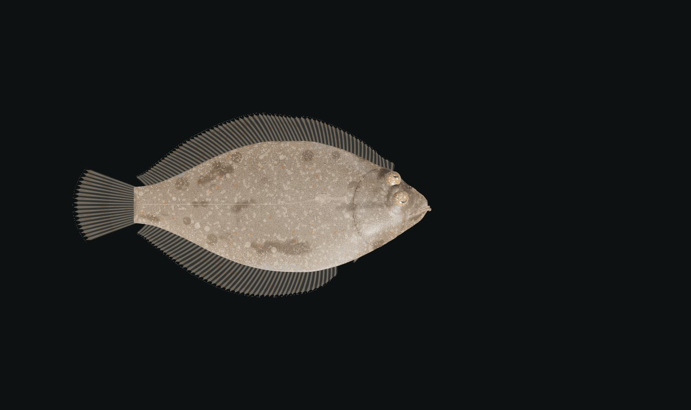 背面（有眼側、LOD0） | 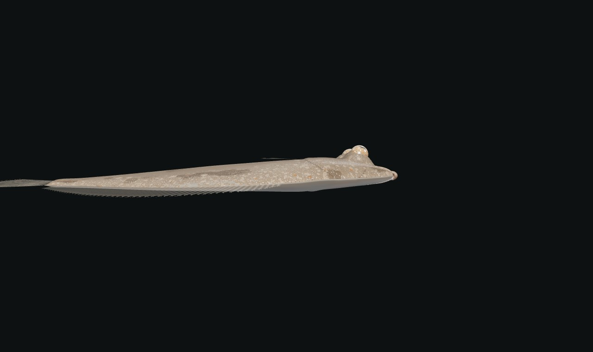 側面: 薄い体、眼窩の上の両眼 |
| 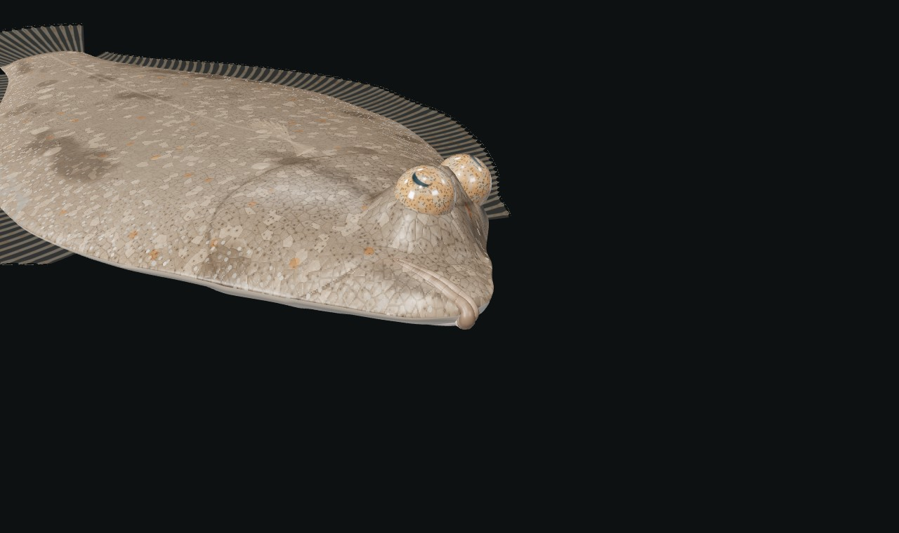 頭部: 小さな端位の口、厚い唇、斜め後ろ下への口裂、吻のくぼみ | 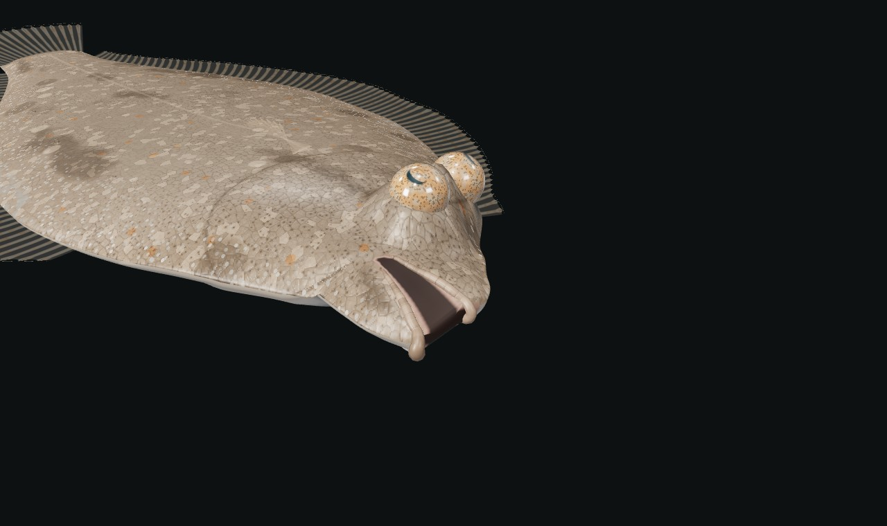 開口: 下顎が下がり、淡い肉色の縁と暗い口腔 |
| 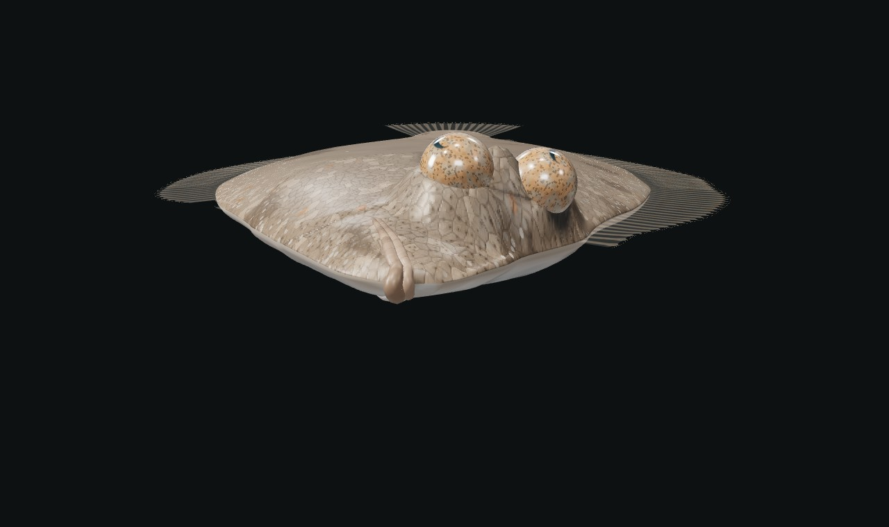 正面: 有眼側の盛り上がり、眼の高さ、口の位置 | 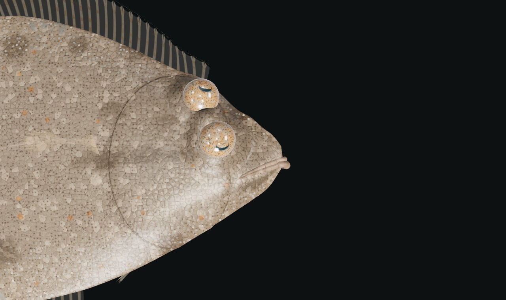 頭部を上から: 近接した両眼と三日月形の瞳孔 |
| 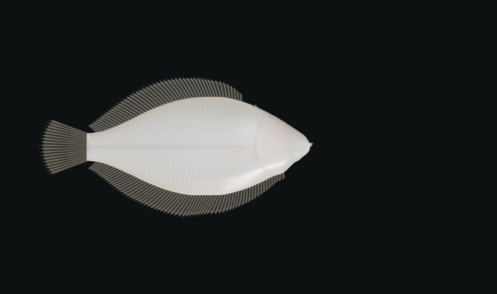 無眼側: 真珠白、透ける筋節 | 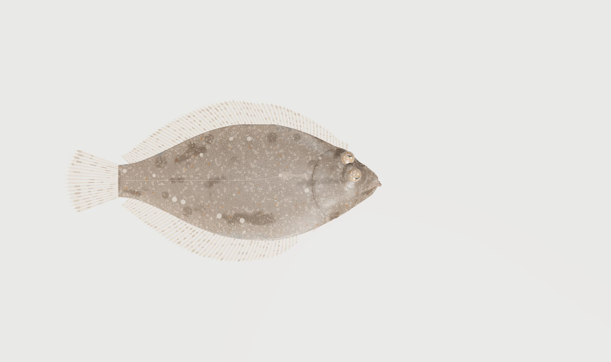 撮影トレー |
|  LOD1 |  LOD2 |
| 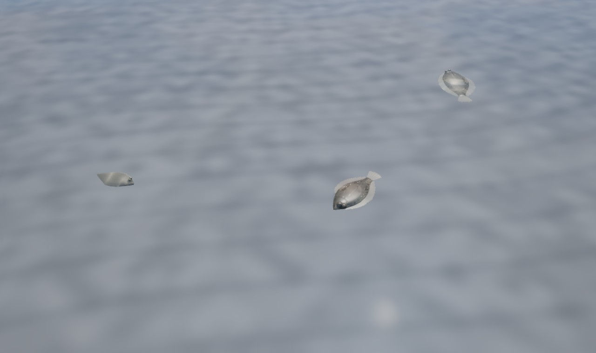 砂泥の浅場（3 尾） | 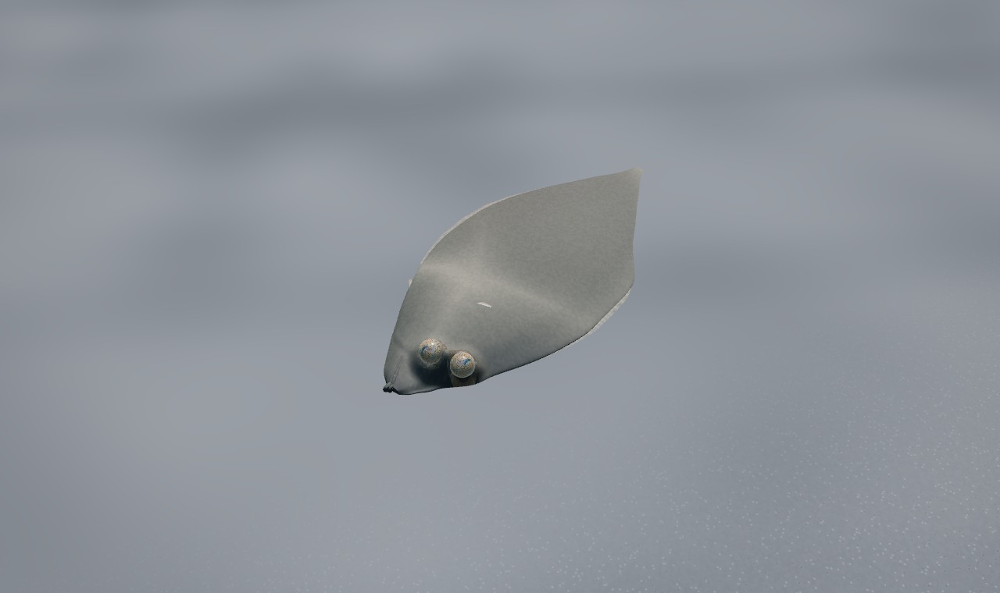 潜砂: 眼と輪郭だけ |
| 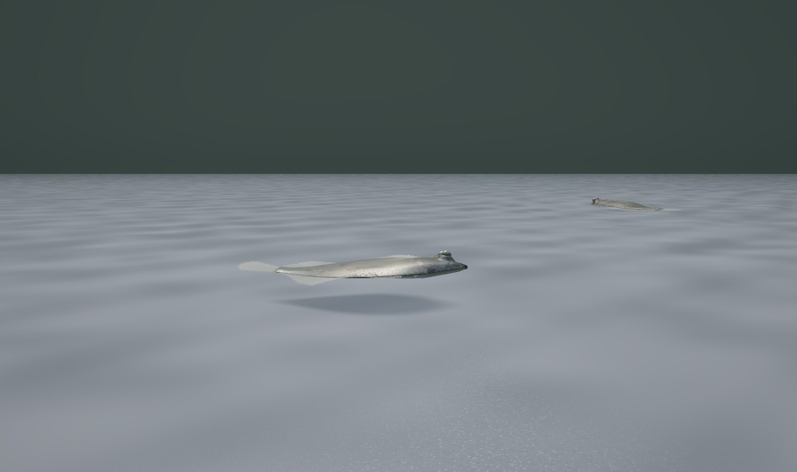 底すれすれを泳ぐ | 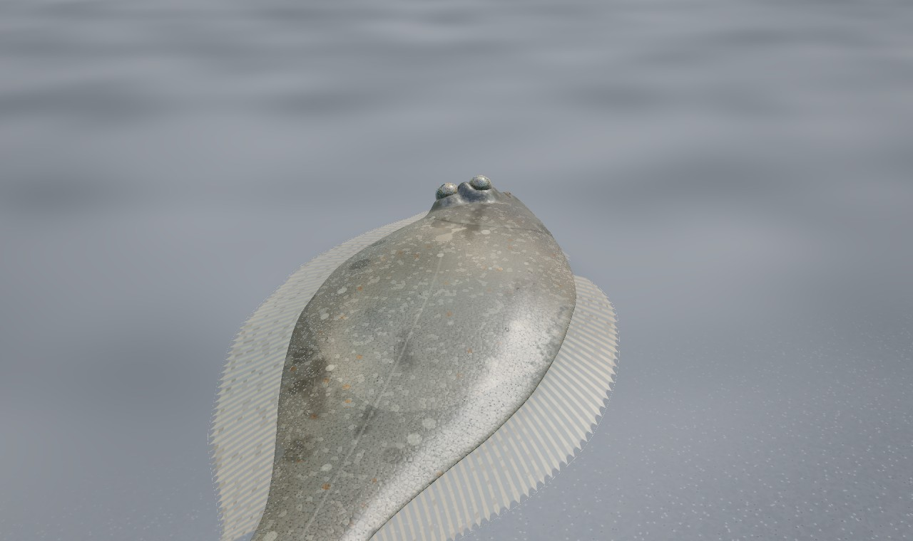 摂餌 |
| 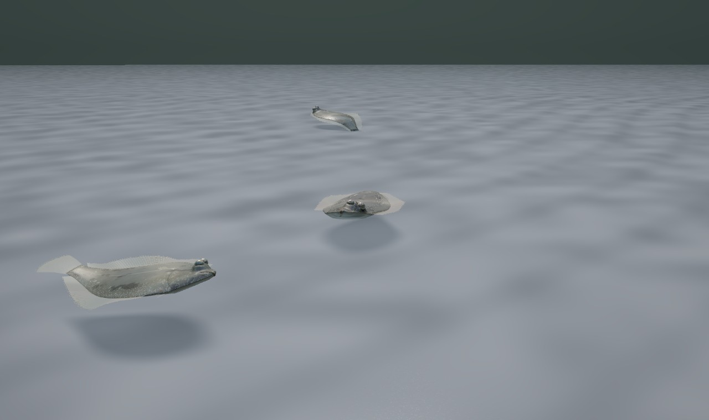 逃避: 尾を打って底を離れる | 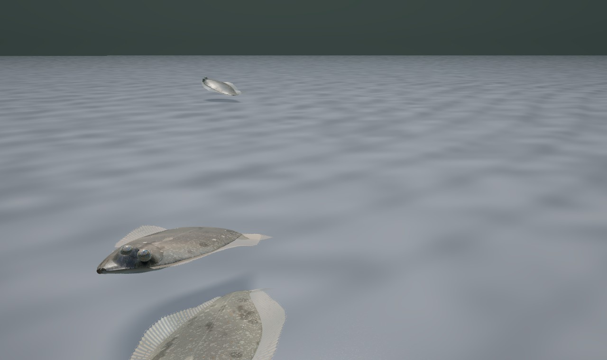 短い突進 |
| 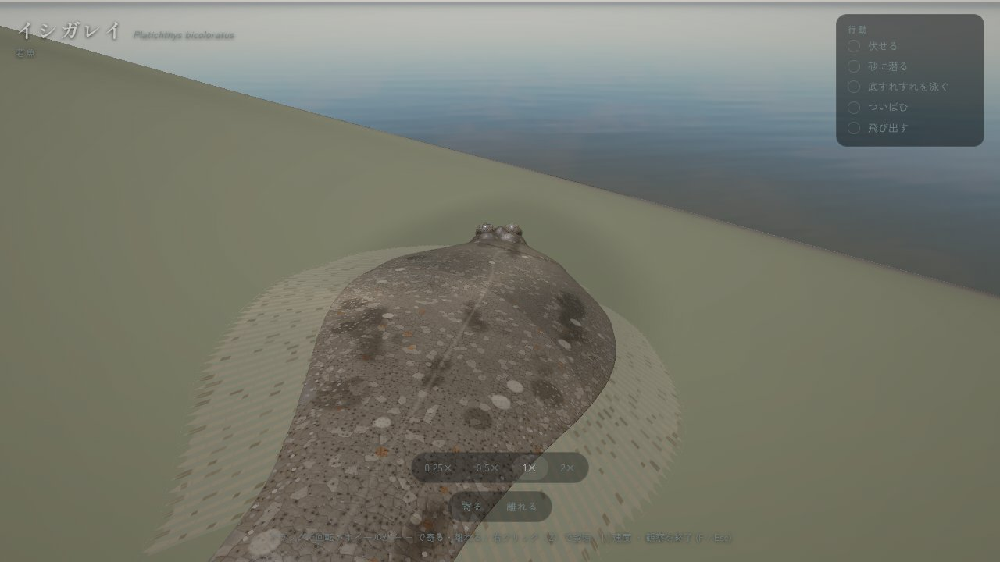 ゲーム内: 観察（行動の記録に 伏せる・砂に潜る・底すれすれを泳ぐ・ついばむ・飛び出す） | 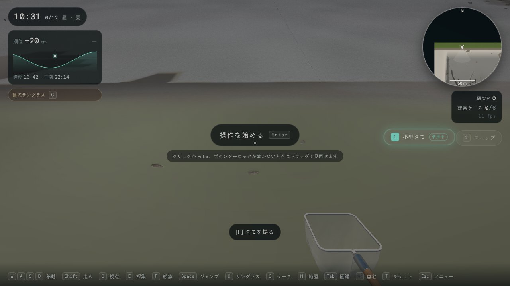 ゲーム内: 浅場にしゃがんで見る |

## 6. 既知の制限

- 砂煙はまだ見えない。行動は砂煙を出す位置・速さ・量を `world.silt` で渡すが、ゲーム側にそれを描く受け口がない（ドライバは渡していない）。潜るときの砂は魚のシェーダーの中（皮膚にかぶる砂）だけで、地形の砂は動かず、潜った跡も残らない。
- 鰭条は付け根で回る剛い線で、鰭条そのものはしならない（波は隣り合う鰭条の位相差で表す）。
- 背景適応は明るさだけで、模様の大きさ（底の粒の粗さ）までは合わせない。
- 浅い角度から見ると、粘液のクリアコートが空を映して銀色っぽく見えることがある。
- 変態途中（眼が移動中）の稚魚、成魚の「石」（骨質板）は作っていない。
