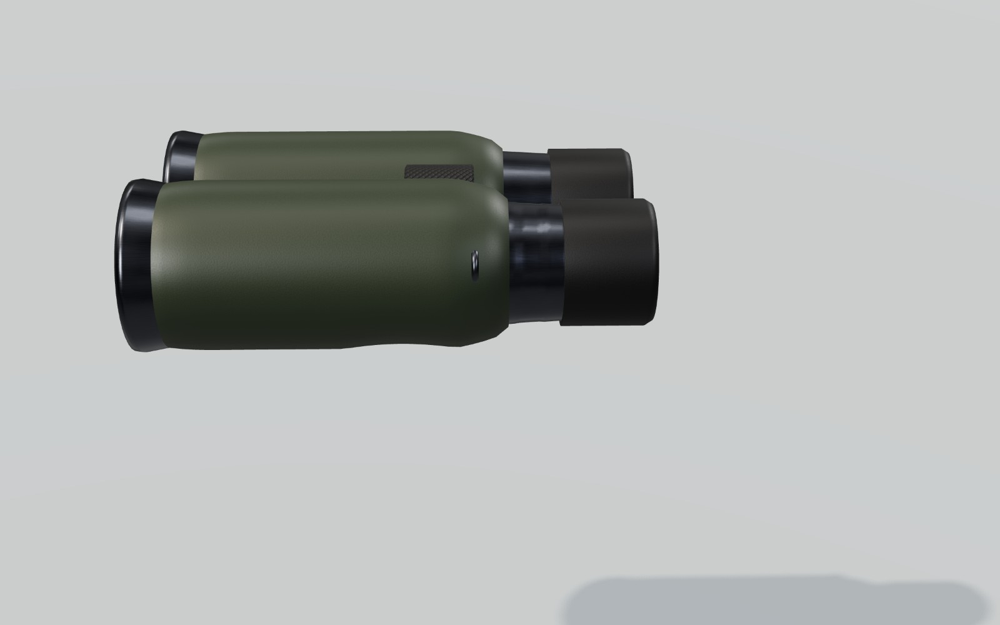
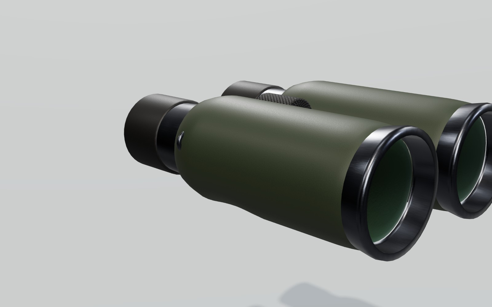
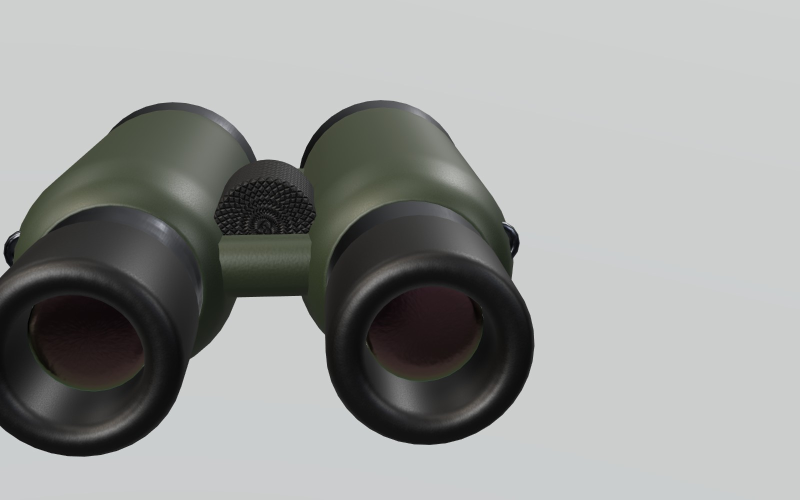
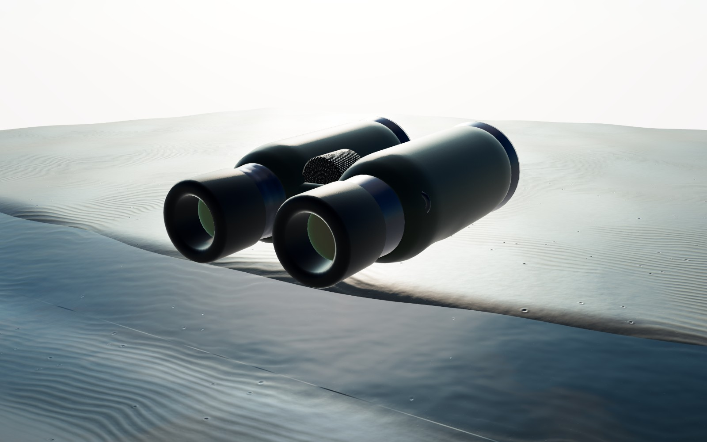

# 双眼鏡（野鳥観察）— 3D モデル（Three.js / GLB）

`src/assets/models/optics/obs_binoculars.{hero,lod1,lod2}.glb`。掘る道具と同じビルダーで作っています。

```bash
npm run model:optics     # GLB と manifest.json を作り直す
npm run render:optics    # この文書の画像を作り直す
```

| 項目 | 値 |
|---|---|
| 形式 | ダハプリズム式 8×42（実視界 7.5°） |
| 寸法 | 全長 15.6 cm、幅 12.8 cm（眼幅 64 mm） |
| 推定重量 | 660 g |
| 構成 | オリーブ色のラバー外装（親指のくぼみ付き）、ガンメタの接眼部と対物リム、右の視度調整リング、中央ヒンジと 2 本のブリッジ、ゴムのピントリング、ツイストアップ見口、マルチコートのレンズ（`KHR_materials_iridescence` で虹色の反射）、ストラップ環 |
| 三角形数 | hero 12.6k / lod1 4.5k / lod2 1.9k |

座標は **メートル、+Y 上、+Z が見る方向**、原点は左右の見口の中間。ノードは `Eye_L` / `Eye_R`（見口。カメラを置く位置）、`Grip_Main` / `Grip_Support`（右手・左手で胴を握る位置）、`Objective_Center`。濡れ・泥は `prepareNet()` がそのまま使えます。

| | |
|---|---|
|  |  |
|  |  |
