# マガキ（Magallana gigas）— 個体・群生・牡蠣礁の手続き生成モデル（Three.js）

`src/creatures/oyster/` にあります。形状・テクスチャ・付着物はすべて実行時の手続き生成（写真テクスチャなし）で、殻表面のテクスチャは起動時に GPU で焼き込みます。ゲームでは両側の土塁の内側の法尻と沈んだ先端、低い干潟の捨て石の山（`src/world/Riprap.ts`）に牡蠣礁として並び、潮位に合わせて開閉します。

```bash
npm run dev  →  http://localhost:5173/gerupamasini/reference/oyster-viewer/   # ビューア（単体・個体差・群生・牡蠣礁、LOD、濡れ、開殻）
npm run render:oyster                   # この文書の画像を作り直す（ヘッドレス Chromium）
```

ゲーム内ではデバッグ（F3）の「牡蠣礁」で最寄りの群生の前へ移動できます。干潮で露出すると閉殻したまま濡れて光り、上げ潮で沈むと数秒置いてゆっくり開き、近づいて走る・網を振る・掘ると素早く閉じます。

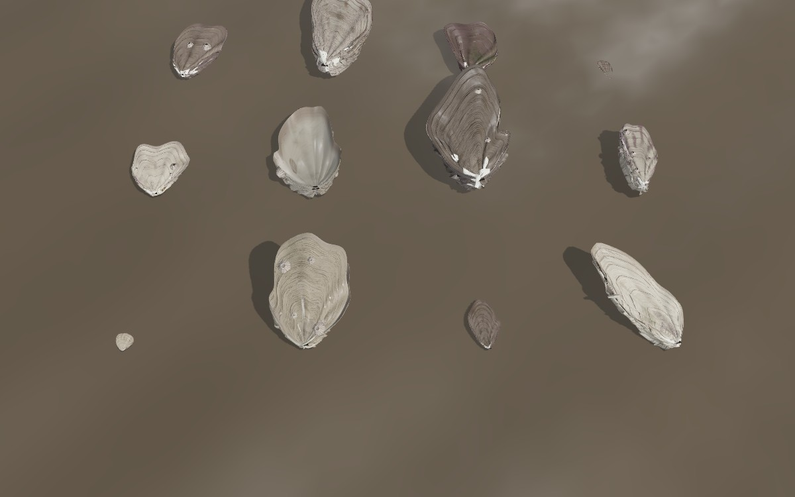

## 1. 実物の調査

| 調べたもの | 分かったこと | モデルへの反映 |
|---|---|---|
| 殻の形（FAO 養殖種概説、国環研・県の貝類図鑑） | 不等殻。左殻（下殻）は深い椀形で基質に固着し、混み合うと側面がほぼ垂直になる。右殻（上殻）は平らかやや膨らみ、左殻の内側に収まり小さい。形は環境で極端に変わる（密集すると細長く殻頂で立ち、岩の上の単独個体は丸く平たい） | 下殻は Poisson 膜で作る深い椀（急な側面と広い底）、上殻は低いドーム。`crowding` で幅/長比（0.35〜0.85）と立ち上がり角を変える。殻頂（蝶番）を原点に置き、上殻だけがそこを軸に回る |
| 殻表面 | 粗く、薄板状の成長脈（鱗片）が重なり、縁が持ち上がってフリル状・短い樋状になる。放射状のひだで殻縁がジグザグに噛み合う。外層は稜柱層、内側は葉状層、ところどころにチョーク層 | 大きな成長脈はジオメトリ（段差＋持ち上がった縁＋下へ折り返すオーバーハング）。その間の小鱗片・成長線・放射肋・稜柱層の粒・穿孔虫の穴は焼き込みの高さ・法線・粗さマップ |
| 色 | 黄白〜灰白の地に紫褐色の放射帯。新しい殻縁ほど紫が濃い。内面は白い陶磁器状（真珠層ではない）、閉殻筋痕は白〜紫、縁に黒紫の帯 | 色は「マスク」だけ焼き込み（明度・紫の放射帯・新しい縁・浸食しやすさ）、地色・紫の量・全体の紫黒化は個体の `colorSeed` でシェーダが決める |
| 軟体部 | 外套膜は 3 枚の褶。外縁は黒〜褐色に色素沈着し触手が並ぶ。開殻中は殻の隙間から外套膜の縁と鰓がわずかに見える | 外套膜の上下 2 葉（縁は暗褐〜黒、不規則な長さの触手 2 列）と体（クリーム色の鰓のひだ）。上葉は上殻に 72 %、下葉は 22 % 追従して、隙間の奥で縁どうしがほぼ接する |
| 開閉（バルボメトリの記録） | 摂食中の開殻は殻縁で数 mm、閉殻筋の収縮は速く、靭帯による開きは遅い。干出時は閉じて水を保つ。接触・振動・影・急な環境変化で即座に閉じる。ときどき偽糞を吐き出す「咳」（素早い半閉→ゆっくり再開） | 摂食時の開角 1.3〜2.9°（10 cm の殻で約 2〜5 mm、テストで 1〜7 mm に制限）。閉殻の時定数 0.09 s、再開はゆっくり |
| 付着・群生 | 幼生は親貝の殻に好んで付着する（群生付着）。礁は生きた貝・死殻・片殻が積み重なり、固着面は相手の表面の形を写し取る。フジツボ、アオサ、泥が付く | 群生の成長シミュレーション（founder → 世代ごとに岩か既存個体の殻へ付着）。下殻は相手面に押し付けて平らにし、セメントの縁を作る（頂点シェーダ）。死殻（開いたまま／下殻だけ）、稚貝・若貝、フジツボ、泥・藻 |

参考: [FAO Cultured Aquatic Species — *Crassostrea gigas*](https://www.fao.org/fishery/docs/DOCUMENT/aquaculture/CulturedSpecies/file/en/en_pacificcuppedoyster.htm)、[Naturalis — *Crassostrea gigas* 形態](https://ns-mollusca.linnaeus.naturalis.nl/linnaeus_ng/app/views/species/taxon.php?id=121471)、[環境省 瀬戸内海の生き物 マガキ](https://www.env.go.jp/water/heisa/heisa_net/setouchiNet/seto/g1/g1chapter1/ikimono/kaki.html)、[Glasgow 大学 学位論文: *C. gigas* の殻の微細構造](https://theses.gla.ac.uk/2939)、[バルボメトリによる二枚貝の開閉行動（VLIZ）](https://www.vliz.be/imisdocs/publications/71/390871.pdf)

## 2. 構造

```
OysterRoot        Group（殻頂＝蝶番が原点、+x が蝶番軸、+z が腹縁へ、+y が上殻側。単位 m）
├── LowerShell    下殻（左殻）: 固着、動かない。外面・殻縁・内面が閉じた 1 枚の面。下殻に付いたフジツボもここ
├── UpperShell    上殻（右殻）: 原点（蝶番）に置き、rotation.x = −開角 で開く
├── Mantle        外套膜 2 葉＋触手＋体。上葉の追従はシェーダ（頂点属性 follow × 開角）
└── Hinge         靭帯
```

| ファイル | 役割 |
|---|---|
| `genome.ts` | 6 つの seed（`shellSeed` `growthSeed` `damageSeed` `sizeSeed` `colorSeed` `attachmentSeed`）から個体のすべてのパラメータ。年齢（spat / juvenile / adult / old）、死（開いた死殻 / 下殻だけ）、混み具合 |
| `variants.ts` | 成長パターン（6 種、左右反転で 12 通り）: 大きな成長脈の位置・段差・持ち上がり・オーバーハングの表、放射ひだ、閉殻筋痕の位置 |
| `geometry.ts` | 殻の手続き生成。輪郭（ベータ関数の涙形＋低次調和＋成長方向のゆらぎ＋曲がり）、Poisson の椀、成長脈の段差と折り返し、欠け（その列の成長座標を切り、層の厚みが断面として見える）、殻縁、内面、外套膜、触手、体、靭帯、フジツボ。LOD ごとの詳細度 |
| `bake.ts` | 殻表面のアトラスを GPU で焼く（マスク RGBA8、高さ＋粗さ RG16F、法線＋AO RGBA8）。共有アトラス（6 型）と接写用のヒーローアトラス、タイル状の詳細法線 |
| `material.ts` | `MeshPhysicalMaterial` の拡張。色・泥・藻・浸食・死・フジツボの表示、濡れ（水の膜をクリアコートで）、開殻と固着面への押し付け（頂点）、同じ変形をする影用の深度マテリアル |
| `behavior.ts` | 5 状態の行動 |
| `OysterIndividual.ts` | 上の階層を持つ 1 個体（LOD0/1/2 を持ち替え） |
| `OysterCluster.ts` | 群生の配置（`layoutCluster`）と 5〜30 個体の群生モデル |
| `OysterReef.ts` | 大量配置（InstancedMesh、共有ジオメトリ・共有マテリアル、LOD、更新頻度の間引き） |
| `src/world/Riprap.ts` | 捨て石・護岸（石の形状と材質、配置、歩ける高さ、付着面の抽出、石の正確な表面への射影） |

## 3. 個体差

seed はそれぞれ独立に効きます（たとえば `colorSeed` だけ変えれば形はそのまま色だけ変わる）。

| seed | 変わるもの |
|---|---|
| `shellSeed` | 幅/長比、椀の深さ、上殻のドーム、最大幅の位置、殻頂の尖り、腹縁の丸み、左右差、曲がり、殻縁のねじれ、輪郭の調和成分、成長方向のゆらぎ（成長脈が同心にならない）、放射ひだの強さ、殻の厚み、摂食時の開角 |
| `growthSeed` | 成長パターンの型と左右反転、フリルの強さ |
| `damageSeed` | 殻縁の欠け（位置・幅・深さ、上下どちらの殻か）、折れたフリルの区間、殻頂・表面の浸食 |
| `sizeSeed` | 殻長（稚貝 12〜26 mm、若貝 28〜55 mm、成貝 65〜120 mm、老成 110〜160 mm） |
| `colorSeed` | 地色（汚白・灰・クリーム・藤灰・スレート）、明るさ、紫の量、紫黒に染まった個体、内面の色調、閉殻筋痕の色、外套膜の色素 |
| `attachmentSeed` | 立ち上がり角、固着の深さ（セメント痕の広さ）、泥・藻の量、フジツボの数と位置 |

礁ではインスタンスごとに別の genome を持つので、同じ原型を使う個体でも大きさ・向き・開き方・色・泥・藻・フジツボ・浸食・固着面がすべて違います。

## 4. 表面: ジオメトリとマップの使い分け

| 尺度 | 表現 |
|---|---|
| 輪郭、椀、上殻のドーム、放射ひだ、殻縁のジグザグ | ジオメトリ |
| 大きな成長脈（5〜9 枚/殻）の段差、持ち上がった縁、下へ折り返すオーバーハング、欠けの断面 | ジオメトリ（LOD0 は 1 枚に 4 行、LOD1 は 2 行の段、LOD2 は平均化した厚み） |
| 小鱗片（縁が裂けて途切れる鋸歯状の段）、剥がれた外層の段、成長線、放射肋 | 高さマップ → 法線マップ、LOD0 は変位（displacement）も |
| 稜柱層の粒、穿孔虫・海綿の穴 | 高さ・法線・粗さ |
| 最も細かい粒（接写） | タイル状の詳細法線マップ |
| 凹部の汚れ・陰 | 高さから焼いた AO（明度にも反映） |
| 濡れ | 粗さを下げ、凹部と泥の上に水の膜（クリアコート、表面張力で途切れる）。干出からの時間で上向きの面から乾く |

アトラスは成長座標 (u, s) 上に焼くので、ジオメトリの段差と法線マップの鱗片の縁が一致します。隣り合うタイルは殻縁どうし・殻頂どうしで接するように向きを交互に反転し、遠距離のミップで異なる領域がにじまないようにしています。

## 5. LOD

| | 用途 | 三角形（目安） | 内容 |
|---|---|---:|---|
| hero | 接写の単体（`OysterIndividual` + ヒーローアトラス 2048²） | 約 75,000 | 縁 200 列、成長脈ごとに 4 行、触手すべて、変位、詳細法線 |
| LOD0 | 礁・群生の近距離（〜2.4 m） | 約 15,600 | 縁 64 列、4 行の成長脈、外套膜＋触手、フジツボ、変位 |
| LOD1 | 通常のゲーム距離（〜11 m） | 約 1,700 | 縁 20 列、2 行の段、外套膜は帯だけ、フジツボ簡略 |
| LOD2 | 遠距離（〜50 m） | 約 300 | 縁 10 列、平均化した厚み、軟体部・フジツボなし、標準マテリアル |

遠くの礁は石のマテリアルにも出ています（潮間帯の帯に古い殻の外皮: 灰白の殻片と黒い継ぎ目、成長輪）。遠景ではこれが礁に見え、近づくとインスタンスの牡蠣がその上に重なります。

## 6. 行動

| 状態 | 条件 | 開角 |
|---|---|---|
| `LOW_TIDE_CLOSED` | 水面より上 | 0（閉殻のまま） |
| `SUBMERGED` | 再び水没 | 2.5〜9 秒閉じたまま、その後ゆっくり開く |
| `FILTER_FEEDING` | 開ききった | 摂食開角（±12 % でゆっくり揺れる）。ときどき「咳」 |
| `CLOSED` | 摂食中に一定確率で休む | 0（8〜30 秒） |
| `THREAT_CLOSE` | 接触、近くの足音（走ると 4 m、歩くと 1.6 m 以内）、網・スコップ、潮位の急変 | 0.09 s の時定数で閉じ、5〜16 秒保持 |

## 7. 群生と牡蠣礁

`layoutCluster` は founder（老成・成貝）を基質に寝かせて固着させ、残りを成貝・若貝・稚貝の順に、基質か既存個体の殻（上殻や下殻の側面）へ付着させます。混み合うほど細長く、殻頂を支点に立ち上がり、腹縁を上や外へ向けます。各個体は殻の球近似 4 個で他個体・基質との貫通を判定し（固着相手とは深め、その他とは浅めの食い込みを許容）、下殻は相手面（石の実際の表面、または下の殻の接平面）に押し付けて平らにします。16 % 前後が死殻（開いたまま、または下殻だけ）、石の足元の泥には死殻の片殻が転がります。

`OysterReef` は 12 種の原型（老成 2、成貝 6、若貝 2、稚貝 2）を LOD ごとに 1 回だけメッシュ化し、原型 × LOD ごとに InstancedMesh を 1 つ、マテリアルは LOD ごとに 1 つを全原型で共有します（描画は最大 36 回、実際は見えているものだけ）。インスタンス属性は `iState`（開角・死・位相・浸食）、`iLook`（色・泥・藻・フジツボ）、`iPlane`（固着面）。LOD とカリングは群生単位で 0.25 秒ごと（カメラが 1.5 m 動いたときも）に決め、ヒステリシス 10 %。行動の更新は LOD0 が毎フレーム、LOD1 が 4 フレームごと、LOD2 と非表示が 16 フレームごと（経過時間はためて渡す）、プレイヤーの近く 4.5 m と潮位の急変時は毎フレーム。

配置先は `Riprap.attachSites`: T.P. +0.38〜−1.15 m の帯に入る石の面のうち、下向きでなく、泥に埋まらず、隣の石に覆われていないものを 0.2 m 間隔で拾います。石ごとに「礁の濃い区間・薄い区間」を低周波ノイズで決めるので、牡蠣は石列に沿ってまだらに付きます。上限は品質 low で 5,000 個、mid/high で 12,000 個（地点はシャッフルしてから上限で切るので、全体が均等に間引かれます）。

## 8. ゲームへの統合（変更点）

| 既存 | 変更 |
|---|---|
| `World`（`src/app/World.ts`） | 石と牡蠣礁を作ってシーンへ。毎フレーム潮位と最近の満潮線（`habitat.wetLevel`）を牡蠣と石のマテリアルへ渡し、石の LOD を更新 |
| `App` | フレームごとに `world.oysters.update`（プレイヤーの位置・速さ・走り）。網の振りの範囲に入った牡蠣と、スコップで掘った地点の牡蠣は閉殻。デバッグのテレポート「牡蠣礁」、マーカー、描画数 |
| `FPSController` | `groundBoost`: 石の上に立てる（0.6 m を超える段は登れない） |
| 水（`WaterPass`） | 変更なし。牡蠣と石は深度を書くので、水没部分は既存のスクリーンスペースの水で屈折・吸収される |

## 9. 画像

| | |
|---|---|
| 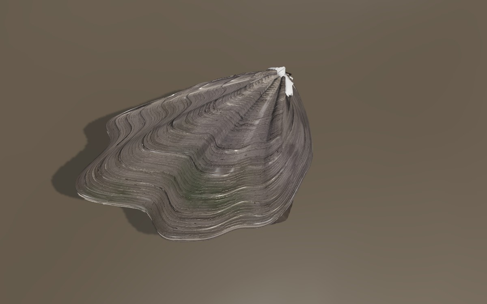 接写（濡れ・摂食中） | 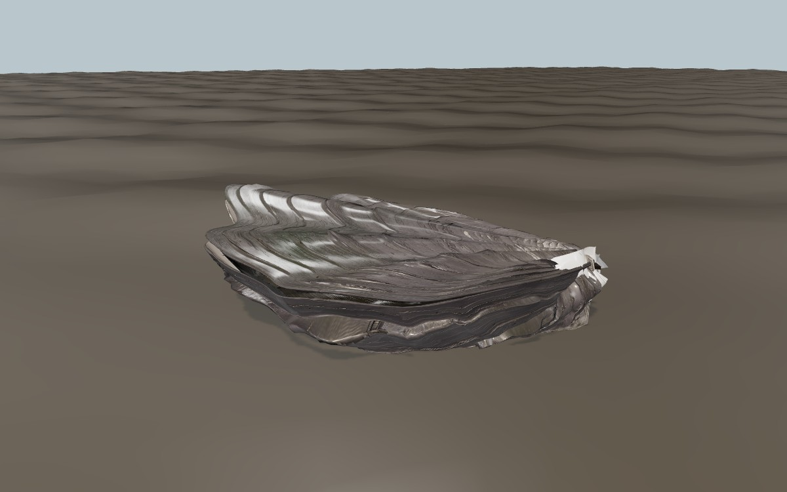 横から: 重なった成長脈 |
| 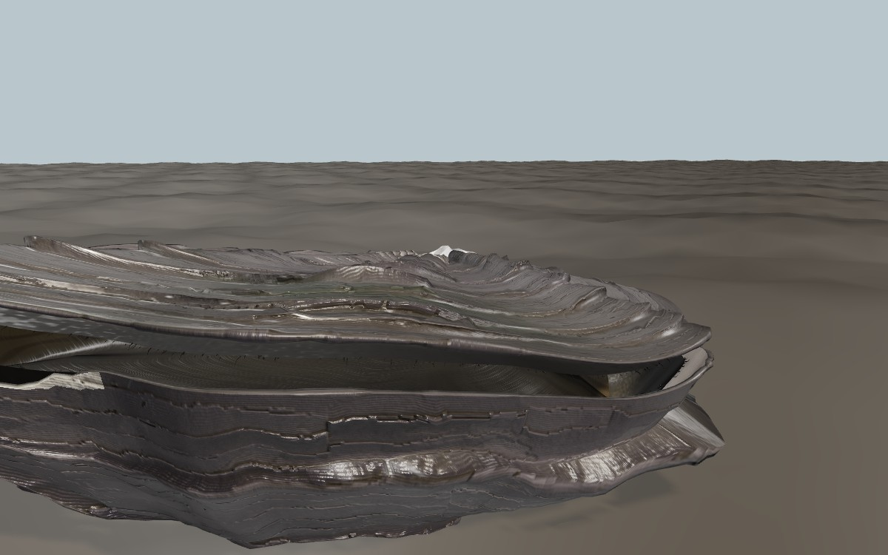 摂食中の開殻（約 4 mm）、奥に外套膜 | 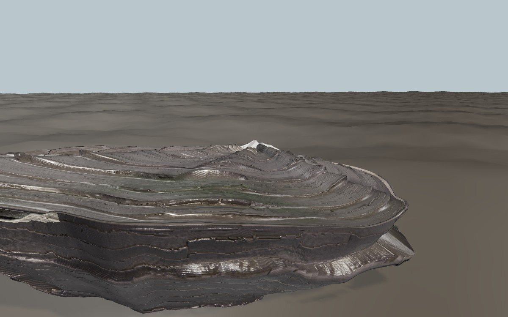 閉殻: ジグザグの殻縁が噛み合う |
| 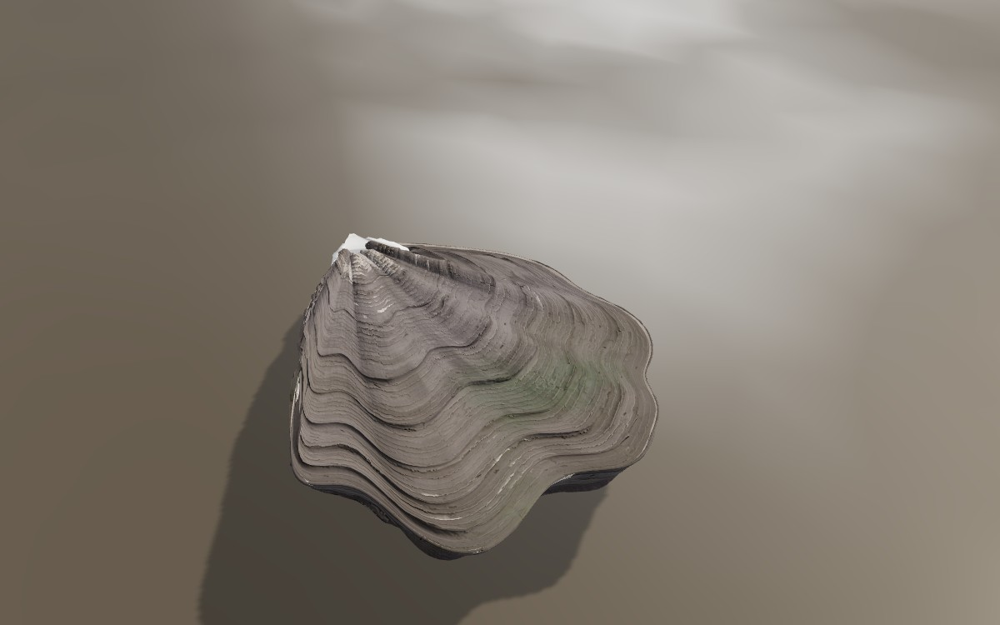 干出して乾いた殻 | 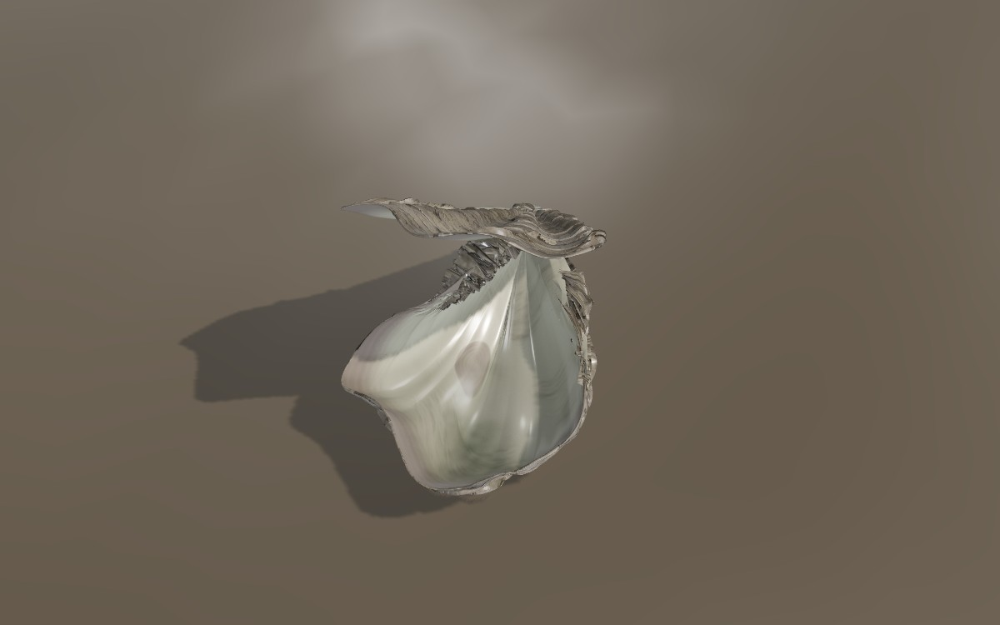 開いた死殻: 内面と閉殻筋痕 |
| 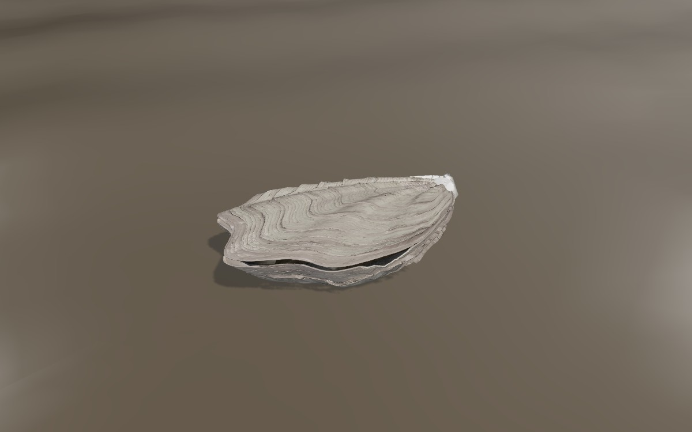 LOD0 | 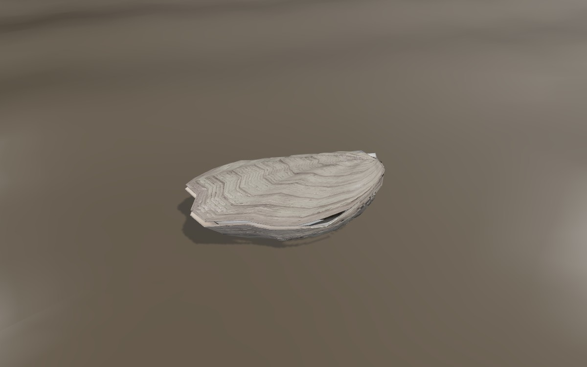 LOD1 |
| 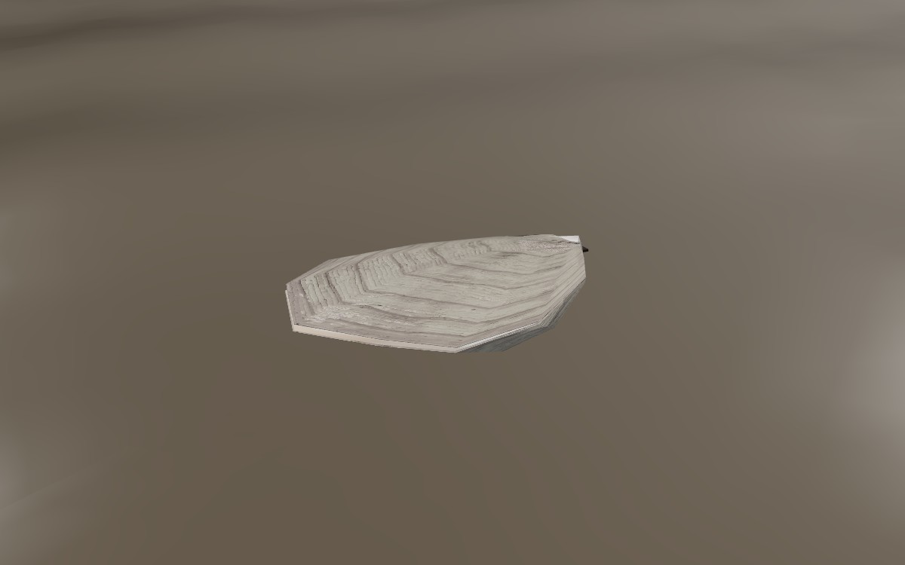 LOD2 | 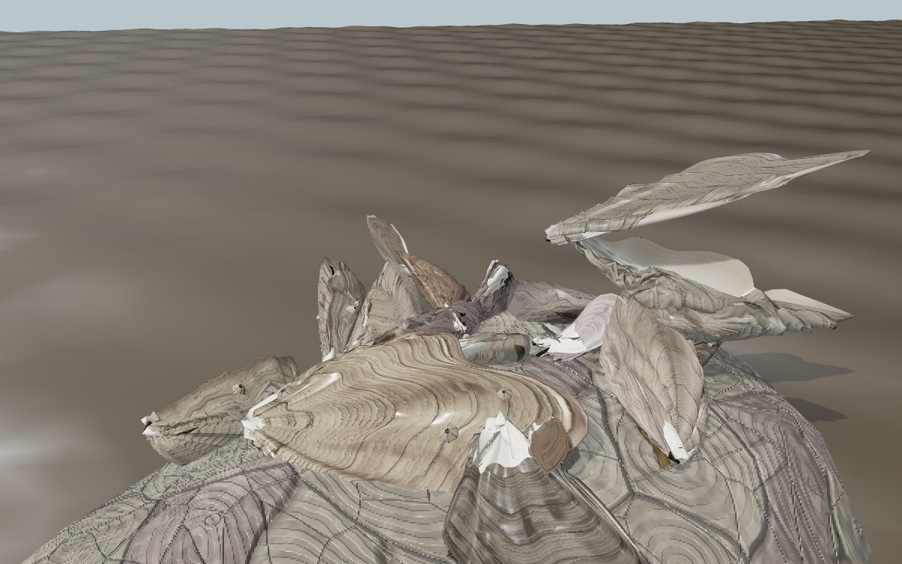 群生（石の上の 18 個体） |
| 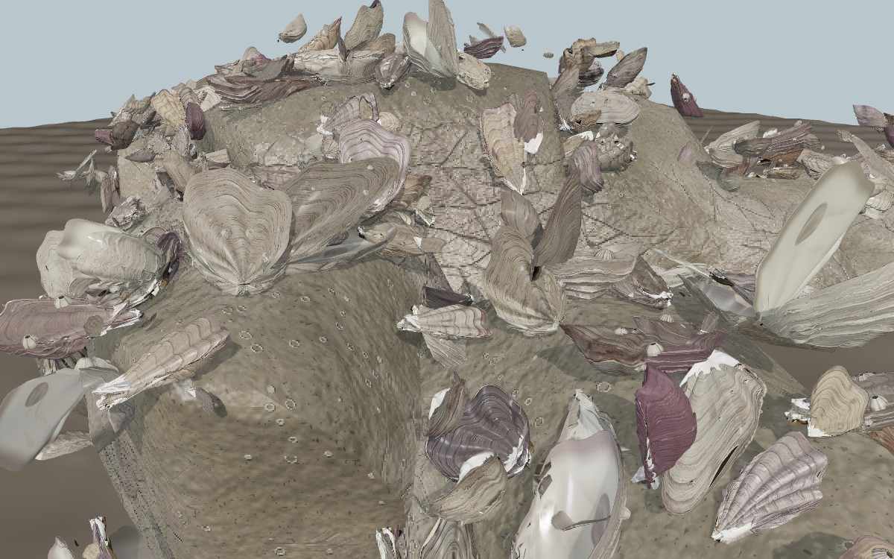 牡蠣礁（ビューア） | 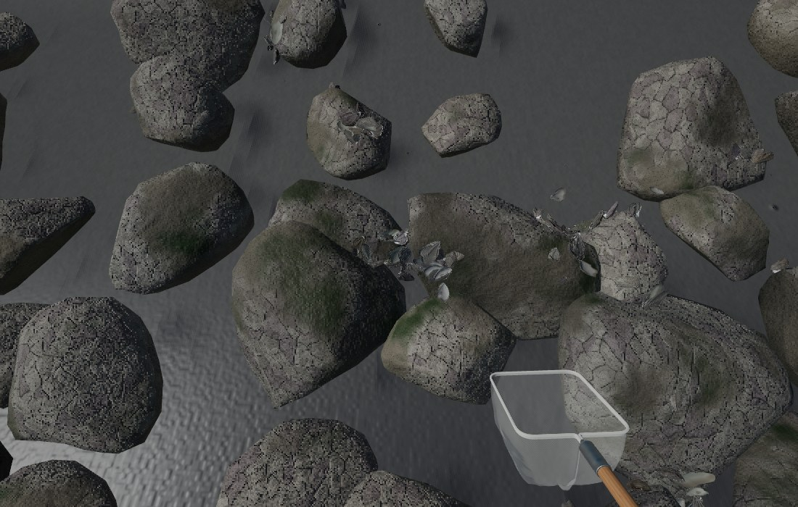 ゲーム内: 干潮の石積み |
