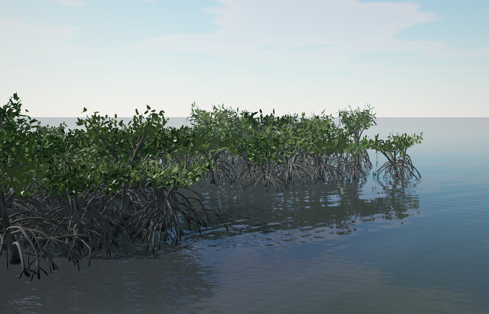
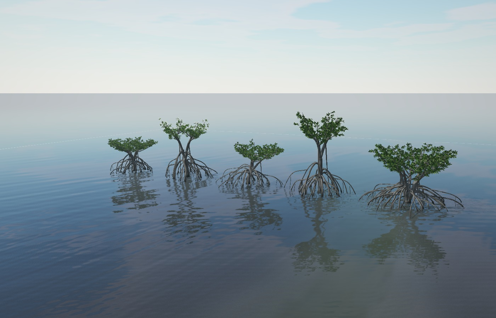
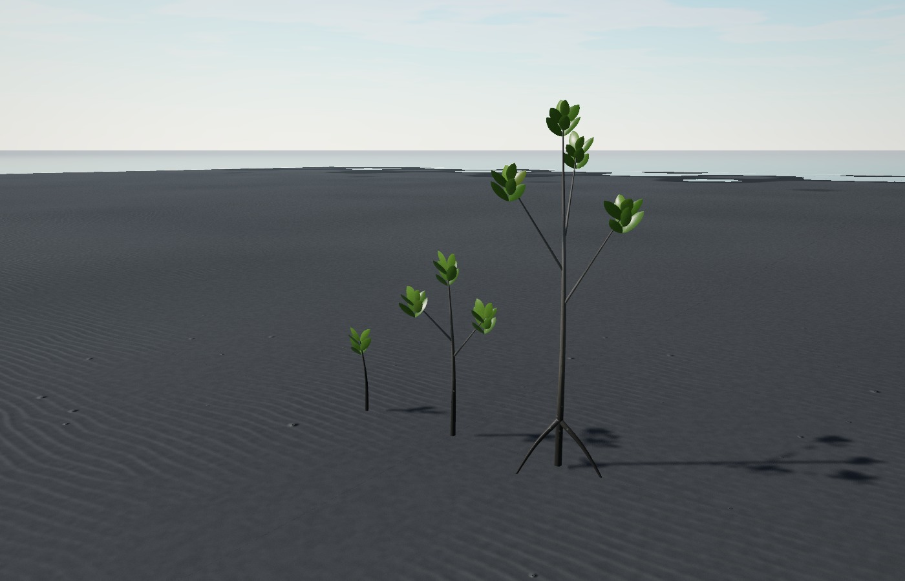
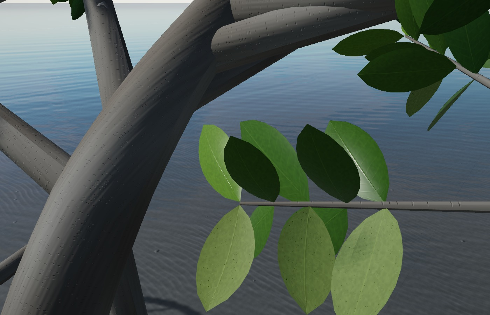
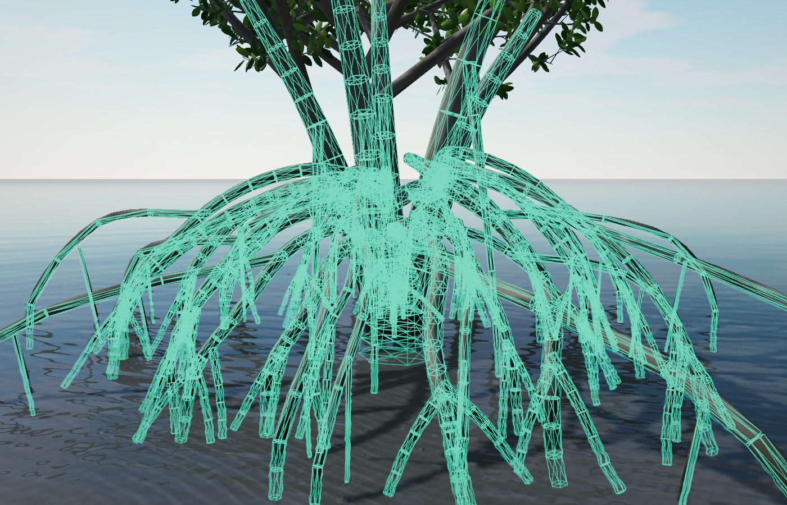

# ヤエヤマヒルギ — Rhizophora stylosa

写真資料の形態を基にした Three.js 用の共有Geometryモデル。成木は**5樹形だけ**、幼木は**3サイズだけ**。支柱根の上面への接地、側面による移動阻止、潮汐による濡れ、3段階LOD、群生の instancing を含む。



## 観察・実行

```sh
npm ci --cache /workspace/.npm-cache
npm run dev
# Vite の /gerupamasini/reference/yaeyama-hirugi-viewer/index.html を開く
npm run check
npm run build
CHROMIUM_PATH=/usr/bin/chromium node tools/models/yaeyama-hirugi/render.mjs
```

ビューアはゲームと同じ `Terrain`、`Habitat`、`WaterPass`、`SkyDome`、`FPSController` を使う。単木、5樹形比較、支柱根、葉の近接、幼木、群生、LOD、seed、潮位、衝突メッシュ表示を切り替えられる。「林を歩く」で WASD／Space／Shift、Esc で OrbitControls に戻る。潮位は手動の検証値で、実在地点の潮汐予測ではない。

既存の葛西・走水には自動配置しない。既存マップの地理・生息環境を変えず、熱帯のマップが `mangroves` を宣言した場合だけ `World` が植生と物理判定を構築する。

## 写真調査と形態

主資料はユーザー提供の **『ヤエヤマヒルギ_写真資料_70枚.pdf』** と幼木の添付写真。PDF全70画像のコンタクトシートを確認し、次を形状に反映した。資料自身の記載どおり、写真の種同定は掲載元の観察記録に依拠し、独立した専門家による再同定ではない。外部補助資料の NSW PlantNET と Australian Tropical Rainforest Plants は通信先のアクセス制限により取得できなかった。

| 観察点 | 主な写真番号 | 実装への反映 |
|---|---|---|
| 低い横広がり・二股・片寄り・縦長・多幹 | 12、14–15、21、42、46–47、51–52、59–60 | 幹数、分岐高、傾斜、樹冠幅を別々に設定した5ベース |
| 幹・支柱根の灰褐色、細かな皺・点状の表皮、濡れた下部、泥の付着 | 21、28、44、56、70 | 微小凹凸、皮目、明るい灰褐色のPBR、潮汐の湿潤帯、地表から20–40 cmの不規則な泥被覆、潮間帯のフジツボ・カキ稚貝の斑点 |
| 幹から外へ張り出してアーチを描き、ほぼ垂直に泥へ下る支柱根。泥際での分岐、外側へ飛び石状に伸びる二次アーチ | 12、21、23、28、42、44–45、56、59–60 | 起点→外向きの立ち上がり→頂部→急な下降→泥中20 cmの6点曲線。泥際の2–3本の「足指」根、頂部から外へ伸びる二次アーチ、細い垂下根 |
| 葉先付近に集まる対生葉、厚い楕円状の葉、表裏の差 | 2、6–7、13、35、49–50、53、57–58、62、67–69 | 対生・十字対生の節、湾曲した葉身、短い尖端、葉脈、表面の光沢、淡い裏面と暗い点 |
| 群生の隙間、林縁の短い木、若木、重なる根 | 1、23、29–31、38、45、60、67 | クラスター内の不規則配置、空隙、林縁の幼木・低い樹冠、根の重なり |
| 幼木の細い直立軸と立ち上がる葉 | ユーザー添付写真、13、27、29、39 | 約0.4／0.85／1.55 m の幹高。最大サイズのみ初期の支柱根 |

根は木の下から生える均一な円錐や呼吸根の列にはしない。斜めの直線で尖った先端（クモの脚状）にもしない。根は泥に入るまで太さの約55%を保ち、先端は地表下で終わる。中心軸に一律につなぐと二股より上で浮いてしまうため、各支柱根の付け根は該当高さに実在する幹の曲線から選ぶ。

PDF写真は観察に使用しただけで、写真テクスチャの転用・再配布はしていない。Geometryと材質の模様は独自に生成する。写真の掲載元・ライセンスは提供PDFの各ページを参照する。

## 成木5樹形と幼木3サイズ



| base | 樹形 | 設計した幹・樹冠の高さ目安 | 主な相違 |
|---|---|---|---|
| 0 | 低い横広がり | 4.2 m | 低い分岐、広い枝の扇、17本の主支柱根 |
| 1 | 二股の開いた樹冠 | 5.6 m | 2本の主幹、左右に開く樹冠、15本の主支柱根 |
| 2 | 水路へ傾く樹冠 | 4.8 m | 片側へ寄った枝と幹、広い根、18本の主支柱根 |
| 3 | 縦長の林内木 | 7.1 m | 高い分岐、狭い樹冠、16本の主支柱根 |
| 4 | 多幹の古木 | 5.0 m | 5本の主幹、最も広い根、24本の主支柱根 |

高さは造形用の代表値で、写真の実測値や生物学的な最大サイズではない。成木の個体差は `trunkSeed`、`rootSeed`、`leafSeed`、`scaleSeed`、配置の回転・尺度で演出する。seedごとの新しいGeometryは作らない。

- `trunkSeed`：幹と枝、接続する根に共通する傾斜。
- `rootSeed`：根の張り出しと不均一な横方向の曲がり。CPUの衝突形状にも同じ変形を適用する。
- `leafSeed`：個体ごとの葉の向き・色味・風の位相。枝先の葉配置は5ベースで共有する。
- `scaleSeed`：一様尺度0.86–1.14。別の `spec.scale` と乗算する。

幼木は成木を縮小したものではなく、別の固定3モデル。seed変形は無効で、細い直立幹・少数の対生葉・段階的な枝と根を持つ。



## 構造と材質

```text
YaeyamaHirugi
├── Trunk
├── Branches
├── Leaves
└── Roots
RootCollision                 ← 別の簡略メッシュ／解析用カプセル
```

単木の各部分は3LODの InstancedMesh を持ち、表示する1段だけを有効にする。林では「48 m の空間区画 × ベース × LOD × 4部分」にまとめる。葉や枝ごとのObject3D／draw callは作らない。木材の管は曲線に沿う座標系で接続し、末端を閉じる。

樹皮は灰褐色の細かな皺・皮目・局所的な色差を持つ `MeshStandardMaterial`。潮位と保水する湿潤帯で色を暗くし、roughness を約0.82から0.30へ変える。狭い帯に控えめな藻膜を加える。

葉は湾曲と中肋の盛り上がりをGeometryで持たせ、`MeshPhysicalMaterial` の clearcoat で表面の光沢を出す。表面と裏面は別の色・粗さ・斑点を持つ。葉脈の微小な法線変化と薄葉の透過光は近似で、体積SSSや植物の生理モデルではない。葉先だけを約1–2 cm揺らし、幹と根は静止させる。同じ変形をカスタム深度材質にも入れるため、影が置き去りにならない。



## 支柱根の衝突判定



描画メッシュを毎フレーム raycast しない。判定は3段階：主支柱根（アーチ）は16区間の滑らかなカプセル列で、上を歩ける・ミナミトビハゼ等の小動物が乗れる面になる。足指根と二次アーチは6区間で、乗れる・引っかかる部分を保つ。細い垂下根は1カプセルの簡略判定（胴体の阻止のみ）。小動物の接地のため、乗れる根の判定半径は最低2.5 cm。幹も障害物に含める。描画LOD、影、距離カリングと無関係に同じ判定が残る。

`RootCollisionWorld` は2 mセルの空間インデックスを持つ。上面はテーパー円筒と丸い端部に対する垂直交差から計算する。接地高さ、実際の接地点、法線、木ID、区間を返す。根の間は床にしない。別区間の内部に埋まる端部は支持面から除外し、垂直根の継ぎ目が不可視の階段になることも防ぐ。

プレイヤーは半径18 cmの足の接触範囲、最大45 cmの段差、立位／低い姿勢の胴体を使う。5 cm以下の間隔で移動経路を検査するため、速い移動でも細い根を飛び越えてすり抜けない。ジャンプ後も根へ着地する。高さ制限付きの支持問い合わせで、頭上の根へ突然吸い上がらない。

`debugMesh()` は同じ区間から作る6角断面の独立した簡略メッシュ。可視メッシュとは別で、デバッグ表示・他の物理エンジンへの移植に使える。実際の判定は丸い端部も持つ解析カプセルなので、角張ったデバッグ円筒とは半径に応じた形状差がある（太い根で数cm）。

将来のミナミトビハゼ等は小さい足幅と落下範囲で問い合わせる。動物自体は今回追加していない。

```ts
const feet = animal.position;
const hit = world.mangroves?.collision.supportAt(
  feet.x, feet.z,
  feet.y + 0.025,  // 乗り越えられる高さ
  feet.y - 0.08,   // 追従できる落下範囲
  0.3,            // 最小の上向き法線成分
  0.008,          // 足の接触半径
);
if (hit) {
  feet.y = hit.height;
  // hit.point: 根表面の接点。hit.normal: 体の接地姿勢に利用。
}
```

## マップへ配置する

マップJSONに追加するだけで `World.create`／`World.update`／`World.dispose` と `App` の歩行判定・画質設定へ接続される。値はそのマップの地形・潮位の基準に合わせる。

```json
{
  "mangroves": {
    "seed": 317,
    "clusters": [
      { "x": -9, "z": -5, "radius": 15, "count": 85 },
      { "x": -13, "z": 21, "radius": 15, "count": 80 }
    ],
    "juvenileFraction": 0.25,
    "minGround": -0.35,
    "maxGround": 0.8,
    "minSpacing": 2.6
  }
}
```

配置は泥・泥混じり砂・砂、指定した標高帯、なだらかな根の接地範囲に限る。水路や急な岸、掘り跡から離し、木同士に間隔を設ける。実際の採用本数は地形条件によって要求本数以下になる。成木の根先は地形へ合わせる。地形変更後には林を再構築し、描画用の地形サンプルとCPUの衝突形状をそろえる。

単木を別シーンの素材として使う場合：

```ts
import { HirugiKit, YaeyamaHirugi, treeSpec, RootCollisionWorld, collisionSegments } from './src/world/mangrove';
const kit = new HirugiKit(terrain);       // 同じ地形・シーンの木で共有
const spec = { ...treeSpec(317, 0, 2), x: 6, z: 3, yaw: 0.8, scale: 1.05 };
const tree = new YaeyamaHirugi(kit, spec);
scene.add(tree);
const physics = new RootCollisionWorld();
physics.add(collisionSegments(kit.skeleton(spec.base), spec, terrain));
tree.setLod(0);
kit.uniforms.uHgWater.value = tideLevel;
kit.uniforms.uHgWet.value = wetLevel;
kit.uniforms.uHgTime.value += dt;
// 除去: tree.dispose(); 最後の利用者を除去した後に kit.dispose();
```

尺度・回転・場所を変更する場合は `spec` と物理形状を一緒に再構築する。親Groupを後から移動・非一様拡大すると、ワールド座標の地形サンプルや判定と一致しなくなる。根と葉の独自シェーダーを使うため、単純なGLBエクスポートだけでは材質・風・seed変形は再現されない。今回の納品形式はThree.jsで動作する実装とGeometryであり、写真測量やGLB一式ではない。

## LODと負荷

| 表示 | 内容 |
|---|---|
| LOD0 | 湾曲した個々の葉、細い枝、全支柱根、滑らかな幹。近接観察向け |
| LOD1 | 細枝を省略し、複数の葉を表す湾曲した切り抜きパッチ。通常の林内表示向け |
| LOD2 | 主枝・主根の輪郭と、さらに集約した葉群パッチ。遠景向け |

LOD1／2は近距離用の造形ではない。独自生成した512×512の共有アトラスに16種類の不規則な葉群を用意し、1枚の大きな葉にせず複数葉の輪郭へ切り抜く。葉の局所UVもアトラスから取得し、表裏や葉脈の材質は近接と同じ方式で描く。mipmapの画素面積に応じて切り抜き閾値を変え、遠くで樹冠が消えるのを抑える。切り抜きは影にも適用する。自動LODの距離には個体の尺度とヒステリシスを入れる。

| 画質 | LOD0まで | LOD1まで | 最遠表示 | 成木LOD0上限 |
|---|---:|---:|---:|---:|
| high | 11 m | 32 m | 180 m | 最も近い2本 |
| mid | 8 m | 25 m | 145 m | 最も近い1本 |
| low | 5 m | 18 m | 110 m | 最も近い1本 |

単木の比較ビューアは任意のLODを固定できる。林を一律LOD0へ固定する設定は造形確認用で、通常のマップ表示には使わない。lowの遠景LOD2は、平面の葉群カードと幹・主根の交差板ポリに切り替え、枝のGeometryを省略する。画質切替で通常LOD2へ戻せる。根のcollisionは全画質で同一。lowは木の影を省略し、LOD2は全画質で影を省略する。区画ごとの保守的な境界球でカリングし、seed変形による根・枝の張り出しも含める。

GPU上の頂点・インデックスはベースごとに共有し、各batchは行列と4つのseedだけを持つ。共通属性を借りているbatchを破棄するときは、他の木のGPUバッファを壊さないよう自分の属性だけ解放する。最後にkitを破棄したとき、残る共有バッファ・材質・地形テクスチャをまとめて解放する。

実測のポリゴン数・draw call・ブラウザー検証結果は [screenshots/results.json](screenshots/results.json) に保存する。そこに記録するソフトウェアWebGLの処理秒数は実機GPUのFPSではない。端末ごとのFPS／VRAM評価は別途必要。

## 検証

`tests/unit/mangrove.test.ts` は5樹形・対生葉・幹への根の接続・幼木・seed分離・Geometry共有と解放・LOD削減・地形追従・根の隙間・テーパー上面・接合部・段差・すり抜け・ジャンプ着地・群生配置・カリング後の判定を検証する。

`tools/models/yaeyama-hirugi/render.mjs` は実際のChromiumで5成木、幼木、根、衝突メッシュ、葉、215本の林、満潮、各LODを描画し、シェーダー／ページエラーを検査する。遠景の木材を診断色で描き、水面合成あり・なしの同じHDR処理の画素を比較する。これは遠方の木が水面に隠れる不具合への回帰検証で、診断色は写真出力には含めない。

実際の地形データを使う `World.create/update/dispose` の統合検証も行う。マングローブのテスト設定はブラウザー内だけで注入し、既存の地図JSONは変更しない。読み込み画面でのシェーダー準備より前に林の初期LODを構築すること、潮位の追従、生成・破棄を確認する。

水面処理の空判定は背景のクリア深度だけに変更した。従来の `depth >= 0.9995` はゲームの近クリップ5 cmでは約100 m以遠の実物も空と扱ってしまうため、遠景の幹が水面に隠れていた。SkyDome自身は深度を書き込まないので、物体の遠近ではなくクリア値で区別する。
