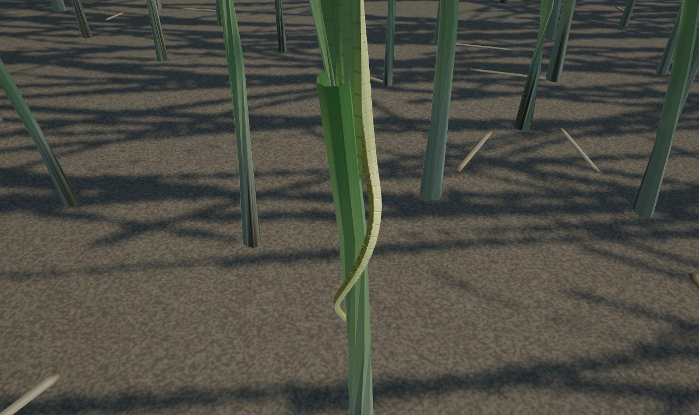
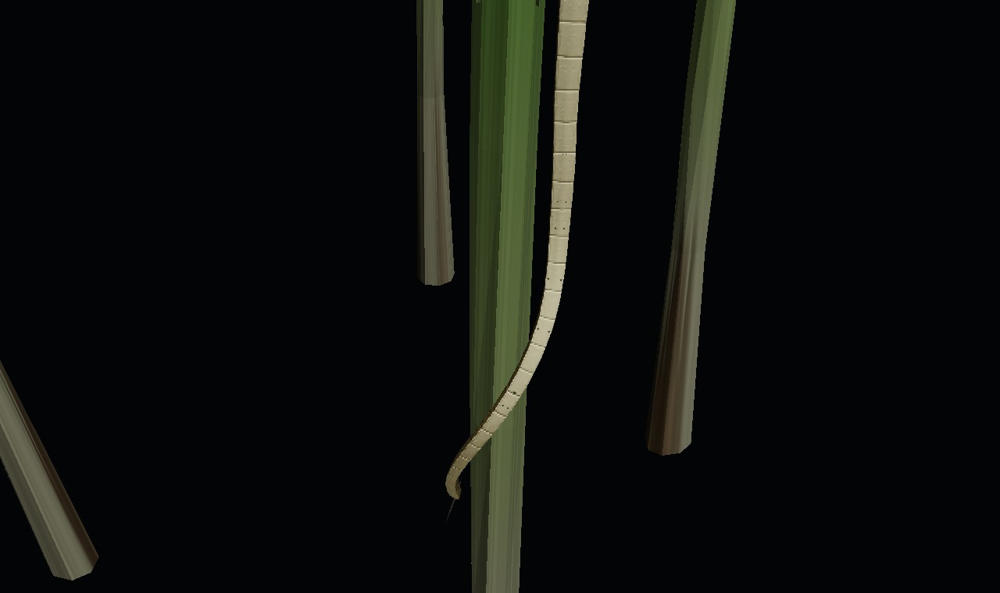
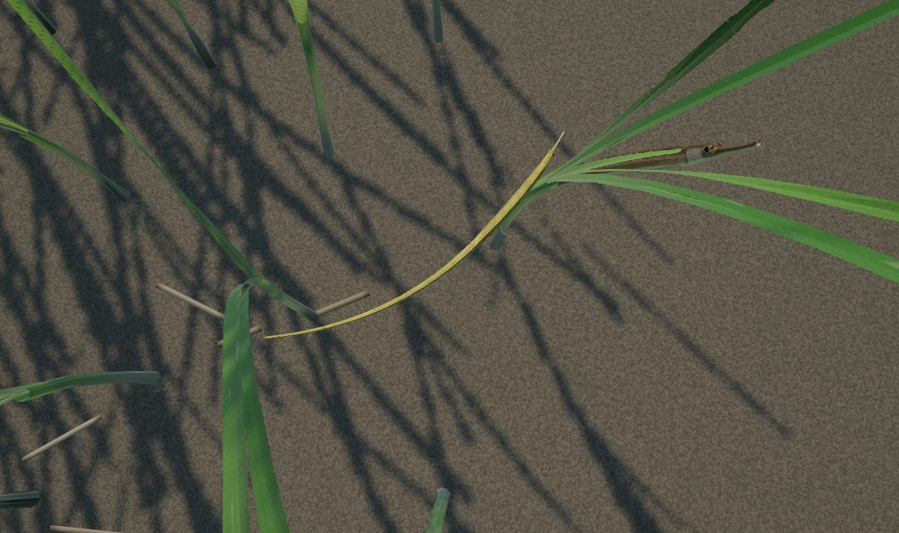
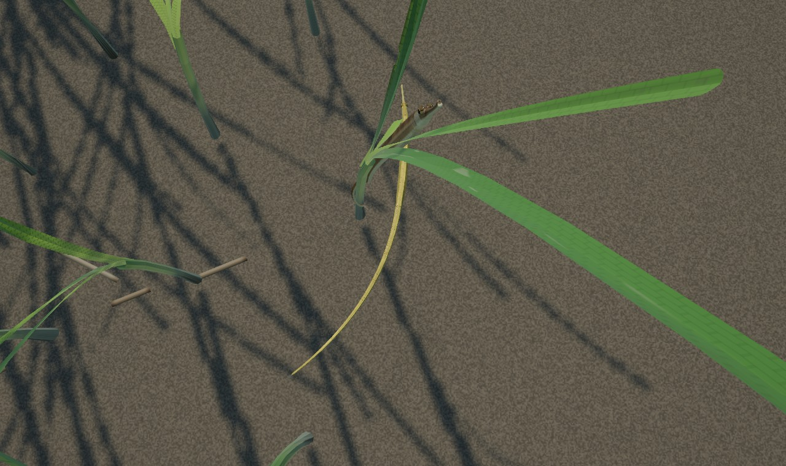
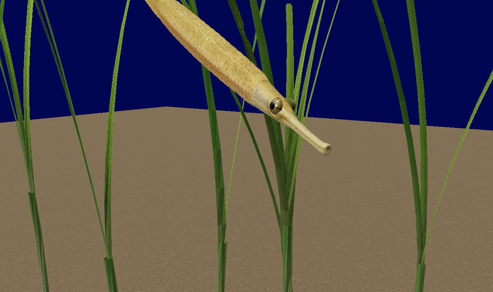
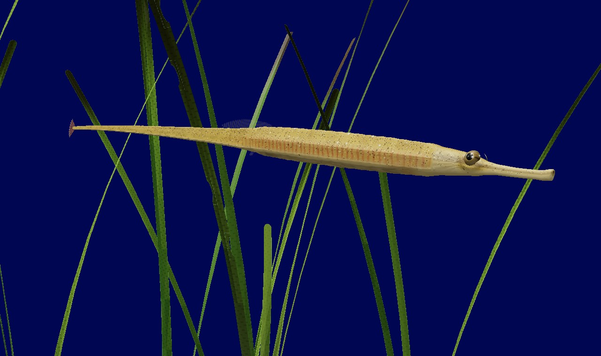

# ヨウジウオ（*Syngnathus schlegeli*）

アマモ場に暮らすヨウジウオの 3D モデルと行動。Three.js の SkinnedMesh で、図鑑の種は `syngnathus_schlegeli`（ヨウジウオ）。走水マップのアマモ場（胴長で入る沖側）に出る。

- コード: `src/creatures/species/youjiuo/`（`anatomy.ts` 体形と体輪、`geometry.ts` 3 段階のジオメトリとリグ、`materials.ts` マテリアル、`pose.ts` 中心線からボーンへ、`behavior.ts` 5 状態と動き、`YoujiuoDriver.ts` ドライバ）
- アマモとの連携: `src/world/amamo/flow.ts`（葉の揺れの CPU 版。シェーダーと同じ流れ・同じ遅れで株の中心線を出す）、`AmamoMeadow.shootsNear`、`Floor.meadow`（`CreatureSystem.setMeadow`）
- データ: `public/data/species/syngnathus_schlegeli.json`、行動ツリー `public/data/behaviors/pipefish_grass.json`
- 確認用ビューア: `reference/youjiuo-viewer/`（`npm run dev` → `/gerupamasini/reference/youjiuo-viewer/index.html`）。場面（アマモ場・水槽・側面・標本・頭部・正面）、行動（アマモに沿う・摂餌・ゆっくり泳ぐ・静止・脅かす）、LOD を切り替えられる。静止画は `node tools/models/youjiuo/render.mjs`
- テスト: `tests/unit/youjiuo.test.ts`（体輪と断面、ジオメトリの予算と向きとウェイト、ポーズの長さ保存、葉の CPU 版、5 状態、水から出ないこと、ドライバ）

## 調査

写真資料 70 枚（透明ケースの生きた個体、アマモの中の個体、物差しの上の個体、頭・眼・尾の接写、雄の育児嚢）と、種の記載（体輪・鰭条数・吻長）から。

| 部位 | ヨウジウオの特徴 | モデル |
|---|---|---|
| 体型 | 全長 10〜30 cm の細い棒。胴（頭の後ろから肛門まで）は全長の約 0.29、尾は約 0.58 で細く長くとがる。胴の高さは全長の約 3 % | 全長 20 cm で作り個体の長さに拡大縮小。高さ・幅・中心の高さを 0.4〜5 % TL 刻みの表で（`DEPTH`・`WIDTH`・`CENTRE`） |
| 体節・骨板 | 体は骨質の環（体輪）が連なった鎧。胴輪 18〜20、尾輪 38〜46。胴の断面は七角形（背中の平らな面、上・側・下の稜、腹の竜骨）、尾は四角形。環の継ぎ目は細い溝、板は少しふくらみ、稜が光る | 胴輪 19・尾輪 41（尾の環は先ほど短い）。断面は 8 つの要点の多角形で、胴→尾で七角形から四角形へ移る。板の間は少しふくらみ、稜は角として残す。LOD0 は 1 環に 3 列で、継ぎ目の列を細くして溝を形に（輪郭に段が出る）。継ぎ目の暗い線・板の放射状の条・稜のつや はシェーダーで（遠くでは継ぎ目を消す） |
| 吻と口 | 細い筒状の長い吻（吻長は頭長の 1/1.6〜1/2.0）。先端がわずかに広がり、小さな口が上向きに開く | 吻長 0.062 TL ＝ 頭長 0.115 TL の 0.54。吻の高さは長さの 1/8。先端に上向きの小さな口（暗い穴と縁）。下顎は骨 `Jaw` |
| 眼 | 頭の中ほど、吻の付け根のすぐ後ろ。大きく、眼窩の骨が盛り上がり、縁に細い放射状の条。瞳は大きく黒い。虹彩は暗いオリーブ褐色で放射状の筋、下半分は鈍い青銅色、瞳のまわりに細い金の輪と金の小斑。吻からの暗い線が眼を横切る。左右が別々に動く | 眼窩をふくらませ、眼球は皮膚に縁を沈めたドーム（`Eye_L`・`Eye_R`）。虹彩は頭の色素から作った暗い地に筋・青銅色の下半分・細い金の輪・まばらな金の斑・暗い線、縁は暗く。眼窩の縁は淡く細かい条（凹凸も）。角膜は clearcoat だが、水中では角膜と水の屈折率がほぼ同じなので反射を弱める（空気中の標本では強い）。左右の眼が独立にサッカード |
| 鰓蓋 | 大きく凸で放射状の筋、緑〜銀色の光沢。鰓孔は後ろ上の小さな切れ込み | 頬のふくらみと自由縁の段、放射状の筋（凹凸）、虹色の薄膜（iridescence）、上後方の暗い切れ込み |
| 背鰭 | 胴の終わりから尾の初めにかけて 8〜9 環の上。鰭条 30〜47（38 で作った）。透明で細い褐色の鰭条 | 38 本の鰭条と膜（鰭条の間はわずかに低い）。8 本の骨 `DorsalFin`〜`DorsalFin_7` が鰭条を横に振る |
| 胸鰭 | 鰓蓋のすぐ後ろ、低い位置の小さな扇。12〜13 条、ほぼ透明 | 斜めの付け根から後ろ外向きに開く 12 条の扇（`PectoralFin_L/R`） |
| 尾鰭 | 尾の先の小さな丸い扇（約 10 条）。褐色で先が淡く白点 | 10 条の扇。保持中は少しすぼむ。LOD2 では体と同じメッシュの板 |
| 腹鰭・臀鰭 | 腹鰭なし。臀鰭は肛門の後ろに 2〜3 条のごく小さいもの | LOD0 だけ 3 条 |
| 体色・皮膚 | 個体差が大きい: オリーブ褐色・黄緑・暗褐色・黄金色・銀色がかった黄褐色・赤褐色・淡い黄褐色。生きた個体の写真では、プラスチックのような均一な面ではなく、黄色の地に細かい黒点（黒色素胞）が群れて散り、白い粒（白色素胞）がやや盛り上がり、胴の下側面には環ごとに橙褐色の細い斜線（赤色素胞）、胴の側面には銀〜金色の反射（虹色素胞）。腹側（下の稜から下）は淡く、少し透ける。吻は体より淡く半透明だが、黒点はそこにも散る。背は暗いまだらや帯の個体、下側面に眼状斑の並ぶ個体も | 色素胞を層として重ねる（`BODY_SURFACE`）: 色相がゆっくり揺らぐ黄色の地、2 つの大きさの黒色素胞（星形に少し枝分かれし、数 mm の群れになって散る。背に多く腹に少ない）、盛り上がった白い粒、環ごとの橙褐色の斜線、胴の側面の虹色素胞の金銀の反射（metalness と iridescence）。配置は断面の実際の周長に沿った座標で（多角形の長い板の上でも点が伸びない）。遠くでは点が平均の色に置き換わりちらつかない。7 つの体色型（`MORPHS`）、4 尾に 1 尾は緑型、他の型もアマモ場の暮らしで少し緑寄り。体の太さ（栄養状態）も個体ごと |
| 透明感・内臓 | 吻・尾の先・鰭は薄く光が透ける。腹壁は薄く、腸・肝臓・鰾がうっすら見えることがある | 皮膚の中で散乱した光を少し回り込ませ（wrap、組織の暖色）、薄い部位には背後の光を足す。腹壁の内側へ短く 4 歩たどって（Beer–Lambert）、下に腸（内容物の暗い塊）、前に黄褐色の肝臓、上に銀白色の鰾を、皮膚の下の影として見せる |

## 行動

調べたこと: ヨウジウオ類は体をほとんど曲げず、背鰭を高い周波数で波打たせて進む（*Syngnathus* の背鰭は毎秒 13〜26 回、波は鰭の前から後ろへ進む。胸鰭は向きの調整と静止）。アマモ場では葉に沿うように体を立て、葉といっしょに揺れて紛れる。小さな甲殻類（カイアシ類・ヨコエビ・アミ）に静かに近づき、頭を一瞬ではね上げて口を獲物へ運び（数 ms で 20°以上）、吻をふくらませて吸い込む（ピボット摂餌）。驚くと泳ぎ回るより、向きを変えて短く素早く離れ、草陰に入って止まる。

旋回と尾のつかまり方（文献調査、2026 年 10 月）:

- 曲がり方の分布: ヨウジウオ類の旋回の運動学（体のどこがどれだけ曲がるか）を測った研究は見つからなかった。骨格からの推定では、胴は幅の広い骨環で内臓と背鰭の基部を支え、前の椎骨は固く結合しているのでほとんど曲がらない。尾は「比較的硬い」（Neutens et al. 2014 *J Anat* 224:710）が「主に舵取りに使う」（Praet et al. 2014 *ICB* 54:E169、要旨）とされる。iNaturalist などの写真でも、体が曲がっているときは頭と胴（体の前 4〜5 割）がほぼまっすぐで、曲がりは尾にある。そこで旋回の曲がりは尾に集め、胴は少しだけにした（胴の分担 0.15〜0.35、尾 1）。一般の魚の旋回では、曲がりは頭から尾へ伝わる。数値（旋回の速さと尾の曲がりの関係、遅れ）は測られておらず、骨格の限界の中で選んだ値。
- 尾の曲がる限界: ヨウジウオ類の尾は、手で曲げても尾全体で約 300° しか曲がらない（タツノオトシゴは約 800°）。曲がる量は尾の根元から先までほぼ一様（Neutens et al. 2014、*Corythoichthys* の透明標本）。曲げられる最小の半径は約 0.1 TL（20 cm の魚で約 2 cm）。モデルでは自由に泳ぐときの曲率を TL あたり 6.5 rad（約 9 rad が限界）に抑え、旋回で曲げるのは尾全体で約 130° まで（狭い U ターン）、逃避の C 字は頭から尾まで 90〜150° にした。
- 尾でつかまるか: *Syngnathus* の尾はものをつかむ尾（巻き付く尾）ではない（Neutens et al. 2014、Herald 1959）。ヨウジウオがアマモに尾を何重にも巻き付けたという記録は見つからず、百科事典は「尾部はまっすぐに伸びて曲がらない」とする。一方、アマモを植えた流水槽では *S. typhle* と *S. rostellatus* が株に「体か尾で」つかまって休んだ（Castejón-Silvo et al. 2021 *Funct Ecol* 35:2316。*S. typhle* のつかまる割合は流れが速くなっても変わらなかった）。日本語版 Wikipedia（出典なし）と水族館の見学ガイドには、ヨウジウオが尾や体をアマモや水槽の飾りに巻き付けていることがあるとある。野外の写真では、近縁のベイパイプフィッシュ（*S. leptorhynchus*）が体の後ろ半分で 1 本の葉にゆるいらせんを 1〜1.25 周かけたものが 1 枚ある（iNaturalist 330942618）。尾をアマモにしっかり巻き付けるのは、別の属のヨウジウオ類（尾鰭のない *Nerophis*、*Stigmatopora*、オーストラリアの *Urocampus carinirostris* など。Howard & Koehn 1985、Kendrick & Hyndes 2003）やタツノオトシゴ類の行動。そこでヨウジウオでは、ふつうは尾の先を株に添わせて少し回し（cling）、ときどき（休むときの 3 割）尾の後ろを葉鞘にゆるく半周〜1 周巻く（hook）ことにした。尾の曲がる限界（半径 0.1 TL）を守るため、巻きは葉鞘に 25〜35° の角度で交わる急ならせんで、長く（尾の後ろ 3 割ほど）使う。何重ものらせんにはしない。

| 状態 | 内容 | 脳の意図 |
|---|---|---|
| `IDLE_HOVER` | 中層、底から手のひら一つほど上で頭を少し上げて（個体ごとに 6〜24°）静止。背鰭は短い連続のふるえを繰り返し、胸鰭は休まず煽ぐ。体はほとんど曲がらない。波に合わせて前後に運ばれ、潮流には逆らって場所を保つ | `special: hover`、アマモがないところの `rest` |
| `SLOW_SWIM` | 背鰭だけで体長の 0.3〜0.8 倍/秒。背鰭の周波数は遅いとき 13 Hz から体長/秒で 24 Hz。体の波は全長の 1 % ほどで尾ほど大きい（まっすぐ進むときはほぼまっすぐ）。旋回では頭と胴がほぼまっすぐのまま向きを変え、尾は曲がりの内側へしなって後から追う（毎秒 40° の旋回で尾は約 40〜50°。肛門の後ろから先へ遅れて伝わり、旋回が終わると少し行き過ぎてまっすぐに戻る）。上り下りも同じ | `wander`、`moveTo` |
| `GRASS_HOLD` | 近くの株を選んで寄り、体を葉の中心線に沿わせて立てる（体の側面を葉の面に添わせ、背は葉の幅の向き）。尾の先でつかまる: ふつう（7 割）は尾の先を株に添わせて 20〜60° 回す（cling）、ときどき（3 割）尾の後ろ 1/4〜1/2 を葉鞘にゆるく半周〜1 周巻く（hook、葉鞘に 25〜35° で交わる急ならせん。曲率半径は約 0.1 TL 以上で、尾の曲がる限界の内）。どちらも休むたびに選び直す。尾鰭は株から少し外へ向けて自由に。体長ほどの水深がない浅い所では株に沿って立たず、底近くで休む。つかまるときは尾の先が先に株に触れ、巻きが根元のほうへ進む（0.6〜1.2 秒）。離すときは頭の側からほどけ、尾の先が最後に離れる（0.3〜0.7 秒、逃げるときは 0.25 秒）。巻きは葉鞘（シェーダーが描く扁平な筒）の最も太い向きの幅から 0.4 mm 離れて沿い（硬い尾は扁平な面の凹みには沿わず、橋渡しする）、株の揺れについていく。休み直すときは同じ株にとどまる。体は株と同じ流れ・同じ遅れで揺れる（根元は小さく、上ほど遅れて大きく）。背鰭はときどき小さくふるえるだけ。ときどき葉に沿ってゆっくり（4 mm/s）上下する | `rest`（アマモの中）、`display`（警戒: 葉の陰で止まる、まだ落ち着く前なら脅威と反対側に回る） |
| `FORAGE` | 眼で探し（左右ばらばら）、小さな甲殻類（ふわふわ沈み、ときどき跳ねるカイアシ類）を見つけると、両眼をそれに向けてゆっくり寄る。獲物が吻の線の少し上（0.36 rad）、頭長ほどの距離に来たら、頭を 10 ms ほどではね上げ、吻をふくらませ下顎を開いて吸い込む。頭はゆっくり戻る。2 割ほどは獲物が跳んで逃げる | `forage` |
| `ESCAPE` | ぴくっと止まる（背鰭が止まり、眼が脅威へ）→ 0.25 秒で向きを変える（尾の側に 7 割以上をかけた C 字、頭から尾まで 90〜150°、吻を少し下げる）→ 体の波を足して短く速く（体長の 3 倍/秒、最大 55 cm/s）、脅威の反対側で最もアマモの密なほうへ → 速度を落とし、アマモの中なら株をつかんで動かない（保持の素早い版）。開けた砂の上なら底近くで静止 | `flee`（割り込み可） |

- 遊泳: 背鰭の 8 本の骨が鰭条を `A·env(u)·sin(φ − 2π·1.4u)` で横に振る（波は前から後ろへ、鰭の長さに 1.4 波）。実際の 13〜26 Hz はフレームレートではちらつくので、見せる周波数は 12.5 Hz（LOD1 以下は 7 Hz）で止め、それ以上は振幅と鰭の膜のぼかし（`uFinBlur`）で表す。推進は意図した速さで直接（体はほとんど曲げない）。
- 体: 中心線（41 点。尾の後半は 1.25 % TL ごと）を `chainFromBends`（体の小さな波、旋回の曲がり、個体ごとのゆるい曲がり、逃避の C 字。どれも曲率×節の長さ）か、保持では葉の中心線（`computeHold`）から作り、節ごとの向きを球面補間で混ぜてから節の長さで並べ直す（位置で混ぜると節が折り返すことがある）。背の向きは、それぞれの姿勢の背を混ぜた姿勢の中心の節へ最小の回転で運んでから、その節の周りの回転として混ぜる（ほぼ逆向きの 2 つを直接混ぜると途中で裏返る）。旋回の曲がりは節ごとの減衰ばね（`turning`: 目標は旋回の速さ×その部位の曲がりやすさ、固有振動数は胴 18 rad/s から尾の先 4.5 rad/s へ下がるので、曲がりが尾の先へ遅れて伝わる）。保持をやめるときは保持の形を残して、頭の側から自由な姿勢へ移す（尾の先が最後）。骨は中心線の上に置き、背の向きは平行移動で胴から頭と尾へ運ぶ（`pose.ts`）。頭は後頭で回る（摂餌の跳ね上げ）、吻は付け根でふくらむ（`Snout` の拡大）、下顎は先で開く。
- 水の中: 頭も尾も水面の下、底の上。浅いところでは傾きを抑える。保持の姿勢は葉と同じく水面で寝る。
- アマモとの同調: `flow.ts` はシェーダー（`amShoot`・`amWaveFlow`・`amTangent`）と同じ式で、株ごとの潮流のうねり・揺すられ・3 つの波列の位相・突風・株の傾きを出す。株ごとの乱数はシェーダーと CPU で同じ値になるよう、正弦を使わないハッシュ（`amHashS`）にした（`fract(sin(x)·43758)` は GPU の sin の精度で値が変わる）。
- 個体差: 体色型、ふだんの傾き、体のゆるい曲がり、鰭のふるえの間隔、眼の動き、つかまり方（cling / hook、回す角度、らせんの傾き）、回す向きと葉のどちら側に添うか。

## 描画

| 段階 | 距離（20 cm 個体） | 三角形 | 内容 |
|---|---|---|---|
| LOD0 | 1.4 m まで、観察中は常に | 16,472（体・眼・口 15,464、鰭 1,008） | 32 角のロフト、1 環 3 列（継ぎ目の溝）、眼、口、背鰭 38 条・胸鰭 12 条×2・尾鰭 10 条・臀鰭 |
| LOD1 | 1.4〜5.5 m | 2,720（体と眼 2,668、鰭 52） | 16 角、1 環 1 列（環は描く）、小さな眼、背・胸・尾鰭 |
| LOD2 | 5.5 m〜表示距離 12 m | 482 | 8 角、尾鰭を体と同じメッシュに（1 ドローコール、不透明） |

- ジオメトリは段階ごとに 1 つを全個体で共有し、個体は自分の骨格（55 本: 胴 6・尾 34・頭・吻・下顎・眼 2・胸鰭 2・背鰭 8。尾の後半は尾を曲げてつかまれるよう細かい）だけを持つ。3 段階が同じ骨格を使い、`THREE.LOD` がカメラごとに選ぶ（ヒステリシス 12 %）。骨はすべて `YoujiuoRoot` の子で、ポーズは根の空間で直接書く。
- マテリアルは `MeshPhysicalMaterial`（PBR: 粗さ、ムラのある薄い粘液の clearcoat（ハイライトは凹凸に半分だけ従う）、虹色素胞の iridescence と metalness）を `onBeforeCompile` で拡張。水中では粘液・角膜の屈折率が水に近いので、誘電体の鏡面反射と clearcoat を弱める（光るのは虹色素胞のグアニンの反射だけ残る。プラスチックのような一様なつやを避ける）。骨板の表面は細かな粒状の凹凸と稜と細い継ぎ目（規則的な放射状の模様は使わない）。プログラムは段階ごとに 1 本を全個体で共有し、マテリアルの物は個体ごと（体色が個体ごと、まわりのアマモの被度も個体ごと）。
- 水中の光: 間接光をスネルの窓（空）・走水の青緑の水の散乱光・日の当たる砂に置き換え、アマモの中では横からの光が緑に、底は暗く、コースティクスは弱くなる。水面直下の減衰・屈折・濁りは既存の画面空間の水（`WaterPass`）が重ねる。トーンマッピングはゲームの ACES。
- 底の影: シャドウマップは細い魚には粗いので、ハクの接地影（`ContactShadows`）を共用し、頭から尾までの投影の長さで細い影を落とす（アマモの中では薄く）。
- 更新頻度: 6 m 以内は毎フレーム（`DRIVERS.youjiuo.nearDistance`）、それより遠くは既存の間引き。LOD2 は頭の細部と鰭の骨を省き、影は半分の頻度。株の線は保持中の個体だけ（20〜30 歩）。
- 獲物: 1.4 mm のカイアシ類（半透明の琥珀色の体と第 1 触角）を、摂餌中の近い個体だけ表示。

## 出現

| 季節 | 場所 | 数 | 全長 |
|---|---|---|---|
| 春〜秋 | 走水のアマモ場（`eelgrass`）、水深 0.25〜2.2 m | 1〜2 尾ずつ、最大 14 尾 | 110〜260 mm |
| 春〜秋 | アマモ場の縁（`eelgrass_edge`） | 1 尾ずつ、最大 6 尾 | 90〜200 mm |
| 冬 | アマモ場の深め（0.4 m 以上） | 1 尾ずつ、最大 5 尾 | 130〜270 mm |

デバッグ（F3）で 走水 に入り、「アマモ」へ移動して「周囲に生物」で確認できる。

## 画像

`node tools/models/youjiuo/render.mjs` で再生成（ビューアの静止画、ヘッドレス Chromium のソフトウェア描画）。

| | |
|---|---|
|  アマモ場: 葉に沿って立ち、尾の後ろを葉鞘にゆるく巻く |  少し寄ったところ: 葉と同じ傾きで揺れる |
|  尾の後ろを葉鞘にゆるく巻く（hook、1 周未満の急ならせん）。尾鰭は離れて自由 |  水槽で: 尾が株の脇を下り、前を回って反対側へ |
|  旋回（上から）: 胴はまっすぐのまま、尾が曲がりの内側へしなる |  0.9 秒後: 尾が遅れて追い、まっすぐに戻りつつある |
|  暗い水槽のアマモの中（写真資料の水槽の構図） |  葉に沿って立つ個体を真横から（体輪の継ぎ目と黒点） |
|  摂餌: 体をまっすぐに保って獲物へ忍び寄る |  ピボット摂餌: 頭がはね上がり、吻がふくらむ |
|  吸い込んだ後、頭がゆっくり戻る |  背鰭で静かに泳ぐ |
|  逃避 0.15 秒: 向きを変える |  0.5 秒: 短く速く、アマモの密なほうへ |
|  3 秒: 草の中へ入り、株をつかみに行く |  群落の縁（開けた砂の側から） |
|  側面（LOD0、透明ケースの写真の光） |  頭部: 筒状の吻、上向きの口、眼窩の盛り上がり、暗いオリーブ褐色の虹彩と細い金の輪、暗い線、鰓蓋 |
|  新鮮な標本の構図（白背景・側面、銀色がかった型） |  正面 |
|  水槽で頭を斜め前から（黄金色の型）: 淡く黒点の散る吻、細い金の輪の眼、白い粒と黒点 |  少し下から: 胴の下側面の橙褐色の斜線、淡い腹 |
|  LOD1 |  LOD2 |
|  ゲーム内（走水、10 時半、潮位 +90 cm）: 観察カメラで上から。葉と波の焦線の中でほとんど見分けられない（中央やや下の斜めの細い棒） |  同じ場所を胴長で立って: 水面の反射でアマモ場の中の魚は見えない（`node tests/smoke/youjiuo.mjs`） |
