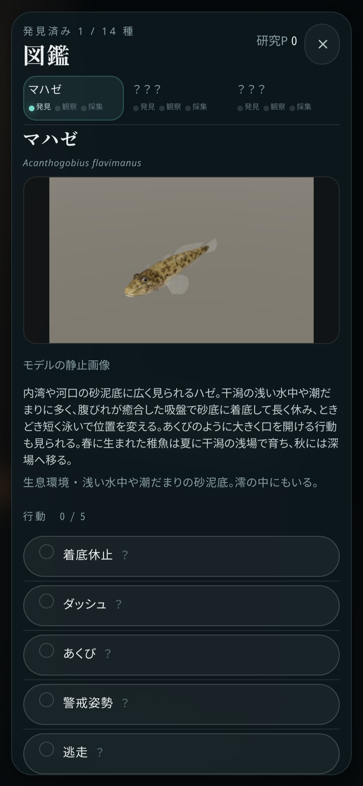

# セーブ修正・独立画質・最低画質

設定画面で「ホーム（水槽）の画質」と「干潟の画質」を、それぞれ **最低・低・中・高** から選択できます。旧設定は両方に引き継ぎます。スマホの初期設定は両方「低」です。

最低画質の図鑑には、現在の3Dモデルを撮影した640×400の静止画像を表示します。全14種の画像は合計約144KB。図鑑用のWebGL描画・GLB読み込みは行いません。図鑑を開いた場所の画質設定を使います。

| 問題 | 変更 |
| --- | --- |
| 継続セーブを新規開始で消せる | 「つづきから」を主ボタンに変更。新規開始には確認を付け、旧データをバックアップ |
| インポート後の旧データ上書き | 保存待ちの処理を整理し、保存中の切り替えを停止。読み込みと同時にゲームの状態も更新 |
| 初期化したデータの復活 | 自動保存・終了時保存を止めてから初期化 |
| 不完全なセーブで起動失敗 | 全体の型・数値・容量・個体重複を検証。破損データを保管し、バックアップ復元・元データ出力を案内 |
| 保存失敗が分からない | 画面端に再試行・JSON保存を表示。失敗した内容も再保存可能。通常の保存でも前の状態を保管 |
| モデル通信失敗が直らない | 失敗した読み込みをキャッシュから除外。図鑑に再読み込みボタン。再試行時は描画領域も再生成。干潟は再試行の間隔を設定 |
| WebGL初期化で空白画面 | 初期化から例外を捕捉し、対応条件と再読み込みを案内 |
| 低画質・変更後の設定が一部のみ反映 | 生物LOD、個体数上限、影、地面、アマモ、水面反射、描画バッファのサンプル数、持つ道具のLODへ反映 |
| 水槽・スマホ図鑑の負荷 | 水槽の影・生物LOD・水面計算の頻度も画質に対応。最低では水面シミュレーションを停止。通常の図鑑も画質別のLOD・解像度上限を設定 |
| ホーム裏で干潟が更新される | 非表示の干潟更新を停止。メニュー・図鑑の背景は変更時だけ描画。非表示タブでも更新を停止 |
| 初期10枚の後にガチャが続かない | 累計100研究ポイントごとに専用チケット1枚。報酬済みの回数を保存して再配布を防止 |
| 潮汐が暫定4分潮・横須賀推測値 | 東京・横須賀の実測由来TICON-4データに置換。37分潮を使用。出典・平均海面基準・検証範囲を表示 |
| 古いスマホ操作説明・初回の案内不足 | 現在の操作ボタンに説明を更新。ホーム端に任意の採集案内、未発見種にも生息ヒントを表示 |
| 保存・画面の不具合をCIで検知できない | 実ブラウザで保存保護・インポート・初期化・容量不足・通信失敗・独立画質・写真表示をCIとPagesの公開前に検証 |

## 確認

- 型検査・単体テスト255件・データ検証・本番ビルド。
- `npm run smoke:recovery`：本番ビルドのスマホ設定、画像表示、保存、復旧、モデル再読み込み、WebGL非対応。
- `node tests/smoke/recovery-quality.mjs --field`：干潟の生成後に低→高→最低へ変更、図鑑写真表示、ホームに戻った後の干潟停止。
- `node tests/smoke/mobile.mjs --editor-lite`：320×568、390×844、568×320、844×390のホーム・行き先・水槽編集・ガチャ。

実機スマホのFPS・消費電力の測定は未実施。潮汐は東京2020年の公式潮位表16日（384点）と比較し、日平均を除いた潮位変動のRMSE 4cm以内、干潮時刻の平均誤差6分以内・最大20分以内をテストします。横須賀の公式表との照合と全年の精度保証は未実施。[潮汐の出典・検証](../research/tide/README.md)。

図鑑画像の再生成：Viteを起動して `node tools/photos/capture.mjs`。実物の生物写真ではなく、ゲーム内モデルの静止画像です。
